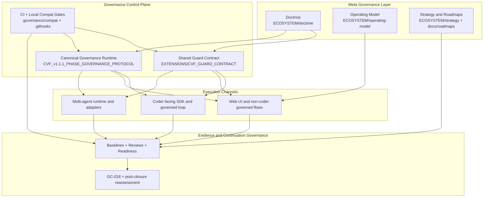
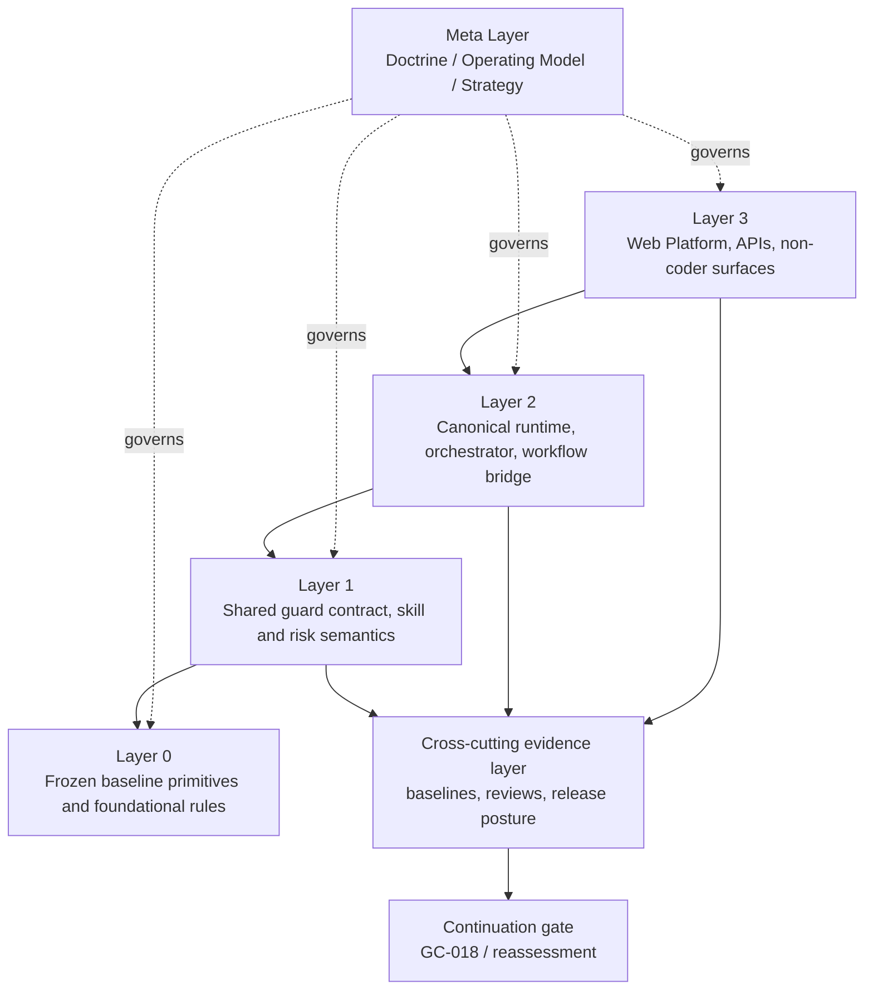
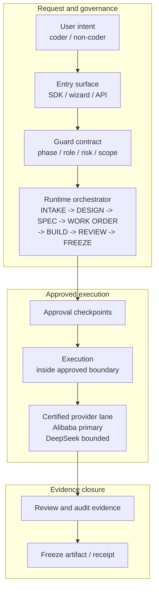
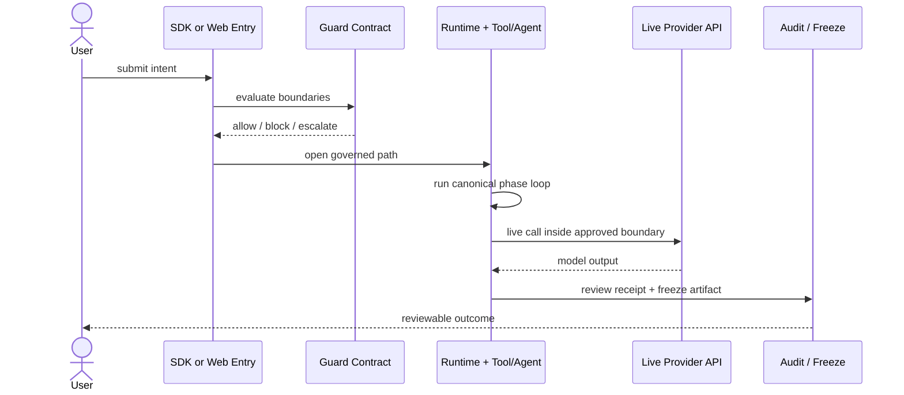
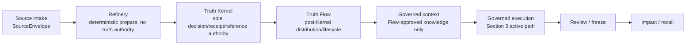

# CVF Architecture

> Front-door architecture view for GitHub readers.
>
> Current readout: CVF is a governance-first AI/agent control framework with live non-coder governance proof, certified Alibaba + DeepSeek provider lanes, and mandatory live API release evidence for governance claims.
>
> This page is one of the three root front-door entrypoints alongside `README.md` and `START_HERE.md`.

## 1. System Shape

CVF is easiest to understand as a governance-first stack with four distinct roles:

- `Meta governance` defines why the system exists and what it should optimize for
- `Control plane` defines how execution is constrained
- `Execution channels` deliver governed experiences for coders and non-coders
- `Evidence + continuation governance` decides whether the system can safely deepen or reopen

The current publication posture is live-first:

- governance behavior is proven through real provider execution, not mock strings;
- Alibaba `qwen-turbo` and DeepSeek `deepseek-chat` are certified provider lanes;
- mock mode is valid only for UI structure checks;
- release-quality proof runs through `python scripts/run_cvf_release_gate_bundle.py --json`.
- Web is governance-inherited on the active governed AI path, but is not the full CVF runtime.
- Workspace bootstrap is now agent-enforcement-ready when generated artifacts and the workspace doctor pass.

Current optimization posture:

- the master architecture and core module baseline are stable-by-default;
- future core changes should be evidence-driven and narrow, usually to absorb useful external knowledge or close a measured control gap;
- the highest-value continuation is now non-coder benefit: make CVF's governed path visibly useful, repeatable across downstream workspaces, and backed by live evidence.

Diagram set:

- module map: how meta governance, control plane, execution channels, and evidence governance relate
- dependency rules: which layers may depend on which lower layers
- active reference path: how a governed request reaches provider execution and receipt closure
- interaction model: the live-proof sequence from user intent to audit/freeze evidence

Diagram note: this is the public module map, not an exhaustive folder tree. It shows how doctrine and operating model govern the control plane, how the guard/runtime pair feeds execution channels, and how evidence gates future continuation.

## 2. Dependency Rules

The engineering stack is intentionally asymmetric:

- higher execution layers depend downward
- Layer 0 never depends upward
- doctrine governs engineering, but does not execute code
- evidence governs continuation, but does not replace runtime controls

Diagram note: dependency direction is intentionally conservative. Higher product surfaces can depend on the lower governance layers, but Layer 0 and the guard semantics should not depend on Web UI or provider-specific behavior.

## 3. Active Reference Path

The current active path is the clearest expression of CVF today. For governance claims, this path must reach a real provider API call.

Diagram note: this is the path that must reach a real provider API call before CVF can claim governance behavior. Alibaba/DashScope is the primary certified release lane; DeepSeek has certified canary evidence and bounded confirmatory coverage. Provider parity is not claimed.

The seven stages are separate control decisions, even when one interface makes
them feel continuous to the user:

| Stage | Architecture responsibility |
| --- | --- |
| `INTAKE` | Normalize intent, authority, context, risk, and approval needs. |
| `DESIGN` | Select the solution shape, owners, trust boundaries, and evidence plan. |
| `SPEC` | Freeze source-verifiable requirements, invariants, negative cases, and acceptance criteria. |
| `WORK ORDER` | Grant bounded execution authority: role, base, paths, tools, budget, evidence, stop rules, and handoff. |
| `BUILD` | Execute inside that grant and emit scoped implementation evidence. |
| `REVIEW` | Independently compare intent, design, spec, authority, output, and evidence. |
| `FREEZE` | Preserve the accepted result, limitations, export disposition, and next allowed move. |

`SPEC` must not collapse into `DESIGN`, because a solution direction is not a
testable contract. `WORK ORDER` must not collapse into `BUILD`, because a
contract is not execution authority.

## 4. Interaction Model

This is the practical governed loop that CVF currently proves on the active path. Mock UI tests do not count as governance evidence.

Diagram note: mock UI tests can validate screens and navigation, but this sequence only counts as governance proof when the provider call is live and the resulting receipt/evidence is captured.

## 5. SOT3 Knowledge Authority Path

The accepted SOT Three-Layer (SOT3) family governs how retrieved knowledge
context earns truth authority before it can be injected into a governed
request. It is a knowledge-authority path, not a replacement for the
governed request path in Section 3 above; it sits before governed execution
when a knowledge-context seam is activated.

Diagram note: Refinery prepares source-bound material deterministically and
holds no truth authority. Truth Kernel alone evaluates trust and issues
decision, receipt, and reference authority. Truth Flow distributes only
Flow-approved, post-Kernel context; provider output remains downstream
content, not truth authority. This path is bounded: the four SOT3 module
owners are `LOCAL_READY` and accepted-review-evidenced, not globally
activated, always-invoked, a provider boundary, publicly exported, or
production-ready. Activation and downstream-application proof are bounded to
one seam (`docs/reference/sot_three_layer/CVF_SOT3_ACTIVATION_ARCHITECTURE_DECISION.md`),
not universal CVF behavior. Full contract, implementation, and proof
references live in `docs/reference/sot_three_layer/README.md`.

## 6. What This Means

The architecture should be read this way:

- CVF is not just a collection of extensions
- the control plane is the point of coherence
- Web UI, SDK flows, and multi-agent paths are valuable only when they stay under the same governed semantics
- baselines, reviews, and continuation gates are part of the system boundary, not just project paperwork
- deeper governance and evidence records matter, but they are not the preferred first-click path from the repository front door
- provider choice is user-owned, but governance evidence remains CVF-owned
- release-quality governance claims require live API-backed evidence; mock mode is UI-only

## 7. Current Evidence Posture

| Claim | Current status | Evidence |
| --- | --- | --- |
| Non-coder governed AI path | Live-proven | W149 trusted-form corpus: Alibaba direct API `40/40`, Alibaba browser UI `40/40`, DeepSeek confirmatory subset `12/12` |
| Non-coder adoption journey | Live-proven | W119 evidence pack `3/3` locked journeys pass: first governed output, project knowledge use, evidence handoff |
| Multi-provider operability | Certified on 2 lanes | Alibaba `qwen-turbo` and DeepSeek `deepseek-chat` both `CERTIFIED`; provider parity is not claimed |
| Release gate | Mandatory live governance | W152 preserves `python scripts/run_cvf_release_gate_bundle.py --json` PASS, including live governance E2E |
| Mock boundary | UI-only | `AGENTS.md` and live evidence packet |
| Provider parity | Not claimed | Speed, cost, quality, latency, and reliability remain provider economics |
| Web CVF inheritance | Active path only | Web is governance-inherited on `/api/execute`; it does not claim full CVF runtime inheritance |
| Workspace agent enforcement | Delivered | W112-T1 adds downstream `AGENTS.md`, `.cvf/` manifest/policy, and workspace doctor checks |
| Downstream adoption proof | Repeatable across 3 tested kinds | W114-CP7 proves cli-productivity, web-app-planning, and data-analysis — all doctor 11/11 PASS, all tests pass, sample 3 includes a secret-free bridge to live Web evidence |
| Trusted-form web front door | Live-usable under W149 boundary | 40-form corpus locked; Alibaba full matrix passed; DeepSeek subset passed |

## 8. Current Control Boundaries

### Web

The web surface can deepen control, but it should not claim to be the whole CVF runtime. The correct boundary is:

- `YES`: live-proven governance on the active governed AI execution path
- `YES`: provider routing, DLP, output validation, audit, and bypass detection on the meaningful execution path
- `NO`: physical sandbox isolation for arbitrary code execution
- `NO`: full inheritance of every CVF module, guard plane, and workspace/agent behavior

Delivered deepening milestone: [W112-T1 Workspace Agent Enforcement and Web Control Uplift](docs/roadmaps/CVF_W112_T1_WORKSPACE_AGENT_ENFORCEMENT_AND_WEB_CONTROL_UPLIFT_ROADMAP_2026-04-22.md).

### Workspace

The current workspace bootstrap protects the CVF core by placing downstream projects in sibling folders and generates agent-enforcement artifacts for the downstream project.

Delivered W112-T1 behavior:

- generate downstream `AGENTS.md`
- generate `.cvf/manifest.json` and `.cvf/policy.json`
- add a workspace doctor/preflight gate
- require first-request agent protocol before downstream execution

Delivered W113-T1 proof:

- bootstrap a real downstream sample project outside CVF core
- record first-request agent declaration
- execute `INTAKE -> DESIGN -> SPEC -> WORK ORDER -> BUILD -> REVIEW -> FREEZE`
- capture live API-backed governance evidence

### Non-Coder Value

The most important current product question is no longer whether the core CVF module architecture is coherent. The practical question is whether a non-coder receives enough visible benefit to trust and reuse CVF.

Current proven baseline:

- one-provider non-coder governed value is proven on the validated Alibaba lane;
- knowledge-native context can improve output quality in `/api/execute`;
- Web exposes governed execution metadata on the active live path;
- workspace adoption is proven for one downstream sample.
- W114 CP4 adds compact live outcome evidence: 19/19 expected route decisions, 12/12 useful allowed outputs, 5/5 guided high-risk blocks, 3/3 knowledge hits, 2/2 follow-up refinements, and 2/2 approval artifacts.
- W114 CP5 makes the main processing UI display route-returned governance evidence instead of leaving that evidence only in API responses.
- W114 CP6 gives downstream workspaces a secret-free bridge receipt that links workspace doctor proof to CVF Web live evidence records.
- W114 CP7 proves the downstream adoption pattern is repeatable across three tested sample kinds: `scripts/w114_cp7_multi_sample_downstream_proof.ps1` creates 3 sample projects (cli-productivity, web-app-planning, data-analysis), all passing doctor 11/11 and unit tests, with sample 3 also writing a secret-free bridge to live Web evidence.
- W114 CP8 publishes the public evidence packet: `docs/reference/CVF_W114_PUBLIC_EVIDENCE_PACKET_2026-04-23.md` summarizes plain-language non-coder benefit claims, evidence chain, claim boundaries, and known limitations.
- W119 proves a bounded first-use adoption journey end-to-end: secret-free first-run readiness, project knowledge ingest/retrieval, governed live `/api/execute`, visible/exportable evidence receipt, and 3/3 locked live journeys passing on the Alibaba lane.

Current posture: W119 closed delivered. Downstream adoption pattern is repeatable across tested sample kinds, and one realistic non-coder Web adoption journey is now live-proven with project knowledge and evidence handoff. Public claims remain bounded to live Web `/api/execute`, tested workspace artifacts/doctor/bridge evidence, and local single-process knowledge persistence.

Latest closed non-coder value roadmap: [W119-T1 Non-Coder Adoption Proof And Evidence UX](docs/roadmaps/CVF_W119_T1_NONCODER_ADOPTION_PROOF_AND_EVIDENCE_UX_ROADMAP_2026-04-23.md).

## 9. Read Next

### General Orientation

- [README](README.md)
- [Agent Instructions](AGENTS.md)
- [Getting Started](docs/GET_STARTED.md)
- [Quick Orientation](docs/guides/CVF_QUICK_ORIENTATION.md)

### Architecture Depth

- [Detailed Architecture Map](docs/reference/CVF_ARCHITECTURE_MAP.md)
- [Ecosystem Architecture](CVF_ECOSYSTEM_ARCHITECTURE.md)
- [Reference Governed Loop](docs/reference/CVF_REFERENCE_GOVERNED_LOOP.md)

### Status And Governance Context

- [Live Evidence Publication Packet](docs/reference/CVF_LIVE_EVIDENCE_PUBLICATION_PACKET_2026-04-21.md)
- [Release Candidate Truth Packet](docs/reference/CVF_RELEASE_CANDIDATE_TRUTH_PACKET_2026-04-21.md)
- [Provider Lane Readiness Matrix](docs/reference/CVF_PROVIDER_LANE_READINESS_MATRIX.md)
- [Known Limitations Register](docs/reference/CVF_KNOWN_LIMITATIONS_REGISTER_2026-04-21.md)
- [Governance Control Matrix](docs/reference/CVF_GOVERNANCE_CONTROL_MATRIX.md)
- [W112-T1 Workspace Agent Enforcement And Web Control Uplift Roadmap](docs/roadmaps/CVF_W112_T1_WORKSPACE_AGENT_ENFORCEMENT_AND_WEB_CONTROL_UPLIFT_ROADMAP_2026-04-22.md)
- [W113-T1 First Downstream Project Proof Roadmap](docs/roadmaps/CVF_W113_T1_FIRST_DOWNSTREAM_PROJECT_PROOF_ROADMAP_2026-04-22.md)
- [W114-T1 Non-Coder Value Maximization And Evidence Roadmap](docs/roadmaps/CVF_W114_T1_NONCODER_VALUE_MAXIMIZATION_AND_EVIDENCE_ROADMAP_2026-04-22.md)
- [W114-T1 Non-Coder Outcome Evidence Pack](docs/assessments/CVF_W114_T1_NONCODER_OUTCOME_EVIDENCE_PACK_2026-04-23.md)
- [W114-T1 Web Benefit Visibility Assessment](docs/assessments/CVF_W114_T1_WEB_BENEFIT_VISIBILITY_ASSESSMENT_2026-04-23.md)
- [W114-T1 Workspace-To-Web Evidence Bridge Assessment](docs/assessments/CVF_W114_T1_WORKSPACE_WEB_EVIDENCE_BRIDGE_ASSESSMENT_2026-04-23.md)
- [W119-T1 Non-Coder Adoption Proof And Evidence UX Roadmap](docs/roadmaps/CVF_W119_T1_NONCODER_ADOPTION_PROOF_AND_EVIDENCE_UX_ROADMAP_2026-04-23.md)
- [W119-T1 Non-Coder Adoption Evidence Pack](docs/assessments/CVF_W119_T1_NONCODER_ADOPTION_EVIDENCE_PACK_2026-04-23.md)
