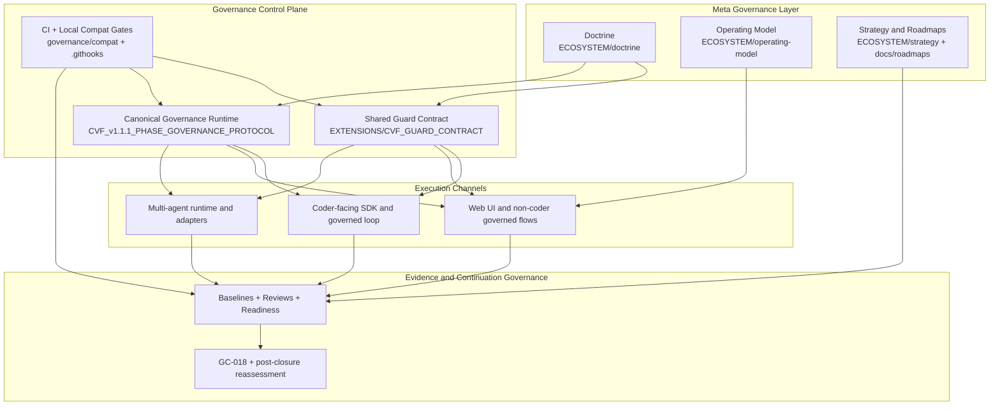
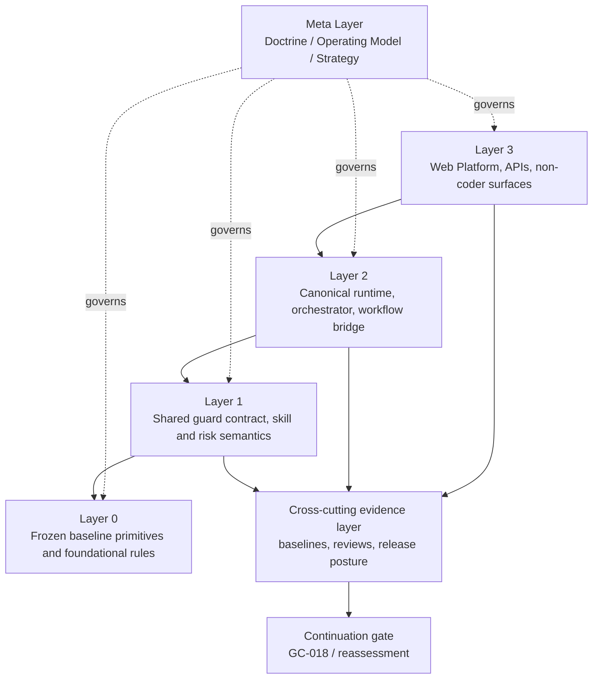
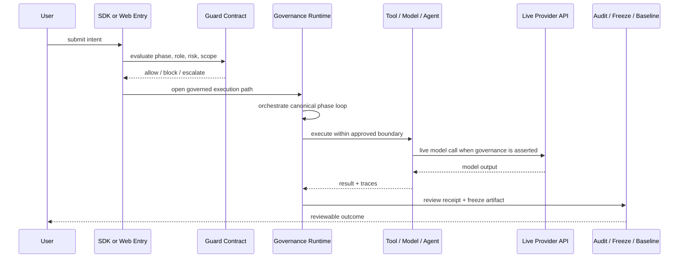

# CVF Architecture

> Front-door architecture view for GitHub readers.
>
> Current readout: CVF is a governance-first AI/agent control framework with live non-coder governance proof, certified Alibaba + DeepSeek provider lanes, and mandatory live API release evidence for governance claims.
>
> This page is one of the three root front-door entrypoints alongside `README.md` and `START_HERE.md`.

## 1. System Shape

CVF is easiest to understand as a governance-first stack with four distinct roles:

- `Meta governance` defines why the system exists and what it should optimize for
- `Control plane` defines how execution is constrained
- `Execution channels` deliver governed experiences for coders and non-coders
- `Evidence + continuation governance` decides whether the system can safely deepen or reopen

The current publication posture is live-first:

- governance behavior is proven through real provider execution, not mock strings;
- Alibaba `qwen-turbo` and DeepSeek `deepseek-chat` are certified provider lanes;
- mock mode is valid only for UI structure checks;
- release-quality proof runs through `python scripts/run_cvf_release_gate_bundle.py --json`.
- Web is governance-inherited on the active governed AI path, but is not the full CVF runtime.
- Workspace bootstrap is now agent-enforcement-ready when generated artifacts and the workspace doctor pass.

## 2. Dependency Rules

The engineering stack is intentionally asymmetric:

- higher execution layers depend downward
- Layer 0 never depends upward
- doctrine governs engineering, but does not execute code
- evidence governs continuation, but does not replace runtime controls

## 3. Active Reference Path

The current active path is the clearest expression of CVF today. For governance claims, this path must reach a real provider API call.

```mermaid
flowchart LR
    INTENT["User intent<br/>coder or non-coder"]
    ENTRY["Entry surface<br/>SDK / wizard / API"]
    GUARDS["Guard contract<br/>phase, role, risk, scope"]
    ORCH["Runtime orchestrator<br/>INTAKE -> DESIGN -> BUILD -> REVIEW -> FREEZE"]
    APPROVAL["Approval checkpoints"]
    EXEC["Execution and tool/model use"]
    PROVIDER["Certified provider lane<br/>Alibaba / DeepSeek"]
    REVIEW["Review and audit evidence"]
    FREEZE["Freeze artifact / receipt"]

    INTENT --> ENTRY
    ENTRY --> GUARDS
    GUARDS --> ORCH
    ORCH --> APPROVAL
    APPROVAL --> EXEC
    EXEC --> PROVIDER
    PROVIDER --> REVIEW
    REVIEW --> FREEZE
```

## 4. Interaction Model

This is the practical governed loop that CVF currently proves on the active path. Mock UI tests do not count as governance evidence.

## 5. What This Means

The architecture should be read this way:

- CVF is not just a collection of extensions
- the control plane is the point of coherence
- Web UI, SDK flows, and multi-agent paths are valuable only when they stay under the same governed semantics
- baselines, reviews, and continuation gates are part of the system boundary, not just project paperwork
- deeper governance and evidence records matter, but they are not the preferred first-click path from the repository front door
- provider choice is user-owned, but governance evidence remains CVF-owned
- release-quality governance claims require live API-backed evidence; mock mode is UI-only

## 6. Current Evidence Posture

| Claim | Current status | Evidence |
| --- | --- | --- |
| Non-coder governed AI path | Live-proven | `E2E Playwright Governance (live): 7 passed` via release gate |
| Multi-provider operability | Certified on 2 lanes | Alibaba `qwen-turbo` and DeepSeek `deepseek-chat` both `CERTIFIED` |
| Release gate | Mandatory live governance | `python scripts/run_cvf_release_gate_bundle.py --json` |
| Mock boundary | UI-only | `AGENTS.md` and live evidence packet |
| Provider parity | Not claimed | Speed, cost, quality, latency, and reliability remain provider economics |
| Web CVF inheritance | Active path only | Web is governance-inherited on `/api/execute`; it does not claim full CVF runtime inheritance |
| Workspace agent enforcement | Delivered | W112-T1 adds downstream `AGENTS.md`, `.cvf/` manifest/policy, and workspace doctor checks |

## 7. Current Control Boundaries

### Web

The web surface can deepen control, but it should not claim to be the whole CVF runtime. The correct boundary is:

- `YES`: live-proven governance on the active governed AI execution path
- `YES`: provider routing, DLP, output validation, audit, and bypass detection on the meaningful execution path
- `NO`: physical sandbox isolation for arbitrary code execution
- `NO`: full inheritance of every CVF module, guard plane, and workspace/agent behavior

Delivered deepening milestone: [W112-T1 Workspace Agent Enforcement and Web Control Uplift](docs/roadmaps/CVF_W112_T1_WORKSPACE_AGENT_ENFORCEMENT_AND_WEB_CONTROL_UPLIFT_ROADMAP_2026-04-22.md).

### Workspace

The current workspace bootstrap protects the CVF core by placing downstream projects in sibling folders and generates agent-enforcement artifacts for the downstream project.

Delivered W112-T1 behavior:

- generate downstream `AGENTS.md`
- generate `.cvf/manifest.json` and `.cvf/policy.json`
- add a workspace doctor/preflight gate
- require first-request agent protocol before downstream execution

## 8. Read Next

### General Orientation

- [README](README.md)
- [Agent Instructions](AGENTS.md)
- [Getting Started](docs/GET_STARTED.md)
- [Quick Orientation](docs/guides/CVF_QUICK_ORIENTATION.md)

### Architecture Depth

- [Detailed Architecture Map](docs/reference/CVF_ARCHITECTURE_MAP.md)
- [Ecosystem Architecture](CVF_ECOSYSTEM_ARCHITECTURE.md)
- [Reference Governed Loop](docs/reference/CVF_REFERENCE_GOVERNED_LOOP.md)

### Status And Governance Context

- [Live Evidence Publication Packet](docs/reference/CVF_LIVE_EVIDENCE_PUBLICATION_PACKET_2026-04-21.md)
- [Release Candidate Truth Packet](docs/reference/CVF_RELEASE_CANDIDATE_TRUTH_PACKET_2026-04-21.md)
- [Provider Lane Readiness Matrix](docs/reference/CVF_PROVIDER_LANE_READINESS_MATRIX.md)
- [Known Limitations Register](docs/reference/CVF_KNOWN_LIMITATIONS_REGISTER_2026-04-21.md)
- [Governance Control Matrix](docs/reference/CVF_GOVERNANCE_CONTROL_MATRIX.md)
- [W112-T1 Workspace Agent Enforcement And Web Control Uplift Roadmap](docs/roadmaps/CVF_W112_T1_WORKSPACE_AGENT_ENFORCEMENT_AND_WEB_CONTROL_UPLIFT_ROADMAP_2026-04-22.md)
