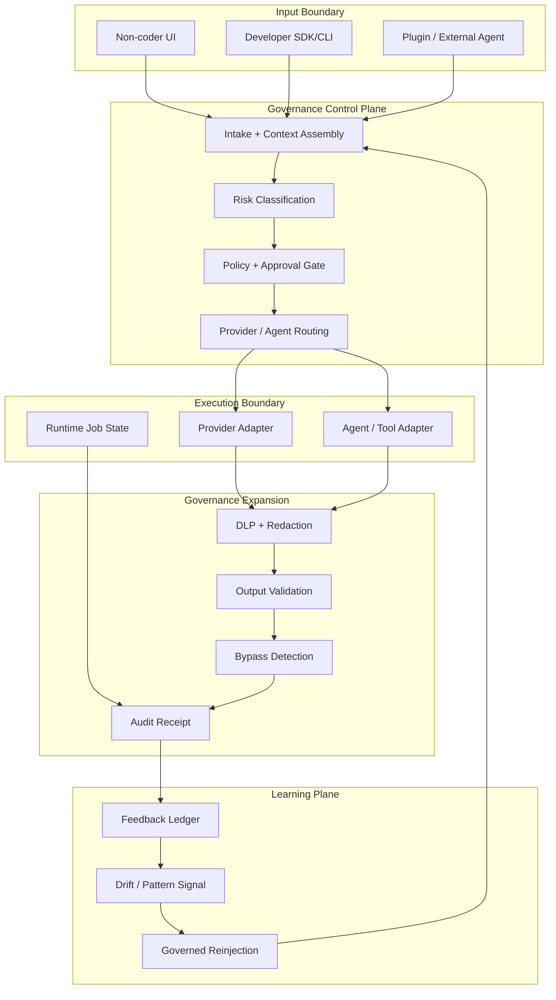
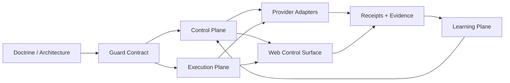

# CVF Architecture

CVF is a governance control plane. Its job is to control how AI and agents are
allowed to act, not to replace the agents or providers that perform the work.

The core architecture is local-first and provider-agnostic:

- CVF receives an input and assembles context.
- CVF applies rules, risk, approval, DLP, output validation, and evidence.
- The actual work may be performed by any bounded provider, plugin, tool, or
  external agent.
- CVF records enough evidence for an operator or developer to inspect what
  happened.

## Canonical Flow

```text
request
  -> intake and context assembly
  -> risk classification
  -> policy and approval gate
  -> provider or agent adapter
  -> execution
  -> DLP/redaction and output validation
  -> audit receipt
  -> governed result
```



## Planes

| Plane | Responsibility |
|---|---|
| Guard Contract | Shared types, rules, enforcement primitives, runtime helpers. |
| Control Plane | Intake, routing, context packaging, knowledge selection, provider selection. |
| Execution Plane | Dispatch, command/runtime boundary, policy gate, async execution status. |
| Governance Expansion | Checkpoints, watchdogs, audit logs, reintake, external asset governance. |
| Learning Plane | Feedback ledger, truth score, pattern detection, drift, reinjection. |
| Web Surface | Operator/non-coder visibility and control surface over governed paths. |

## Public Repository Tree

This renewed public repository is intentionally smaller than the provenance
archive. When cloned, the working tree should look like this at the top level:

```text
Controlled-Vibe-Framework-CVF/
|-- ARCHITECTURE.md
|-- GOVERNANCE.md
|-- PROVIDERS.md
|-- COST_AND_QUOTA.md
|-- PROVENANCE.md
|-- README.md
|-- netlify.toml
|-- ECOSYSTEM/
|   `-- doctrine/
|-- EXTENSIONS/
|   |-- CVF_GUARD_CONTRACT/
|   |-- CVF_CONTROL_PLANE_FOUNDATION/
|   |-- CVF_EXECUTION_PLANE_FOUNDATION/
|   |-- CVF_GOVERNANCE_EXPANSION_FOUNDATION/
|   |-- CVF_LEARNING_PLANE_FOUNDATION/
|   |-- CVF_MODEL_GATEWAY/
|   |-- CVF_v1.6_AGENT_PLATFORM/
|   |   `-- cvf-web/
|   `-- supporting bounded modules...
|-- docs/
|   |-- evidence/
|   `-- EXPORT_MANIFEST.md
|-- governance/
|   `-- public-surface-manifest.json
|-- scripts/
|   |-- check_public_surface.py
|   |-- run_cvf_release_gate_bundle.py
|   `-- provider readiness scripts
`-- .github/
    |-- workflows/
    `-- pull_request_template.md
```

The provenance archive keeps the full development journal, raw wave history,
reviews, rebuttals, handoffs, and local operational traces. The public tree
keeps only the product surface, architecture, runnable code, curated evidence,
and release gates.

## Dependency Rules



The dependency direction is deliberate:

- doctrine defines boundaries, but does not execute runtime behavior;
- guard contracts must stay reusable and provider-neutral;
- provider adapters must not bypass risk, approval, DLP, validation, or receipt
  creation;
- web may expose controls, but it must not become the only runtime path;
- evidence may summarize behavior only when live proof exists.

## Provider And Agent Boundary

CVF does not need to own the model or the worker agent. A provider, plugin,
tool, or external agent connects to CVF through an adapter boundary.

The adapter must make governance-visible facts available:

- selected provider/model
- request metadata
- risk and policy decision
- output validation result
- token/cost signal where available
- audit receipt reference

## Local-First Posture

The default deployment posture is local-first. Developers can clone and run CVF
on their own machine. Web exists to make the same controls visible and usable,
especially for non-coders and operators.

Managed/cloud persistence can be added later, but it must not become the only
valid way to use CVF.

## Web Boundary

`cvf-web` is a control surface. It is not the whole CVF runtime.

The web app helps users:

- submit governed requests
- see risk and provider posture
- inspect evidence receipts
- run protected governance jobs
- operate non-coder workflows

Claims about web governance must still be backed by live provider evidence.

## Public vs Provenance Boundary

This repository is the public product surface. It should be useful to
developers evaluating the system, operators running local-first governance, and
integrators building adapters.

The following material is intentionally kept outside the public repo unless it
is curated into evidence:

- raw handoff logs;
- rebuttal chains;
- historical wave notes;
- local runtime state;
- browser traces and temporary artifacts;
- private key setup transcripts;
- draft assessments that no longer describe the current product.

The public-surface scanner enforces that boundary before push.
