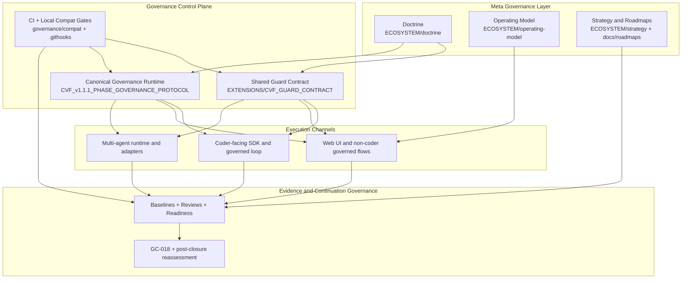
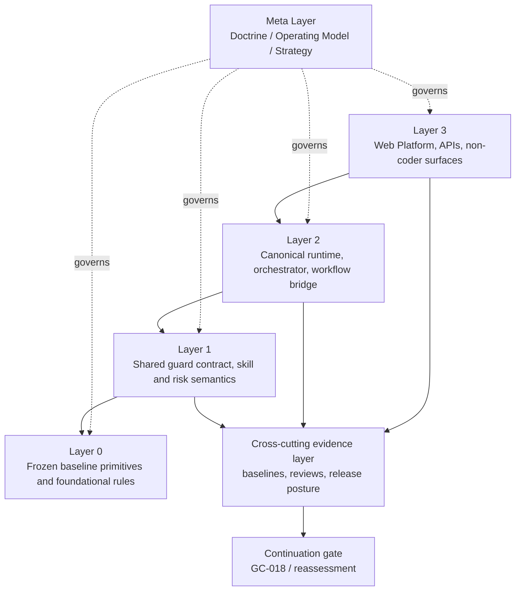
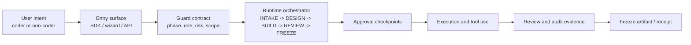
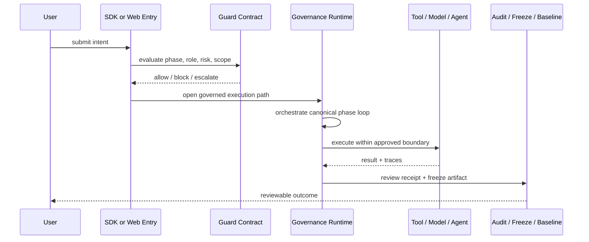

# CVF Architecture

> Front-door architecture view for GitHub readers.
>
> Current readout: the active system-unification wave is complete on the active reference path, while future expansion is gated by reassessment and `GC-018`.

## 1. System Shape

CVF is easiest to understand as a governance-first stack with four distinct roles:

- `Meta governance` defines why the system exists and what it should optimize for
- `Control plane` defines how execution is constrained
- `Execution channels` deliver governed experiences for coders and non-coders
- `Evidence + continuation governance` decides whether the system can safely deepen or reopen

## 2. Dependency Rules

The engineering stack is intentionally asymmetric:

- higher execution layers depend downward
- Layer 0 never depends upward
- doctrine governs engineering, but does not execute code
- evidence governs continuation, but does not replace runtime controls

## 3. Active Reference Path

The current active path is the clearest expression of CVF today:

## 4. Interaction Model

This is the practical governed loop that CVF currently proves on the active path:

## 5. What This Means

The architecture should be read this way:

- CVF is not just a collection of extensions
- the control plane is the point of coherence
- Web UI, SDK flows, and multi-agent paths are valuable only when they stay under the same governed semantics
- baselines, reviews, and continuation gates are part of the system boundary, not just project paperwork

## 6. Read Next

- [README](README.md)
- [Release Readiness](docs/reference/CVF_RELEASE_READINESS_STATUS_2026-03-20.md)
- [System Checkpoint](docs/reviews/CVF_INDEPENDENT_SYSTEM_CHECKPOINT_2026-03-20.md)
- [System Unification Roadmap](docs/roadmaps/CVF_SYSTEM_UNIFICATION_REMEDIATION_ROADMAP_2026-03-19.md)
- [Governance Control Matrix](docs/reference/CVF_GOVERNANCE_CONTROL_MATRIX.md)
- [Detailed Architecture Map](docs/reference/CVF_ARCHITECTURE_MAP.md)
- [Architecture Separation Diagram](EXTENSIONS/ARCHITECTURE_SEPARATION_DIAGRAM.md)
