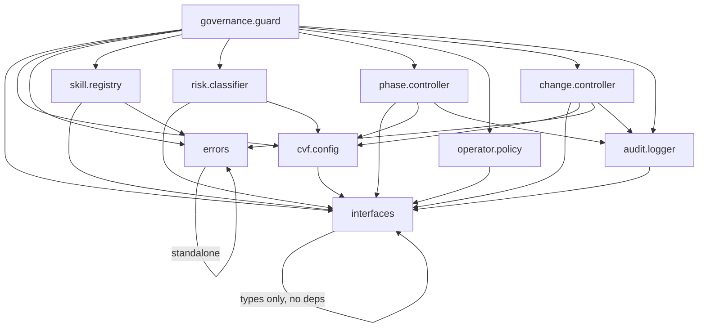

# Dependency Map — CVF Toolkit Core

This document formalizes the dependency graph between all toolkit modules.

## Module Dependency Graph



## Dependency Table

| Module              | Depends On                                                                       | Depended By                        |
| ------------------- | -------------------------------------------------------------------------------- | ---------------------------------- |
| `interfaces.ts`     | (none — pure types)                                                              | All modules                        |
| `errors.ts`         | (none — pure classes)                                                            | `skill.registry`, `change.controller`, `governance.guard` |
| `cvf.config.ts`     | `interfaces.ts`                                                                  | `risk.classifier`, `phase.controller`, `change.controller`, `governance.guard` |
| `audit.logger.ts`   | `interfaces.ts`                                                                  | `phase.controller`, `change.controller`, `governance.guard` |
| `skill.registry.ts` | `interfaces.ts`, `errors.ts`                                                     | `governance.guard`                 |
| `operator.policy.ts`| `interfaces.ts`                                                                  | `governance.guard`                 |
| `risk.classifier.ts`| `interfaces.ts`, `cvf.config.ts`                                                 | `governance.guard`                 |
| `phase.controller.ts`| `interfaces.ts`, `cvf.config.ts`, `audit.logger.ts`                             | `governance.guard`                 |
| `change.controller.ts`| `interfaces.ts`, `cvf.config.ts`, `errors.ts`, `audit.logger.ts`               | `governance.guard`                 |
| `governance.guard.ts`| `interfaces.ts`, `cvf.config.ts`, `errors.ts`, `skill.registry.ts`, `risk.classifier.ts`, `phase.controller.ts`, `operator.policy.ts`, `change.controller.ts`, `audit.logger.ts` | Adapters, Extensions |

## Layer Dependency

```
Layer 0 (Foundation): interfaces.ts, errors.ts
Layer 1 (Config/Log): cvf.config.ts, audit.logger.ts
Layer 2 (Pure Logic): skill.registry.ts, operator.policy.ts
Layer 3 (Risk/Phase): risk.classifier.ts, phase.controller.ts, change.controller.ts
Layer 4 (Guard):      governance.guard.ts
```

## Rules

1. No circular dependencies
2. Lower layers cannot import from higher layers
3. Only `governance.guard` may import from all modules
4. Adapters may only import from Layer 4 (governance.guard) + types
5. Extensions may import from adapters or Layer 2 (skill.registry) + types
