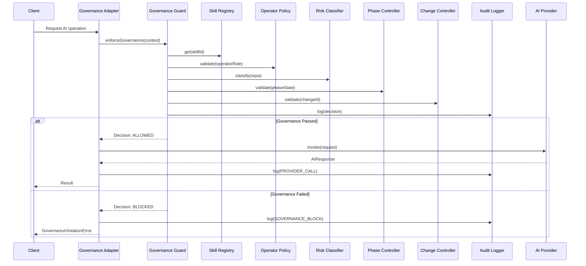
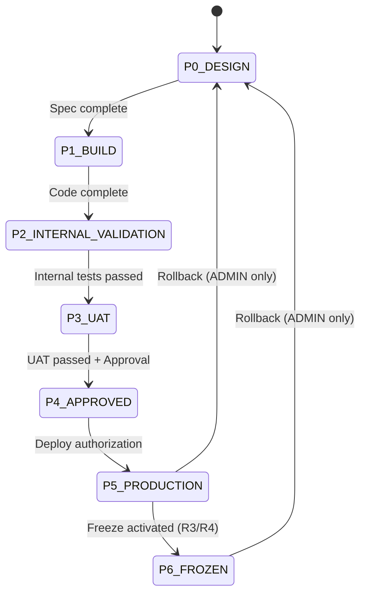
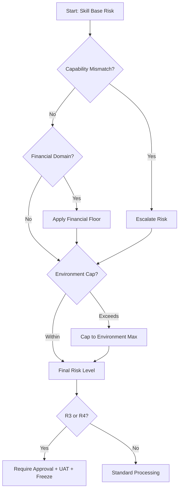

# Architecture Overview — CVF Toolkit Integration Spec

## Layered Architecture

```mermaid
graph TB
    subgraph "Layer 0 — Canonical Reference"
        A[cvf_version.lock.md]
        A2[cvf.version.validator.ts]
    end

    subgraph "Layer 1 — Core Mapping"
        B1[governance.mapping.md]
        B2[risk.phase.mapping.md]
        B3[skill.schema.mapping.md]
        B4[change.control.mapping.md]
        B5[agent.lifecycle.mapping.md]
    end

    subgraph "Layer 2 — Toolkit Core"
        C0[interfaces.ts]
        C01[errors.ts]
        C02[cvf.config.ts]
        C1[audit.logger.ts]
        C2[skill.registry.ts]
        C3[operator.policy.ts]
        C4[risk.classifier.ts]
        C5[phase.controller.ts]
        C6[change.controller.ts]
        C7[governance.guard.ts]
        C8[audit.sanitizer.ts]
    end

    subgraph "Layer 3 — Adapter Layer"
        D1[cvf.skill.adapter.ts]
        D2[cvf.governance.adapter.ts]
        D3[cvf.change.adapter.ts]
        D4[cvf.agent.adapter.ts]
        D5[cvf.audit.adapter.ts]
        D6[adapter.factory.ts]
    end

    subgraph "Layer 4 — Extensions"
        E1[Financial Extension]
        E2[Dexter Integration]
        E3[Extension Template]
    end

    subgraph "Layer 5 — Quality & Versioning"
        F1[UAT Runner]
        F2[Certification Schema]
        F3[Freeze Protocol]
    end

    subgraph "Layer 6 — AI Providers"
        G1[Provider Interface]
        G2[OpenAI Provider]
        G3[Claude Provider]
        G4[Gemini Provider]
        G5[Provider Registry]
    end

    A --> B1
    B1 --> C7
    C7 --> D2
    D2 --> E1
    D2 --> E2
    C7 --> F1
    G1 --> G5
    G5 --> D2
```

## Data Flow: Governance Enforcement

## Phase State Machine

## Risk Classification Flow

## Design Principles

| # | Principle | Description |
|---|-----------|-------------|
| 1 | Governance-first | Governance precedes execution |
| 2 | Domain isolation | Extensions cannot modify core |
| 3 | Deterministic | Same input → same decision |
| 4 | Version locked | Core immutable per version |
| 5 | Extend without mutation | Add, never change |
| 6 | Freeze before deploy | R3/R4 freeze pre-production |
| 7 | Audit everything | Every decision traceable |
| 8 | Risk never downgrades | Escalation only |
| 9 | Sequential phases | No phase skipping |
| 10 | Provider agnostic | Business logic ≠ AI model |
