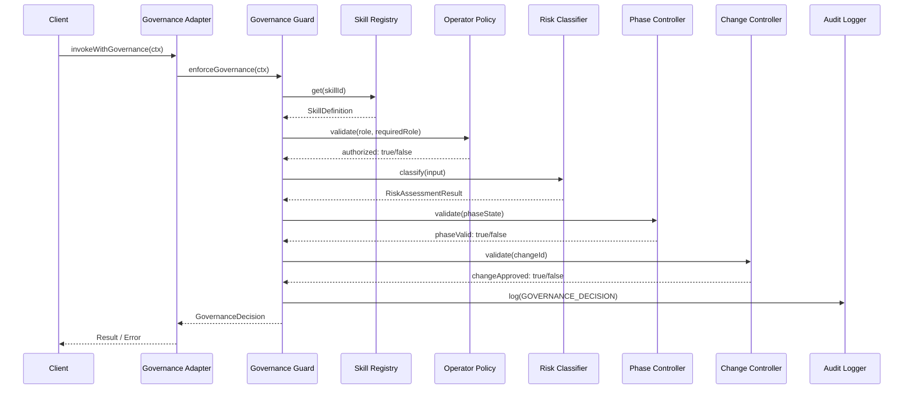
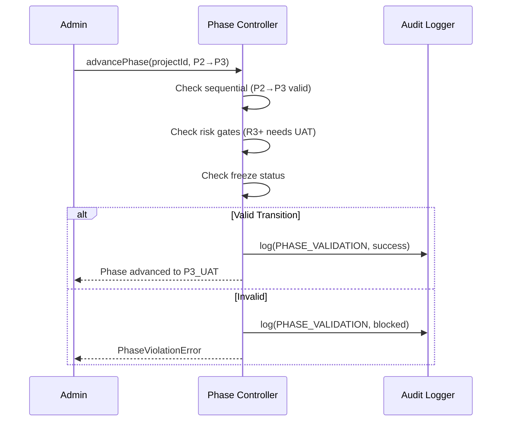
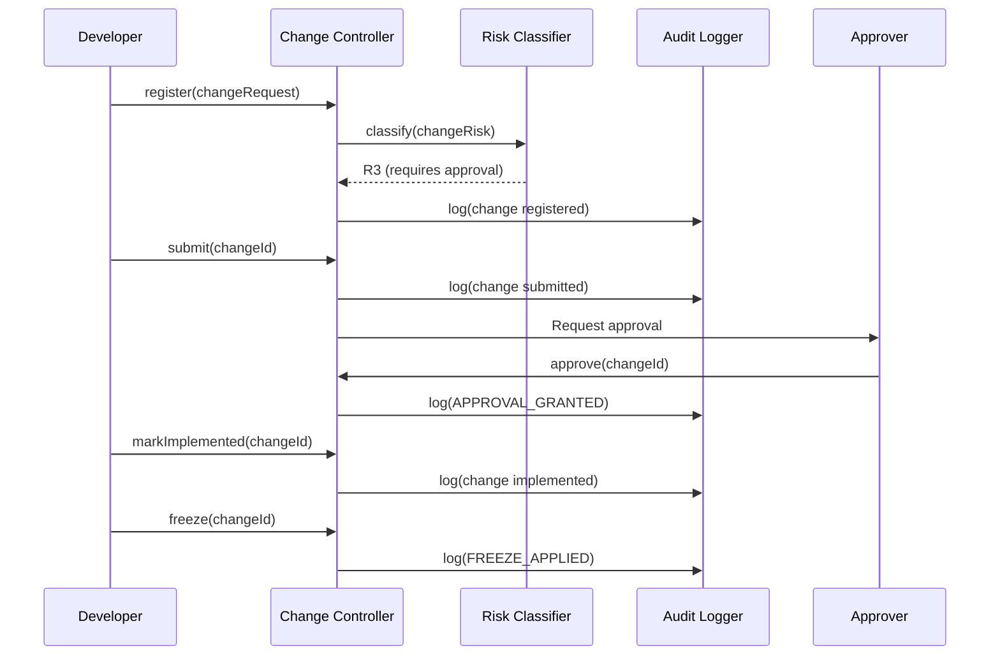
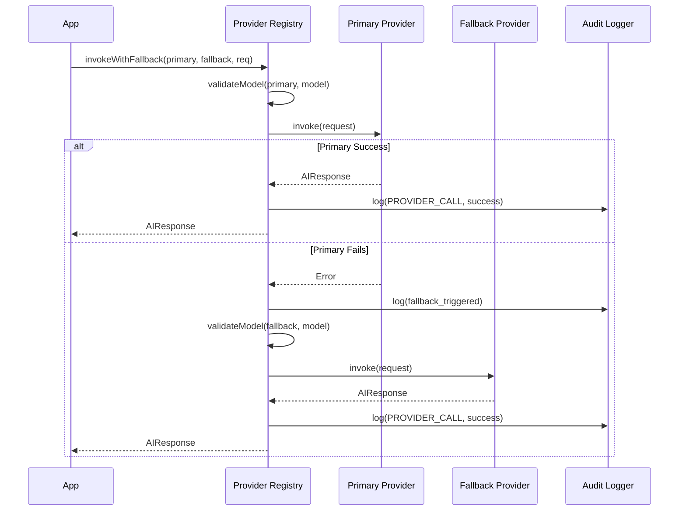
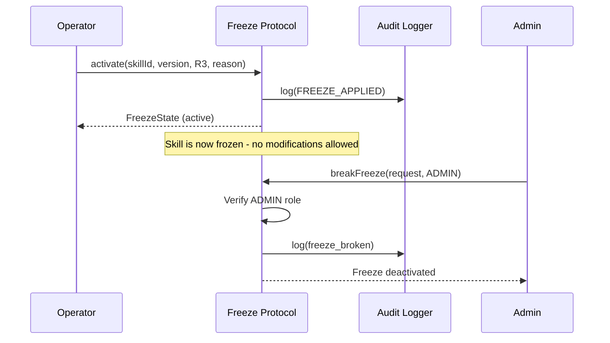

# Sequence Diagrams — CVF Governance Flows

## 1. Governance Enforcement (Full Flow)

## 2. Phase Transition

## 3. Change Control Lifecycle

## 4. Provider Invocation with Fallback

## 5. Freeze + Break Flow

