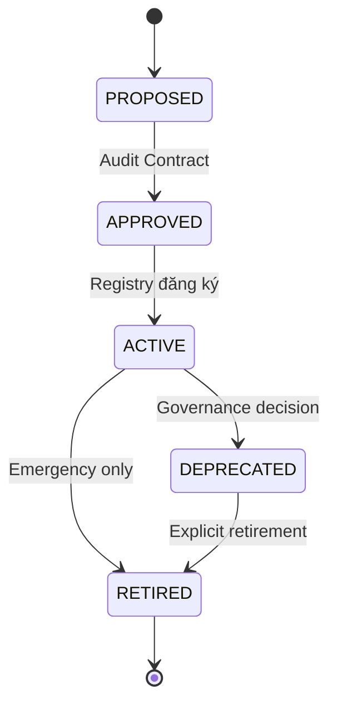

# Capability Lifecycle — CVF v1.2

> **Version:** 1.2 | **Status:** STABLE

---

## 1. Purpose

Tài liệu này định nghĩa vòng đời chính thức của một **Capability** trong CVF v1.2, từ lúc đề xuất → sử dụng → nâng cấp → ngừng hoạt động.

**Mục tiêu:**
- Chặn skill drift
- Tránh "AI biết làm nhưng không ai chịu trách nhiệm"
- Cho phép tiến hóa mà không phá governance

---

## 2. Canonical Lifecycle States

Mọi Capability **BẮT BUỘC** nằm trong đúng 1 trạng thái sau:



| State | Can Execute | Description |
|-------|:-----------:|-------------|
| **PROPOSED** | ❌ | Capability mới được đề xuất |
| **APPROVED** | ⚠️ Sandbox | Đã audit, chưa production |
| **ACTIVE** | ✅ | Production-ready |
| **DEPRECATED** | ⚠️ Warning | Không khuyến khích, backward-compat |
| **RETIRED** | ❌ | Vô hiệu hóa hoàn toàn |

> ⛔ Không có trạng thái ngoài danh sách này.

---

## 3. State Definitions

### 3.1 PROPOSED

Capability mới được đề xuất, chưa được resolve.

**BẮT BUỘC có:**
- Draft Skill Contract
- Risk assessment sơ bộ

| Allowed | Not Allowed |
|---------|-------------|
| Submit for review | ❌ Execution |
| Update contract | ❌ Production use |

---

### 3.2 APPROVED

Skill Contract đã được audit và phê duyệt.

**Yêu cầu:**
- Governance constraints hợp lệ
- Có người chịu trách nhiệm phê duyệt

| Allowed | Not Allowed |
|---------|-------------|
| ✅ Test sandbox | ❌ Production use |
| ✅ Finalize contract | ❌ Critical decisions |

---

### 3.3 ACTIVE

Capability hợp lệ để resolve và execution.

**Đây là trạng thái duy nhất cho production use.**

| Allowed | Required |
|---------|----------|
| ✅ Execution | Audit logging |
| ✅ Registry resolve | Trace mọi action |
| ✅ Chain với capabilities khác | |

---

### 3.4 DEPRECATED

Capability vẫn tồn tại nhưng **KHÔNG khuyến khích** sử dụng.

**Lý do deprecated:**
- Rủi ro đã xác định
- Có capability thay thế
- Governance mismatch

| Allowed | Not Allowed |
|---------|-------------|
| ✅ Backward compatibility | ❌ Quyết định mới |
| ⚠️ Execution (với warning) | ❌ Mở rộng usage |

---

### 3.5 RETIRED

Capability bị **vô hiệu hóa hoàn toàn**.

| Allowed | Not Allowed |
|---------|-------------|
| ✅ Audit lịch sử | ❌ Execution |
| ✅ Reference tài liệu | ❌ Reference trong code mới |

> Contract chỉ giữ để audit lịch sử.

---

## 4. Versioning Rules (CRITICAL)

### 4.1 Contract Versioning

Skill Contract có version riêng với format: `MAJOR.MINOR`

| Thay đổi | Version |
|----------|---------|
| Thêm/bớt input/output | **MAJOR** |
| Siết governance | **MAJOR** |
| Thay đổi risk level | **MAJOR** |
| Làm rõ mô tả | MINOR |
| Sửa typo | MINOR |

### 4.2 Capability ID Stability

> ⚠️ **CAPABILITY_ID KHÔNG BAO GIỜ đổi**

- Version gắn vào contract, không gắn vào ID
- Ví dụ: `CODE_REVIEW_v1` luôn là ID đó, contract version có thể là 1.0, 1.1, 2.0...

### 4.3 Breaking Changes

Breaking change → capability phải:
1. Bị **DEPRECATED**
2. Capability mới được tạo riêng với ID mới

> ❌ **Không overwrite capability đang ACTIVE**

---

## 5. Lifecycle Transitions

| From | To | Điều kiện | Actor |
|------|----|-----------| ------|
| PROPOSED | APPROVED | Audit contract thành công | Reviewer |
| APPROVED | ACTIVE | Registry đăng ký | Registry Admin |
| ACTIVE | DEPRECATED | Governance decision | Owner |
| DEPRECATED | RETIRED | Explicit retirement | Owner |
| ACTIVE | RETIRED | **Emergency only** | Authority |

### Transition Rules

1. **Forward only** — Không quay lại trạng thái trước
2. **Explicit reason** — Mọi transition phải có lý do
3. **Audit trail** — Ghi lại mọi transition

---

## 6. Registry Interaction Rules

| State | Registry Behavior |
|-------|-------------------|
| PROPOSED | ❌ Không resolve |
| APPROVED | ⚠️ Sandbox only |
| **ACTIVE** | ✅ **Resolve bình thường** |
| DEPRECATED | ⚠️ Resolve + Warning |
| RETIRED | ❌ DENY |

```python
# Ví dụ (v1.3 SDK)
capability = registry.resolve(
    capability_id="CODE_REVIEW_v1",
    archetype="Execution",
    phase="C"
)

if capability.state == LifecycleState.DEPRECATED:
    logger.warning(f"Using deprecated capability: {capability.deprecation_reason}")
```

---

## 7. Skill Drift Prevention Rules

Một Capability bị coi là **DRIFTING** nếu:
- Execution behavior khác contract
- Input/output vượt spec
- Governance bị bypass

### Drift Response

```
DRIFT Detected → auto DEPRECATED → pending review
```

| Drift Level | Response |
|-------------|----------|
| Minor (logging issue) | Warning, continue |
| Major (output mismatch) | **auto DEPRECATED** |
| Critical (governance bypass) | **Emergency RETIRED** |

---

## 8. Accountability

Mỗi Capability có:

| Field | Required | Description |
|-------|:--------:|-------------|
| Owner | ✅ | Người chịu trách nhiệm |
| Last audit date | ✅ | Lần audit gần nhất |
| Active contract version | ✅ | Version đang dùng |
| Registered by | ✅ | Người đăng ký vào registry |

> ⚠️ **Không owner = không ACTIVE**

---

## 9. Implementation (v1.3 SDK)

```python
from sdk import SkillRegistry, SkillContract
from sdk.models.capability import Capability, LifecycleState

# Register capability (enters PROPOSED)
capability = registry.register(
    contract=SkillContract.from_yaml("my.contract.yaml"),
    owner="team-name",
    registered_by="admin@example.com"
)

# Approve after review
capability.approve(
    actor="reviewer@example.com",
    reason="Contract meets requirements"
)

# Activate for production
capability.activate(
    actor="admin@example.com",
    reason="Ready for production"
)

# Check state
print(capability.state)  # LifecycleState.ACTIVE
print(capability.can_execute)  # True

# Deprecate when needed
capability.deprecate(
    actor="owner@example.com",
    reason="Replaced by CODE_REVIEW_v2"
)
```

---

## 10. Canonical Status

> Tài liệu này là **chuẩn vòng đời duy nhất** cho capability trong CVF v1.2.

Có thể copy cho domain khác mà không cần sửa core.

---

*Cập nhật: 29/01/2026*