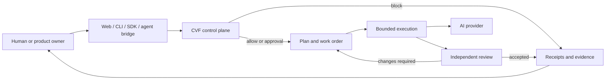

<div align="center">

# Controlled Vibe Framework

### Governed AI execution for real work

Turn a request into a bounded plan, controlled execution, independent review,
and auditable evidence.

**Not faster by default. Safer, clearer, and more governable.**

[](https://github.com/Blackbird081/Controlled-Vibe-Framework-CVF/releases)
[](LICENSE)
[](.github/workflows/cvf-ci.yml)
[](#current-public-status)

[Get started](docs/GET_STARTED.md) | [Architecture](ARCHITECTURE.md) | [Governance](GOVERNANCE.md) | [Technical catalog](docs/reference/CVF_TECHNICAL_PRODUCT_CATALOG_2026-05-18.md)

</div>

---

## Choose your path

| You are... | Start here | What you will find |
| --- | --- | --- |
| A user or product owner | [Getting Started](docs/GET_STARTED.md) | The shortest path to use CVF without reading the internal governance corpus. |
| A developer | [Architecture](ARCHITECTURE.md) | System boundaries, extension points, setup, tests, and repository structure. |
| An AI agent | [Agent Instructions](AGENTS.md) | Operating rules, source-of-truth routing, work-order boundaries, and evidence requirements. |
| A reviewer or evaluator | [External Agent Review Guide](docs/guides/external-agent-review-guide.md) | A paste-ready review route plus public claim and evidence boundaries. |

> The public repository is a product and integration front door. Historical
> handoffs, private continuity records, and development provenance are not the
> reading path for normal users.

## What CVF does

CVF is a governance-first control plane for AI-assisted work. It sits between
a human request, an execution surface, and one or more AI providers.

It helps answer four practical questions:

1. **May this work proceed?** Risk, authority, scope, and approval are checked.
2. **Who should do what?** Planner, worker, reviewer, and closer roles stay distinct.
3. **What evidence is required?** Tests, receipts, diffs, and claim boundaries travel with the work.
4. **Can the work close?** Completion is accepted only when the evidence supports it.

```text
REQUEST
   |
   v
INTAKE -> DESIGN -> WORK ORDER -> BUILD -> REVIEW -> FREEZE
   |                       |          |         |
 classify              bounded    evidence   accept,
 risk/scope            execution   + tests   return,
                                               or block
```

CVF does not replace human judgment. It makes the decision path visible and
keeps an agent from silently expanding its authority.

## Start in five minutes

Clone the public repository:

```bash
git clone https://github.com/Blackbird081/Controlled-Vibe-Framework-CVF.git
cd Controlled-Vibe-Framework-CVF
```

For a normal project, keep CVF as a hidden governance sibling:

```text
CVF-Workspace/
  .Controlled-Vibe-Framework-CVF/
  WORKSPACE_RULES.md
  your-app/
```

On Windows/PowerShell:

```powershell
git clone https://github.com/Blackbird081/Controlled-Vibe-Framework-CVF.git .Controlled-Vibe-Framework-CVF
pwsh .Controlled-Vibe-Framework-CVF/scripts/new-cvf-workspace.ps1 -WorkspaceRoot .
pwsh .Controlled-Vibe-Framework-CVF/scripts/check_cvf_workspace_agent_enforcement.ps1 -WorkspaceRoot .
```

To refresh an existing workspace:

```powershell
pwsh .Controlled-Vibe-Framework-CVF/scripts/update_cvf_workspace_public_core.ps1 -WorkspaceRoot .
```

For Web, CLI, provider, and deployment options, continue with
[Getting Started](docs/GET_STARTED.md).

## Architecture at a glance



The current system also includes:

- **SOT3** for source intake, registered truth, derived context, governed
  output, freeze, and impact recall;
- **MAO** for bounded multi-agent role resolution, durable execution evidence,
  review convergence, and closer interlocks;
- **CVF Web** for operator-facing workflows and read-only governance views;
- **Projection mapping** for detecting drift between provenance, public, and
  Web surfaces without unattended semantic edits.

Read [Architecture](ARCHITECTURE.md) for the complete system shape and
[As-Built System Chain](docs/evidence/as-built-system-chain-and-catalog-2026-07-11.md)
for the evidence-backed implementation view.

## Use CVF by role

### For users and product owners

- Start from the result you need, not from an internal module name.
- Use templates and governed workflows to define scope and expected output.
- Review the decision, evidence, and limitations before accepting the result.

### For developers

- Integrate through a documented Web, CLI, SDK, or agent boundary.
- Keep provider keys user-owned and secret-safe.
- Run focused tests and the applicable governance gates before claiming closure.
- Treat source files as implementation evidence, not automatic proof of
  production readiness.

### For AI agents

- Read [AGENTS.md](AGENTS.md) before governed work.
- Verify source symbols and paths instead of relying on memory.
- Obey allowed paths, forbidden scope, commit ownership, and review routing.
- Return a blocked result when authority or source evidence is missing.

## Current public status

CVF is a **local-first release candidate**, not a hosted SaaS product.

| Capability | Public status | Important boundary |
| --- | --- | --- |
| Governance workflow | Available | Release-quality governance claims require real provider-backed proof. |
| Web application | Available | Route existence or a UI badge alone is not production evidence. |
| CLI, SDK, and agent bridges | Available in bounded surfaces | Each integration retains its own authentication and execution boundary. |
| SOT3 knowledge flow | Source and application foundations available | Registered evidence is distinct from derived output and provider memory. |
| Multi-agent orchestration | Bounded foundation available | No permissionless autonomous agent runtime is claimed. |
| Provider lanes | Configurable | Provider speed, quality, latency, and cost parity are not claimed. |
| Public projection | Curated documentation and selected source | Private provenance and raw operational evidence stay outside this repository. |

Before evaluating a strong claim, read:

- [Public Evaluation Claim Boundary](docs/reference/CVF_PUBLIC_EVALUATION_CLAIM_BOUNDARY_2026-06-04.md)
- [Provider Lane Readiness Matrix](docs/reference/CVF_PROVIDER_LANE_READINESS_MATRIX.md)
- [Known Limitations](docs/reference/CVF_KNOWN_LIMITATIONS_REGISTER_2026-04-21.md)
- [Technical Product Catalog](docs/reference/CVF_TECHNICAL_PRODUCT_CATALOG_2026-05-18.md)

## Live governance proof

Any release-quality claim that CVF controls AI or agent behavior must use a
real provider-backed governance path:

```bash
python scripts/run_cvf_release_gate_bundle.py --json
```

Mock checks are suitable for layout, navigation, static badges, and other
UI-only behavior. They do not prove risk classification, approval flow,
provider routing, DLP filtering, output validation, or audit behavior.

Never commit or print API keys. Supply them through documented environment
variables such as `DASHSCOPE_API_KEY`, `ALIBABA_API_KEY`, or
`DEEPSEEK_API_KEY`.

## Repository map

| Path | Purpose |
| --- | --- |
| `EXTENSIONS/CVF_GUARD_CONTRACT/` | Shared guard semantics and public SDK boundary. |
| `EXTENSIONS/CVF_CONTROL_PLANE_FOUNDATION/` | Control-plane contracts and orchestration composition. |
| `EXTENSIONS/CVF_EXECUTION_PLANE_FOUNDATION/` | Bounded execution and MAO foundations. |
| `EXTENSIONS/CVF_LEARNING_PLANE_FOUNDATION/` | Governed learning and knowledge foundations. |
| `EXTENSIONS/CVF_v1.6_AGENT_PLATFORM/cvf-web/` | Web UI and governed operator workflows. |
| `governance/` | Local and CI compatibility gates. |
| `docs/` | Public guides, architecture, evidence, and reference material. |
| `scripts/` | Setup, verification, workspace, and release helpers. |

## What CVF is not

CVF is not:

- a permissionless autonomous agent runtime;
- a guarantee that every provider performs equally;
- a claim that every route, template, skill, or extension is production-ready;
- a substitute for live evidence when governance behavior is claimed;
- a place to publish secrets, raw provider logs, private handoffs, or internal
  provenance material.

## Documentation

| Topic | Link |
| --- | --- |
| Installation and first run | [Getting Started](docs/GET_STARTED.md) |
| System architecture | [Architecture](ARCHITECTURE.md) |
| Governance model | [Governance](GOVERNANCE.md) |
| Provider configuration | [Providers](PROVIDERS.md) |
| Multi-agent routing | [Multi-Agent Provider Routing](docs/guides/CVF_MULTI_AGENT_PROVIDER_ROUTING.md) |
| Technical capabilities | [Technical Product Catalog](docs/reference/CVF_TECHNICAL_PRODUCT_CATALOG_2026-05-18.md) |
| Public evidence boundary | [Public Evaluation Claim Boundary](docs/reference/CVF_PUBLIC_EVALUATION_CLAIM_BOUNDARY_2026-06-04.md) |
| Full documentation index | [Docs Index](docs/INDEX.md) |

## Contributing

Start with [Contributing](CONTRIBUTING.md). For every change:

1. keep the claim boundary explicit;
2. update affected tests or evidence when behavior changes;
3. run the relevant compatibility gates;
4. keep private provenance material out of the public repository.

Public Markdown changes follow `GC-045` and
`CVF_MARKDOWN_STRUCTURAL_COMPLETENESS_GUARD.md`.

CVF is owned and governed by **Tien / Blackbird081**. AI systems are used as
collaboration tools for design, implementation, review, and documentation. See
[Contributors](CONTRIBUTORS.md).

## License

Licensed under [CC BY-NC-ND 4.0](LICENSE).
