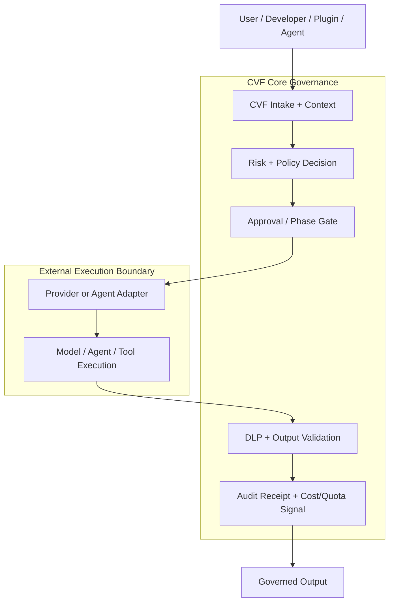

# Controlled Vibe Framework (CVF)

> **Developed by Tien / Blackbird081**
>
> **Controlled vibe coding. Not faster, but safer and more governable.**

[](LICENSE)
[](docs/evidence/latest-release-gate.md)
[](docs/evidence/provider-lanes.md)
[](governance/public-surface-manifest.json)
[](ARCHITECTURE.md)

CVF is a local-first governance control plane for AI and agent execution. It
sits between a user request and any provider, agent, tool, or workflow, then
enforces risk, approval, DLP, provider routing, output validation, audit
receipts, and cost/quota signals before returning governed output.

CVF solves three problems in AI-assisted development: uncontrolled provider
costs, ungoverned agent execution, and lack of verifiable audit trails. Without
CVF, agents can call providers without budget enforcement, leak or repeat
sensitive content in outputs, and leave weak evidence of what ran.

## Attribution

CVF is owned and governed by **Tien / Blackbird081**. Claude and Codex are
acknowledged AI collaboration contributors for design, implementation,
repository maintenance, governance checks, and verification support. See
[CONTRIBUTORS.md](CONTRIBUTORS.md).

## Quick Navigation

<table>
  <tr>
    <td align="center"><a href="#architecture-at-a-glance"><strong>Overview</strong></a></td>
    <td align="center"><a href="#quick-start"><strong>Start Here</strong></a></td>
    <td align="center"><a href="ARCHITECTURE.md"><strong>Architecture</strong></a></td>
    <td align="center"><a href="#technical-footprint"><strong>Tech Stack</strong></a></td>
    <td align="center"><a href="#provider-boundary"><strong>Providers</strong></a></td>
    <td align="center"><a href="#governance-boundary"><strong>Governance</strong></a></td>
    <td align="center"><a href="#public-evidence"><strong>Evidence</strong></a></td>
    <td align="center"><a href="CONTRIBUTORS.md"><strong>Contributors</strong></a></td>
  </tr>
</table>

## Current Live-Proof Boundary

> Current live proof: Alibaba/DashScope is the primary certified release lane
> with a `7/7` release-gate PASS. DeepSeek has bounded provider-lane evidence.
> Other providers may have adapter contracts or experimental integration
> surfaces, but provider parity is not claimed until live evidence exists.

## Architecture At A Glance



CVF should be understood as a governed pass-through layer: outside agents,
plugins, providers, and workflows connect to CVF, pass through CVF's rules and
evidence boundary, then return governed output. CVF does not need to own the
agent that performs the work.

## Current Public Surface

This renewed repository contains the current product surface:

- foundation packages for guard, control, execution, governance expansion, and learning planes
- the `cvf-web` control surface used by operators and non-coders
- release-gate scripts and protected live-gate workflow
- curated evidence summaries and provider boundaries
- public-surface guardrails that keep internal provenance material out of this repo

The full development history is preserved separately in the provenance archive.
See `PROVENANCE.md`.

## Technical Footprint

The public repository is intentionally slimmed for external use, so its GitHub
language mix is different from the private provenance archive. Current public
surface by GitHub Linguist byte count:

| Language | Public role | Current share |
|---|---|---:|
| TypeScript | Web control surface, governance runtime contracts, tests | 98.7% |
| JavaScript | Node scripts, config, build/runtime helpers | 0.8% |
| Python | Release gates, public-surface scanners, provider readiness checks | 0.3% |
| CSS | Web styling surface | 0.1% |

The private provenance archive contains a broader historical language mix and
more internal verification material. The public repo preserves only the current
external-facing implementation, docs, and proof surfaces.

## Quick Start

Install the web app:

```bash
cd EXTENSIONS/CVF_v1.6_AGENT_PLATFORM/cvf-web
npm ci
npm run build
npm run dev
```

Open:

```text
http://localhost:3000
```

For live governance proof, set a DashScope-compatible key in the environment:

```bash
DASHSCOPE_API_KEY=<operator-supplied-key>
```

Accepted aliases:

```text
ALIBABA_API_KEY
CVF_ALIBABA_API_KEY
CVF_BENCHMARK_ALIBABA_KEY
```

Then run:

```bash
python scripts/run_cvf_release_gate_bundle.py --json
```

That command is the release-quality proof command. It includes live governance
E2E and must fail if no DashScope-compatible live key is available.

## Module Map

| Path | Purpose |
|---|---|
| `EXTENSIONS/CVF_GUARD_CONTRACT` | Shared guard contract, typed runtime helpers, default governance engine. |
| `EXTENSIONS/CVF_CONTROL_PLANE_FOUNDATION` | Control-plane contracts for routing, context, knowledge, and coordination. |
| `EXTENSIONS/CVF_EXECUTION_PLANE_FOUNDATION` | Execution-plane contracts for dispatch, policy gates, command runtime, and reintake. |
| `EXTENSIONS/CVF_GOVERNANCE_EXPANSION_FOUNDATION` | Expansion layer for governance checkpoints, watchdog signals, and audit surfaces. |
| `EXTENSIONS/CVF_LEARNING_PLANE_FOUNDATION` | Learning-plane contracts for feedback, scoring, drift, and reinjection. |
| `EXTENSIONS/CVF_v1.6_AGENT_PLATFORM/cvf-web` | Web control surface and non-coder/operator UI. |
| `ECOSYSTEM/doctrine` | Current doctrine and layer model for CVF positioning. |
| `governance/public-surface-manifest.json` | Allowlist and classification for public files. |
| `scripts/check_public_surface.py` | Fast public-release scanner. |

See `ARCHITECTURE.md` for the diagram-first architecture view, including the
module map, dependency rules, active reference path, interaction model, and
clone treeview.

## Provider Boundary

CVF is provider-agnostic by design. Providers connect through bounded adapters
and must expose enough metadata for CVF to govern input, execution, output, and
receipts.

Current public evidence is intentionally bounded:

- Alibaba/DashScope has live release-gate proof on the active lane.
- DeepSeek has confirmatory/provider-lane evidence, not a blanket parity claim.
- OpenAI, Gemini, Claude, and other providers can be added through adapters, but
  this repo does not claim parity until live evidence exists.

See `PROVIDERS.md` and `docs/evidence/provider-lanes.md`.

## Governance Boundary

CVF governance behavior means:

- risk classification
- approval flow
- DLP and redaction
- bypass detection
- provider routing
- output validation
- audit trail and evidence receipts

Any public claim about those behaviors must cite live provider evidence.
Mock mode is acceptable only for UI structure, navigation, layout, and RBAC
checks that do not assert AI governance behavior.

## Cost And Quota

CVF is local-first. The operator supplies provider keys, controls where data is
stored, and decides when cost-bearing live gates run.

Cost/quota controls are part of the governance surface:

- live gates require explicit key/environment setup
- protected GitHub workflow requires an operator confirmation input
- provider keys must never be printed, committed, or stored in evidence
- cost spikes and quota policy belong in `COST_AND_QUOTA.md`

## Netlify

The root `netlify.toml` points Netlify to:

```text
EXTENSIONS/CVF_v1.6_AGENT_PLATFORM/cvf-web
```

If an existing Netlify site was connected to the old repository before renewal,
reconnect it to this renewed repository if Netlify does not follow the GitHub
rename/reuse automatically.

## Public Evidence

Start here:

- `docs/evidence/README.md`
- `docs/evidence/latest-release-gate.md`
- `docs/evidence/provider-lanes.md`
- `docs/evidence/web-governance-path.md`
- `docs/evidence/redaction-and-key-safety.md`
- `docs/evidence/claim-boundaries.md`

## What Is Intentionally Not Here

This public repository does not include the internal operating journal:

- agent handoffs
- Claude/Codex rebuttal chains
- raw wave roadmaps
- raw browser traces
- uncurated audits and baselines
- local runtime state
- provider-key setup transcripts

Those belong in the private provenance archive or local operator storage.
