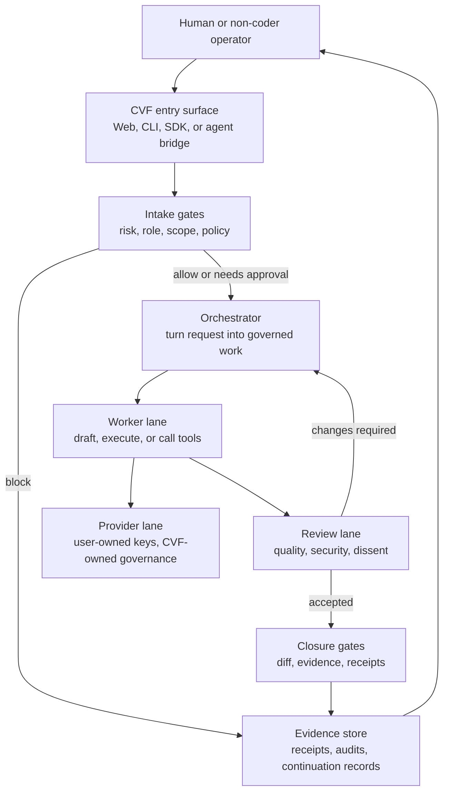

# Controlled Vibe Framework (CVF)

> Governed AI execution for people who need useful output, controlled cost, and
> auditable evidence.

**Controlled vibe coding. Not faster by default, but safer and more governable.**

[](https://github.com/Blackbird081/Controlled-Vibe-Framework-CVF/releases)
[](LICENSE)
[](.github/workflows/cvf-ci.yml)
[](#live-governance-proof)

CVF is owned and governed by **Tien / Blackbird081**. AI systems were used as
collaboration tools for design, implementation, review, and documentation. See
[Contributors](CONTRIBUTORS.md).

## Start Here

| Need | Go to |
| --- | --- |
| Understand the system shape | [Architecture](ARCHITECTURE.md) |
| Understand CVF capabilities and boundaries | [Technical Product Catalog](docs/reference/CVF_TECHNICAL_PRODUCT_CATALOG_2026-05-18.md) |
| Install or run locally | [Getting Started](docs/GET_STARTED.md) |
| Understand governance rules | [Governance](GOVERNANCE.md) |
| Review public claims safely | [Public Evaluation Claim Boundary](docs/reference/CVF_PUBLIC_EVALUATION_CLAIM_BOUNDARY_2026-06-04.md) |
| Ask an external AI reviewer to evaluate CVF | [External Agent Review Guide and paste-ready prompt](docs/guides/external-agent-review-guide.md) |
| Review current public state | [2026-06-27 Public Current State Snapshot](docs/evidence/public-current-state-snapshot-2026-06-27.md) |
| Review external-evaluation baseline | [2026-06-19 Public External Review Snapshot](docs/evidence/public-external-review-snapshot-2026-06-19.md) |
| Review ERH follow-up summary | [ERH Public Sync Summary](docs/reference/CVF_ERH_PUBLIC_SYNC_SUMMARY_2026-06-04.md) |
| Check current evidence and open debt | [Known Limitations](docs/reference/CVF_KNOWN_LIMITATIONS_REGISTER_2026-04-21.md) |
| Configure provider lanes | [Providers](PROVIDERS.md) |
| Choose a multi-agent/provider mix | [Multi-Agent Provider Routing](docs/guides/CVF_MULTI_AGENT_PROVIDER_ROUTING.md) |
| Use CVF with your own project | [Workspace Bootstrap](#workspace-bootstrap) |
| Plan cost and quota | [Cost and Quota](COST_AND_QUOTA.md) |
| Contribute safely | [Contributing](CONTRIBUTING.md) |

Governed artifact authors must also follow the machine-enforced
`CVF_GOVERNED_ARTIFACT_AUTHORING_GUARD.md` chain before claiming a public
export, closure, or catalog update is complete.
Knowledge absorption and extension work must also respect
`CVF_KNOWLEDGE_ABSORPTION_PRIORITY_GUARD.md` before creating a new public
runtime or documentation surface.
Template and skill value-proof work must respect
`CVF_TEMPLATE_SKILL_STANDARD_GUARD.md` before claiming trusted benchmark value.

## Governance Guards

The guard registry is intentionally not duplicated in this README. Use:

- [Core Knowledge Base](docs/CVF_CORE_KNOWLEDGE_BASE.md)
- [Operation Guard Toolkit](governance/toolkit/05_OPERATION/)
- [Guard Surface Classification](docs/reference/CVF_GUARD_SURFACE_CLASSIFICATION.md)
- [Public Evaluation Claim Boundary](docs/reference/CVF_PUBLIC_EVALUATION_CLAIM_BOUNDARY_2026-06-04.md)

## What CVF Is

CVF is a governance-first control plane for AI-assisted work. It sits between a
human request, the execution surface, and one or more AI providers.

CVF decides:

- whether a request is allowed, blocked, or needs approval;
- which role and provider lane may handle the work;
- what evidence must be recorded before the result can be trusted;
- whether a workflow can close, continue, or must return to review.

The governed workflow is intentionally explicit:

```text
INTAKE -> DESIGN -> SPEC -> WORK ORDER -> BUILD -> REVIEW -> FREEZE
```

That workflow is the public control map. CVF expands each stage into smaller
gates so an agent does not jump from a request directly into implementation:

```text
INTAKE
  -> request capture
  -> source/context intake
  -> authority, risk, and domain classification
  -> ambiguity ledger

DESIGN
  -> scope boundary
  -> non-goals
  -> lane split
  -> dependency and source-verification plan
  -> claim boundary
  -> acceptance criteria
  -> dispatch-readiness decision

SPEC
  -> contract, schema, or interface
  -> machine-readable semantics
  -> invariants and failure tokens
  -> evidence requirements

WORK ORDER
  -> allowed paths and forbidden paths
  -> source verification table
  -> implementation steps
  -> test plan
  -> worker return schema
  -> commit authority boundary

BUILD
  -> implementation
  -> focused tests
  -> local gates
  -> artifact production

REVIEW
  -> diff gate
  -> roadmap-to-work-order trace
  -> acceptance matrix
  -> finding-to-governance disposition
  -> closure decision

FREEZE
  -> commit
  -> session or handoff sync
  -> public export disposition
  -> next allowed move
```

The purpose of the detailed map is control, not ceremony: ambiguity should be
resolved in intake and design; source facts should be verified before work
orders; build should execute a bounded packet; review should close only what
the evidence supports.

## Why It Exists

Ungoverned agent workflows can spend tokens without budget discipline, mutate
files outside scope, skip review, blur provider responsibility, and leave weak
audit trails.

CVF keeps the useful parts of AI-assisted execution while adding:

- policy and risk gates before execution;
- role boundaries for planners, workers, reviewers, and closure checks;
- provider routing that remains subordinate to governance;
- evidence receipts and review records;
- live-proof requirements for public governance claims.

## Architecture Map



This map is the public front-door view. For layer diagrams and dependency
rules, read [Architecture](ARCHITECTURE.md).

## Multi-Agent Routing

CVF routes by **role, policy, evidence, and cost boundary**. Provider/model
choices are configuration decisions, not the source of trust.

| Stage | Purpose | Closure requirement |
| --- | --- | --- |
| Intake gates | classify request, risk, scope, and approval need | decision and policy basis recorded |
| Orchestrator | create structured work orders or execution plan | source facts and allowed scope verified |
| Worker | implement, call tools, or produce the governed output | diff, tests, receipts, or explicit N/A |
| Reviewer | check quality, safety, and claim boundaries | findings resolved or returned |
| Closure gates | verify final state and evidence | no false PASS, no unbacked readiness claim |

Detailed provider recipes and model-lane notes belong in [Providers](PROVIDERS.md)
and [Multi-Agent Provider Routing](docs/guides/CVF_MULTI_AGENT_PROVIDER_ROUTING.md),
not in the README front door.

## Current Public Claims

CVF can currently claim the following bounded capabilities. Public readers and
external agents should also read the
[External Agent Review Guide](docs/guides/external-agent-review-guide.md) and
[Public Evaluation Claim Boundary](docs/reference/CVF_PUBLIC_EVALUATION_CLAIM_BOUNDARY_2026-06-04.md)
before treating route files, CI badges, demo data, or connector specs as proof.

Current public evidence snapshot:

| Area | Public status | Boundary |
| --- | --- | --- |
| Live governance proof | Protected/manual live gate is the release-quality path. | Requires operator-supplied provider key and may consume paid quota. |
| Static CI and coverage | Public workflows expose build, docs, static governance, and web coverage jobs. | A workflow file or badge is not a current pass unless the run artifact is inspected. |
| Route governance | Some governed route paths have linked evidence and tests. | Route existence alone is inventory, not route coverage proof. |
| Agent work-order governance | Public docs now record authoring-time guard lessons for dispatch prompt placement, CVF-governed lesson capture, and stale next-move handling. | Documentation/front-door calibration only unless a linked public checker or live proof supports a stronger claim. |
| Memory Plane Integration | MPI-T5 public static checker is exported; MPI-T6 runtime remains parked with concrete reopen conditions. | No runtime memory route, vector/durable-store expansion, MCP/CLI adapter, provider/live, or route-side federation claim. |
| Foundation plane roadmap direction | Current priority is plane-to-system workflow-chain completion through interlock and machine-check gap closure. | Roadmap direction only; no public registry edit, checker implementation, runtime/provider behavior, or production-readiness claim. |
| Benchmark quality | QBS methodology and limitations are public. | Reviewer agreement, corpus size, and provider-quality parity remain bounded limitations. |
| Product maturity | Local-first framework with public setup docs and web UI. | No hosted SaaS, enterprise SSO/PostgreSQL readiness, or production deployment claim. |

- a governed non-coder AI path has live evidence on the primary Alibaba lane;
- Alibaba, DeepSeek, and OpenAI have certified provider-lane evidence where
  listed in the provider readiness matrix;
- governance behavior claims require live provider-backed proof;
- mock mode is valid for UI structure checks only;
- static CI checks do not replace protected live release-gate proof;
- route source files do not prove route governance coverage without a linked
  evidence path;
- provider speed, quality, latency, and cost parity are **not** claimed;
- public readiness is limited to the evidence and boundaries linked below.

Important evidence anchors:

- [2026-06-27 Public Current State Snapshot](docs/evidence/public-current-state-snapshot-2026-06-27.md)
- [2026-06-19 Public External Review Snapshot](docs/evidence/public-external-review-snapshot-2026-06-19.md)
- [MPI-T5 Public Sync Note](docs/assessments/CVF_PUBLIC_SYNC_MPI_T5_MEMORY_ACCESS_CLAIM_CHECKER_2026-06-22.md)
- [Provider Lane Readiness Matrix](docs/reference/CVF_PROVIDER_LANE_READINESS_MATRIX.md)
- [Public Non-Coder Value Statement](docs/reference/CVF_PUBLIC_NONCODER_VALUE_STATEMENT_2026-04-17.md)
- [Live Evidence Publication Packet](docs/reference/CVF_LIVE_EVIDENCE_PUBLICATION_PACKET_2026-04-21.md)
- [Release Candidate Truth Packet](docs/reference/CVF_RELEASE_CANDIDATE_TRUTH_PACKET_2026-04-21.md)
- [Known Limitations Register](docs/reference/CVF_KNOWN_LIMITATIONS_REGISTER_2026-04-21.md)
- [ERH Public Sync Summary](docs/reference/CVF_ERH_PUBLIC_SYNC_SUMMARY_2026-06-04.md)
- [2026-06-16 Public Front-Door and Catalog Sync](docs/evidence/cvf-16-06-public-front-door-catalog-sync.md)

## Live Governance Proof

Any release-quality claim that CVF controls AI or agent behavior must run a real
provider-backed governance path.

```bash
python scripts/run_cvf_release_gate_bundle.py --json
```

Mock checks can validate navigation, layout, static badges, and other UI-only
surfaces. They do not prove risk classification, provider routing, approval
flow, DLP filtering, output validation, or audit behavior.

Never commit or print raw API keys. Use environment variables such as
`DASHSCOPE_API_KEY`, `ALIBABA_API_KEY`, or `DEEPSEEK_API_KEY`.

## Quick Start

Clone the repository:

```bash
git clone https://github.com/Blackbird081/Controlled-Vibe-Framework-CVF.git
cd Controlled-Vibe-Framework-CVF
```

Install only the extension you are actively using:

```bash
cd EXTENSIONS/<target-extension>
npm ci
```

If that extension has no `package-lock.json`, use:

```bash
npm install
```

For setup and deployment details, use:

- [Getting Started](docs/GET_STARTED.md)
- [Deploy Guide](docs/guides/CVF_DEPLOY_GUIDE.md)
- [Security](SECURITY.md)

## Workspace Bootstrap

For normal user/dev work, keep CVF as a hidden governance core in a parent
workspace and put downstream projects beside it:

```text
CVF-Workspace/
  .Controlled-Vibe-Framework-CVF/
  WORKSPACE_RULES.md
  your-app/
```

Fresh setup:

```powershell
git clone https://github.com/Blackbird081/Controlled-Vibe-Framework-CVF.git .Controlled-Vibe-Framework-CVF
pwsh .Controlled-Vibe-Framework-CVF/scripts/new-cvf-workspace.ps1 -WorkspaceRoot .
pwsh .Controlled-Vibe-Framework-CVF/scripts/check_cvf_workspace_agent_enforcement.ps1 -WorkspaceRoot .
```

Refresh an older local workspace core:

```powershell
pwsh .Controlled-Vibe-Framework-CVF/scripts/update_cvf_workspace_public_core.ps1 -WorkspaceRoot .
```

See [Workspace Rules](docs/reference/CVF_WORKSPACE_RULES.md) and
[New Machine Setup Checklist](docs/reference/CVF_NEW_MACHINE_SETUP_CHECKLIST.md).

## Repository Map

| Path | Purpose |
| --- | --- |
| `EXTENSIONS/CVF_GUARD_CONTRACT/` | shared guard semantics and public SDK boundary |
| `EXTENSIONS/CVF_v1.1.1_PHASE_GOVERNANCE_PROTOCOL/` | canonical phase and governance runtime primitives |
| `EXTENSIONS/CVF_v1.6_AGENT_PLATFORM/cvf-web/` | web UI, non-coder flows, provider settings, governed execute path |
| `governance/` | local and CI compatibility gates |
| `docs/` | public docs, evidence packets, guides, roadmaps, and reviews |
| `ECOSYSTEM/` | doctrine, operating model, and ecosystem context |

## What CVF Is Not

CVF is not:

- a claim that every provider has equal quality, speed, or cost;
- a permissionless autonomous agent runtime;
- a guarantee that all legacy templates or skills are production-ready;
- a substitute for live evidence when governance behavior is claimed;
- a claim that every public API route is governed or production-ready merely
  because the route exists in source;
- a claim that MPI-T6 runtime memory access, vector/durable storage,
  external-agent MCP/CLI read access, or route-side memory federation is open
  by default;
- a place to publish private keys, raw provider logs, or internal provenance
  material.

## Documentation

| Topic | Link |
| --- | --- |
| Architecture front door | [ARCHITECTURE.md](ARCHITECTURE.md) |
| Governance model | [GOVERNANCE.md](GOVERNANCE.md) |
| Public claim boundary | [CVF Public Evaluation Claim Boundary](docs/reference/CVF_PUBLIC_EVALUATION_CLAIM_BOUNDARY_2026-06-04.md) |
| Provider setup and boundaries | [PROVIDERS.md](PROVIDERS.md) |
| Multi-agent provider routing | [CVF Multi-Agent Provider Routing](docs/guides/CVF_MULTI_AGENT_PROVIDER_ROUTING.md) |
| Cost and quota | [COST_AND_QUOTA.md](COST_AND_QUOTA.md) |
| Documentation index | [docs/INDEX.md](docs/INDEX.md) |
| Technical product catalog | [CVF Technical Product Catalog](docs/reference/CVF_TECHNICAL_PRODUCT_CATALOG_2026-05-18.md) |
| Vietnamese guide | [Getting Started](docs/GET_STARTED.md) |

## Contributing

For contributor attribution and AI collaboration roles, see
[Contributors](CONTRIBUTORS.md).

For code or documentation changes:

1. keep the claim boundary explicit;
2. update the affected tests or evidence when behavior changes;
3. run the relevant governance compatibility gates;
4. do not publish private provenance material into this public repository.

Public Markdown changes follow `GC-045` and
`CVF_MARKDOWN_STRUCTURAL_COMPLETENESS_GUARD.md`.

Start with [Contributing](CONTRIBUTING.md).

## License

Licensed under [CC BY-NC-ND 4.0](LICENSE).
