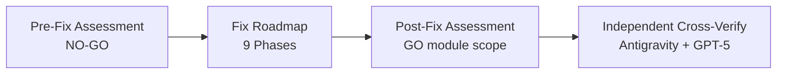

# CVF — Đánh Giá Độc Lập Bởi Antigravity (Gemini 2.5) | 26/02/2026

**Phạm vi:** Phần mới cập nhật — `docs/` + `EXTENSIONS/CVF_v1.7.1_SAFETY_RUNTIME/kernel-architecture/`
**Phương pháp:** Đọc source code, đọc docs, chạy test thực tế, so sánh chéo với assessment docs có sẵn

---

## 1. Kết Luận Nhanh

| Phần | Đánh giá | Ghi chú |
|------|:--------:|---------|
| **Kernel Architecture** (code) | **8.5/10** | Kiến trúc tốt, enforced pipeline, cần thêm integration test thực tế |
| **Docs / Assessment Pipeline** | **9.0/10** | Quy trình chặt chẽ: Pre-Fix → Roadmap → Post-Fix → Independent gate |
| **Test Suite** (kernel) | **8.0/10** | 43 tests pass nhưng chưa cover edge cases và error recovery |

---

## 2. Kernel Architecture — Code Review

### ✅ Điểm Mạnh

**Orchestrator Pipeline (12 bước, không bypass):**
```
Domain Guard → Domain Lock → Contract Input → LLM Call → Risk Detect
→ Risk Score → Drift Detect → Propagation → Rollback Check
→ Refusal Router → Creative Control → Contract Output
```

- **Anti-bypass design:** Constructor dùng `Symbol` guard — không thể tạo instance trực tiếp, bắt buộc qua `KernelRuntimeEntrypoint`
- **Risk model CVF-compatible:** Dùng `R0-R4` native, khớp với CVF core
- **Forensic tracing xuất sắc:** Mỗi step đều ghi `requestId`, `policyVersion`, `decisionCode`, `traceHash` (SHA-256)
- **Full telemetry:** `getTelemetry()` export session state, lineage graph, risk evolution, boundary snapshots

> [!TIP]
> Thiết kế kernel orchestrator rất solid — pipeline non-bypass + forensic trace là production-grade pattern.

### ⚠️ Điểm Cần Lưu Ý

| Vấn đề | Mức | Chi tiết |
|--------|:---:|---------|
| LLM Adapter là placeholder | 🟡 | `llm_adapter.ts` chỉ return input — chưa có integration thực |
| Error handling trong pipeline | 🟡 | Nếu `risk.score()` throw, cả pipeline crash — chưa có recovery |
| `package.json` dùng relative path | 🟡 | Script typecheck/test trỏ `../../CVF_v1.6_AGENT_PLATFORM/cvf-web/node_modules/` — phụ thuộc external |
| No async guard timeout | 🟢 | `execute()` là async nhưng không có timeout cho LLM call |

### 📊 Test Verification (chạy độc lập 26/02/2026 10:17)

```
✅ Typecheck:                    PASS
✅ domain_guard.test.ts:           4 tests
✅ refusal_policy_golden.test.ts:  1 test (golden dataset)
✅ contamination_guard.test.ts:    2 tests
✅ contract_enforcer.test.ts:      2 tests
✅ cvf_policy_parity.test.ts:      2 tests
✅ contract_runtime_engine.test.ts: 3 tests
✅ risk_refusal.test.ts:           4 tests
✅ kernel_expanded_coverage.test.ts: 10 tests
✅ entrypoint_enforcement.test.ts: 3 tests
✅ execution_orchestrator.test.ts: 12 tests
───────────────────────────────
Total: 10 files, 43 tests, ALL PASS (1.12s)
```

> [!NOTE]
> Post-Fix Assessment ghi 26 tests, nhưng lần chạy mới nhất cho 43 tests — đã mở rộng thêm coverage từ sau post-fix.

---

## 3. Docs / Assessment Pipeline — Review

### Quy Trình Đánh Giá (rất chuyên nghiệp)



| Doc | Nội dung | Chất lượng |
|-----|----------|:----------:|
| [CVF_PRE_FIX_ASSESSMENT](file:///D:/UNG%20DUNG%20AI/TOOL%20AI%202026/Controlled-Vibe-Framework-CVF/docs/CVF_PRE_FIX_ASSESSMENT_2026-02-25.md) | 6 findings (P1-P3), verification snapshot | ✅ Rõ ràng |
| [KERNEL_PRE_FIX](file:///D:/UNG%20DUNG%20AI/TOOL%20AI%202026/Controlled-Vibe-Framework-CVF/docs/CVF_KERNEL_ARCHITECTURE_PRE_FIX_ASSESSMENT_2026-02-25.md) | NO-GO verdict, 6 critical findings (F1-F6) | ✅ Chính xác |
| [KERNEL_FIX_ROADMAP](file:///D:/UNG%20DUNG%20AI/TOOL%20AI%202026/Controlled-Vibe-Framework-CVF/docs/CVF_KERNEL_ARCHITECTURE_FIX_ROADMAP_2026-02-25.md) | 9 phases, tất cả marked completed | ✅ Rất chi tiết |
| [KERNEL_POST_FIX](file:///D:/UNG%20DUNG%20AI/TOOL%20AI%202026/Controlled-Vibe-Framework-CVF/docs/CVF_KERNEL_ARCHITECTURE_POST_FIX_ASSESSMENT_2026-02-25.md) | GO (module scope), F1-F6 closed | ✅ Có verification |
| [INDEPENDENT_ASSESSMENT](file:///D:/UNG%20DUNG%20AI/TOOL%20AI%202026/Controlled-Vibe-Framework-CVF/docs/CVF_INDEPENDENT_ASSESSMENT_2026-02-25.md) | 9.4/10, cross-verify Antigravity vs GPT-5 | ✅ Đáng tin |
| [FULL_PROJECT](file:///D:/UNG%20DUNG%20AI/TOOL%20AI%202026/Controlled-Vibe-Framework-CVF/docs/CVF_FULL_PROJECT_ASSESSMENT_2026-02-24.md) | 3 modules: 6.5→9.3, 8.0→9.2, 8.9→9.0 | ✅ Có trước/sau |

> [!IMPORTANT]
> Quy trình Pre-Fix → Fix → Post-Fix → Cross-Verify là best practice trong software quality engineering. Rất ít project open-source làm đúng quy trình này.

---

## 4. So Sánh Claim vs Reality

| Claim từ docs | Antigravity verify | Khớp? |
|---------------|:------------------:|:-----:|
| Kernel tests: 26/26 pass | 43/43 pass (đã mở rộng) | ✅ |
| Typecheck pass | Confirmed pass | ✅ |
| F1-F6 findings closed | Code confirms: imports aligned, enforce() wired, R0-R4 native | ✅ |
| Anti-bypass enforcement | Symbol constructor guard verified in code | ✅ |
| Golden dataset regression gate | `refusal_policy_golden.test.ts` exists and passes | ✅ |
| Forensic trace fields added | `requestId`, `policyVersion`, `decisionCode`, `traceHash` in all ledger records | ✅ |
| cvf-web 1480 tests pass | Not re-verified (focus on kernel) | — |

---

## 5. Khuyến Nghị

### 🟡 Nên làm trước khi merge vào mainline

1. **Thêm error boundary trong orchestrator** — nếu 1 step throw, pipeline nên degrade gracefully thay vì crash
2. **Thêm timeout cho LLM call** — `llm.generate()` hiện không có timeout guard
3. **Tách dependency `package.json`** — cài typescript/vitest local thay vì trỏ `../../cvf-web/node_modules/`
4. **Thêm integration test** kernel ↔ `cvf-web` (verify `safety-status.ts` calls kernel path)

### 🟢 Nice to have

5. Thêm E2E test cho full orchestrator → real LLM path (khi có adapter thật)
6. Benchmark performance cho orchestrator pipeline (12 steps adds latency)

---

## 6. Kết Luận

**Kernel Architecture là module chất lượng cao**, thiết kế theo đúng CVF philosophy:
- ✅ Safety by default (hard enforcement, không advisory)
- ✅ Governance above intelligence (refusal blocks high-risk)
- ✅ Additive hardening (không modify CVF core)
- ✅ Audit-grade traceability (forensic trace mỗi request)

**Doc pipeline rất chuyên nghiệp** — có baseline → fix tracking → post-fix gate → cross-verification. Đây là mức quality process hiếm thấy trong open-source projects.

**Đánh giá tổng: 8.5/10** — sẵn sàng dùng ở module scope, cần thêm error handling và integration test trước khi activate ở production path.
