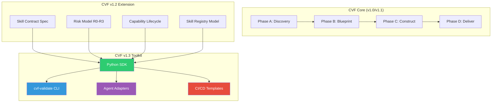
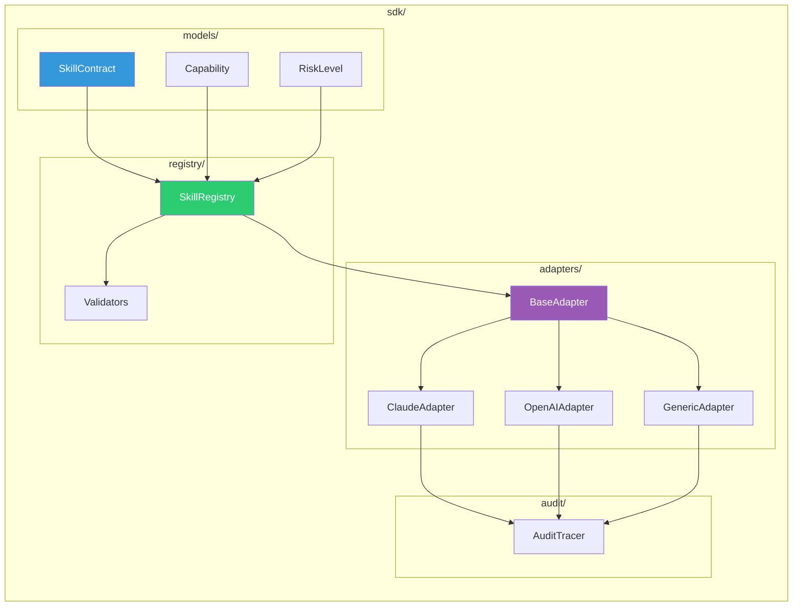
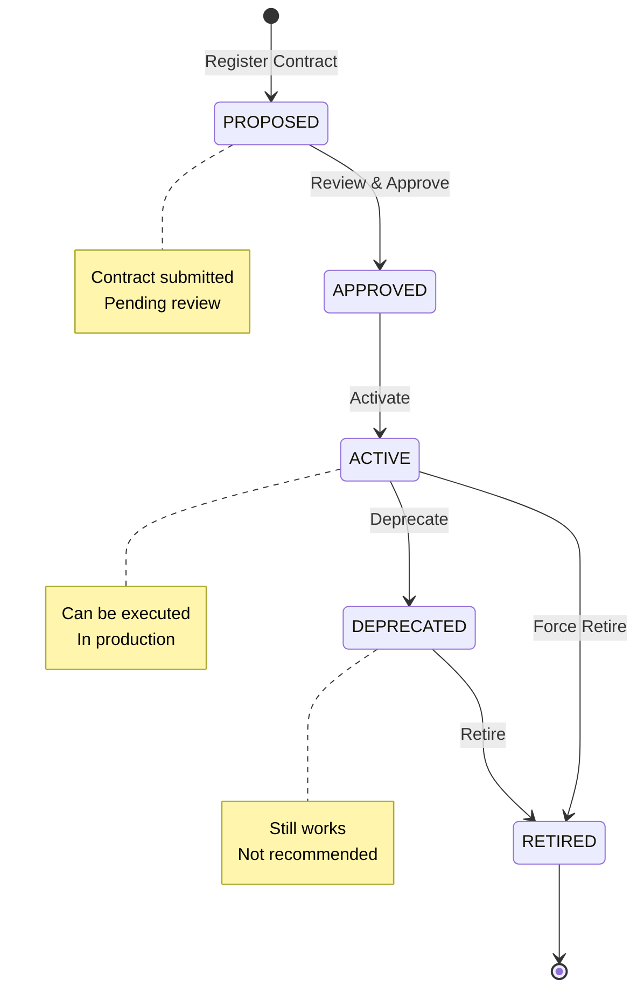
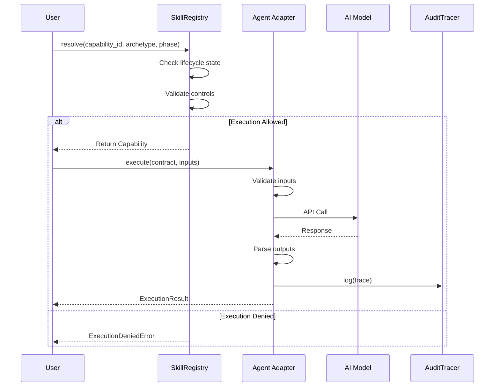
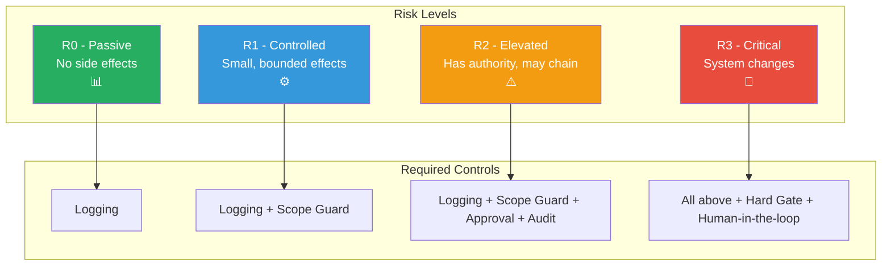
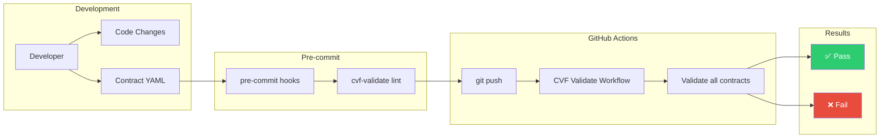
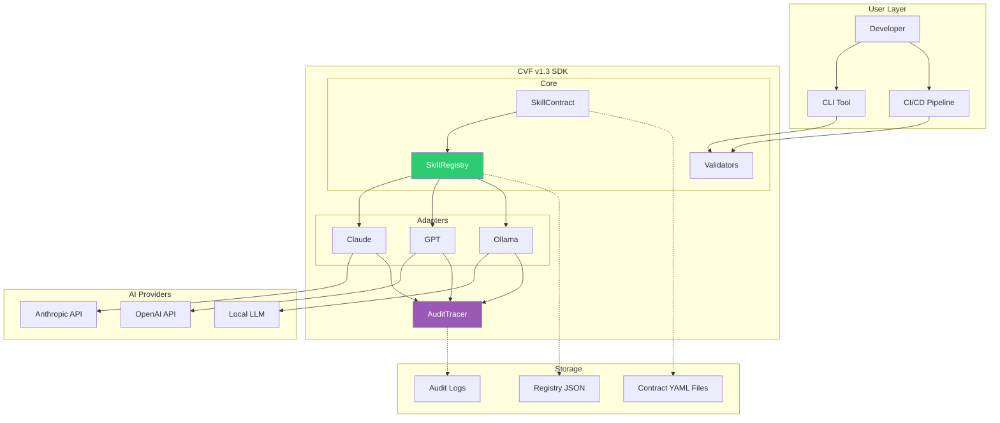

# CVF v1.3 Architecture Diagrams

Tài liệu này chứa các sơ đồ kiến trúc minh họa cho CVF v1.3 Implementation Toolkit.

---

## 1. Tổng quan Kiến trúc CVF

---

## 2. SDK Component Architecture

---

## 3. Capability Lifecycle Flow

---

## 4. Execution Flow with Adapter

---

## 5. Risk Model Hierarchy

---

## 6. CI/CD Integration Flow

---

## 7. Full System Architecture

---

## Sử dụng Diagrams

Các diagrams này có thể được render bằng:

1. **GitHub** - Tự động render Mermaid trong markdown files
2. **VS Code** - Cài extension "Markdown Preview Mermaid Support"
3. **Online** - Sử dụng [Mermaid Live Editor](https://mermaid.live)

---

*Cập nhật: 29/01/2026*
