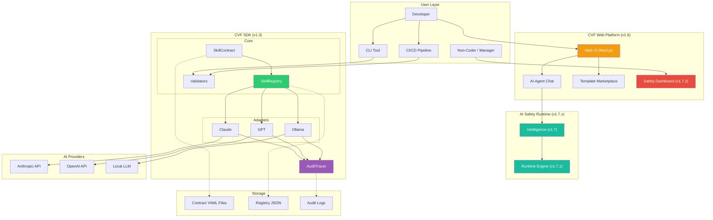

```mermaid
flowchart LR
    subgraph "Development"
        DEV[Developer]
        CODE[Code Changes]
        CONTRACT[Contract YAML]
    end

    subgraph "Pre-commit"
        PC[pre-commit hooks]
        LINT[cvf-validate lint]
    end

    subgraph "GitHub Actions"
        PUSH[git push]
        GA[CVF Validate Workflow]
        VAL2[Validate all contracts]
    end

    subgraph "Results"
        PASS[✅ Pass]
        FAIL[❌ Fail]
    end

    DEV --> CODE
    DEV --> CONTRACT
    CONTRACT --> PC
    PC --> LINT
    LINT --> PUSH
    PUSH --> GA
    GA --> VAL2
    VAL2 --> PASS
    VAL2 --> FAIL

    style PASS fill:#2ecc71,color:#fff
    style FAIL fill:#e74c3c,color:#fff
```

# CVF Architecture Diagrams

This document contains architecture diagrams illustrating the full CVF stack from v1.0 through v1.7.2.

---

## 1. Full Architecture Overview (5 Layers)

```mermaid
flowchart TB
    subgraph "Layer 5: Safety Dashboard (v1.7.2)"
        DASH["🛡️ Safety Dashboard"]
        RISK["Risk View: 🟢🟡🟠🔴"]
        SIM["Policy Simulation"]
    end

    subgraph "Layer 4: Agent Platform (v1.6)"
        WEB["🌐 Web UI (Next.js)"]
        CHAT["AI Agent Chat"]
        TOOLS["34 Agent Tools"]
        GOV["🔐 Governance Engine (v1.6.1)"]
    end

    subgraph "Layer 3: AI Safety Runtime (v1.7/v1.7.1)"
        INTEL["🧠 Controlled Intelligence (v1.7)"]
        GATE["Reasoning Gate"]
        ENTROPY["Entropy Guard"]
        SANITIZE["Prompt Sanitizer"]
        RUNTIME["⚙️ Safety Runtime (v1.7.1)"]
        POLICY["Policy Lifecycle Engine"]
        AUTH["Auth + DI Container"]
        AUDIT["Audit Trail"]
    end

    subgraph "Layer 2: Tools (v1.3)"
        SDK["Python SDK"]
        CLI["cvf-validate CLI"]
        ADP["Agent Adapters"]
        CICD["CI/CD Templates"]
    end

    subgraph "Layer 1: Core (v1.0/v1.1/v1.2)"
        PHASES["Phase A→D"]
        SKILLS["141 Skills"]
        RISKM["Risk Model R0-R3"]
        REGISTRY["Skill Registry"]
    end

    DASH --> WEB
    RISK --> RUNTIME
    SIM --> POLICY
    WEB --> INTEL
    CHAT --> SANITIZE
    GOV --> RUNTIME
    INTEL --> GATE
    INTEL --> ENTROPY
    INTEL --> SANITIZE
    RUNTIME --> POLICY
    RUNTIME --> AUTH
    RUNTIME --> AUDIT
    SDK --> REGISTRY
    CLI --> REGISTRY
    PHASES --> SKILLS
    SKILLS --> RISKM
    RISKM --> REGISTRY

    style DASH fill:#e74c3c,color:#fff
    style WEB fill:#f39c12,color:#fff
    style INTEL fill:#1abc9c,color:#fff
    style RUNTIME fill:#1abc9c,color:#fff
    style SDK fill:#2ecc71,color:#fff
    style PHASES fill:#3498db,color:#fff
```

---

## 2. CVF v1.3 SDK Component Architecture

---

## 3. Capability Lifecycle Flow

---

## 4. Execution Flow with Adapter

---

## 5. Risk Model Hierarchy

---

## 6. AI Safety Runtime Architecture (v1.7.x)

```mermaid
flowchart TB
    subgraph "Input"
        USER_MSG["User Message"]
    end

    subgraph "v1.7 Intelligence Layer"
        SANITIZE["Prompt Sanitizer"]
        ENTROPY["Entropy Guard"]
        ANOMALY["Anomaly Detector"]
        GATE["Reasoning Gate"]
    end

    subgraph "v1.7.1 Runtime Layer"
        POLICY["Policy Engine"]
        AUTH2["Auth Module"]
        DI["DI Container"]
        AUDIT2["Audit Logger"]
    end

    subgraph "Decision"
        ALLOW["🟢 Allow"]
        STRIP["🟡 Strip & Allow"]
        BLOCK["🔴 Block"]
    end

    USER_MSG --> SANITIZE
    SANITIZE --> ENTROPY
    ENTROPY --> ANOMALY
    ANOMALY --> GATE
    GATE --> POLICY
    POLICY --> AUTH2
    AUTH2 --> DI
    
    POLICY --> ALLOW
    POLICY --> STRIP
    POLICY --> BLOCK

    ALLOW --> AUDIT2
    STRIP --> AUDIT2
    BLOCK --> AUDIT2

    style SANITIZE fill:#1abc9c,color:#fff
    style POLICY fill:#e74c3c,color:#fff
    style ALLOW fill:#27ae60,color:#fff
    style STRIP fill:#f39c12,color:#fff
    style BLOCK fill:#e74c3c,color:#fff
```

---

## 7. CI/CD Integration Flow

---

## 8. Full System Architecture (v1.7.2)

---

## Using These Diagrams

These diagrams can be rendered using:

1. **GitHub** — Automatically renders Mermaid in markdown files
2. **VS Code** — Install "Markdown Preview Mermaid Support" extension
3. **Online** — Use [Mermaid Live Editor](https://mermaid.live)

---

*Updated: February 25, 2026*
