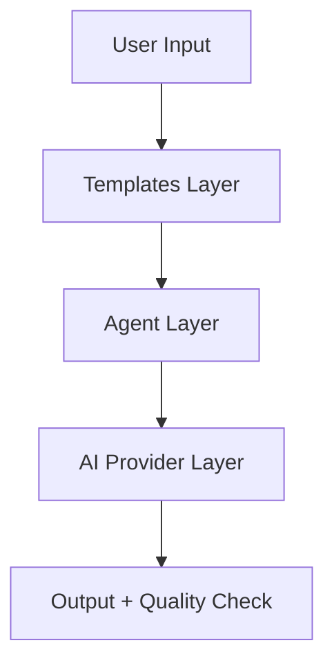

# CVF v1.6 Agent Platform — Complete Guide

**Version:** 1.6  
**Release Date:** February 2026  
**Status:** ✅ Production Ready  

---

## 🎯 What is CVF v1.6?

**CVF v1.6 Agent Platform** là ứng dụng web đầu tiên của Controlled Vibe Framework, đưa các nguyên tắc governance của CVF vào một giao diện end-user thân thiện.

### Key Innovation

> **CVF v1.0-v1.3**: SDK/CLI tools cho developers  
> **CVF v1.6**: Web application cho ALL users (không cần code)

---

## 🏗️ Core Architecture

### Three-Layer Design



#### 1. Templates Layer (Intent-Driven)
- Cấu trúc hóa user intent thành task rõ ràng
- Map với CVF Phases (A→D)
- Enforce governance từ đầu

#### 2. Agent Layer (Controlled Execution)
- **Agent Chat**: 1-on-1 với AI
- **Multi-Agent**: Multiple AI roles collaborate
- Built-in checkpoints và human review

#### 3. Provider Layer (AI-Agnostic)
- Gemini 2.5 Flash
- GPT-5.2 Mini
- Claude Sonnet 4.5

---

## 📋 Core Concepts

### 1. Templates = CVF Governance in Action

**What are they?**
Pre-structured workflows embodying CVF phases

**Example:**
```
Template: "Build & Review"
├── Phase A (Discovery): User defines requirements
├── Phase B (Design): AI creates architecture plan
├── Phase C (Build): AI writes code
└── Phase D (Review): Quality check + user approval
```

**Available Templates:**
| Template | CVF Phases | Use Case |
|----------|------------|----------|
| Quick Draft | A→C | Fast prototyping |
| Build & Review | A→D | Production code |
| Research & Analyze | A→B | Understanding |
| Team Collaboration | Multi-phase | Complex projects |

### 2. Agent Chat = Controlled AI Interaction

**NOT** raw ChatGPT! **IS** CVF-governed conversation:

✅ **Has:**
- System prompt with CVF guidelines
- User context injection
- Conversation history
- File upload support

❌ **Doesn't have (yet):**
- Access to project files
- Code execution
- RAG/vector search

**CVF Controls:**
- Intent recognition
- Output formatting
- Stop conditions
- Checkpoint triggers

### 3. Multi-Agent System = Role Specialization

**4 Agent Roles:**

| Role | Responsibility | CVF Phase | Ideal AI |
|------|----------------|-----------|----------|
| 🎯 **Orchestrator** | Coordinate & delegate | A | Gemini (reasoning) |
| 📐 **Architect** | Design architecture | B | Claude (design) |
| 🔨 **Builder** | Write code | C | GPT (fast code) |
| 🔍 **Reviewer** | Quality assurance | D | Claude (thoroughness) |

**Two Modes:**

**Single AI Mode** (Default)
```
All agents use same AI (simple, one API key)
```

**Multi AI Mode** (Advanced)
```
Each agent has specialized AI
- Orchestrator: Gemini (best reasoning)
- Architect: Claude (best design)
- Builder: GPT (fastest coding)
- Reviewer: Claude (best QA)
```

### 4. Quality Assurance = Built-in CVF Phase D

**Every output gets:**
- ✅ Quality Score (0-100)
- ✅ Accept/Reject actions
- ✅ Retry with feedback
- ✅ Send to Agent for refinement

**CVF Risk Levels in v1.6:**
- Templates are **R0** (passive, no execution)
- Agent Chat is **R1** (controlled, logged)
- Multi-Agent is **R2** (explicit approval needed)

---

## 🎨 How CVF Principles Apply

### Principle 1: Intent-Driven
```
User thinks: "I want a login form"
↓
Template: Auth & Security → Login Form
↓
Agent understands intent, not exact words
```

### Principle 2: Phase-Based Workflow

**CVF Classic (v1.0-v1.3):**
```
A: Discovery → B: Blueprint → C: Construct → D: Deliver
```

**CVF v1.6 Web:**
```
Template Selection → Agent Execution → Quality Check → User Approval
```

Same phases, better UX!

### Principle 3: Governance without Micromanagement

**Control Points:**
1. Template enforces structure
2. System prompt guides AI
3. Quality score validates output
4. User reviews before accepting

**Freedom:**
- AI chooses implementation details
- User iterates with natural language
- No need to write prompts manually

### Principle 4: Traceability

**Everything logged:**
- Template used
- Inputs provided
- AI provider & model
- Execution time
- Quality score
- User decision (accept/reject)

### Principle 5: AI is Executor, Not Decision-Maker

**User decides:**
- Which template to use
- Which inputs to provide
- Accept or reject output
- When to send to agent for refinement

**AI executes:**
- Following template structure
- Within governance constraints
- With built-in quality checks

---

## 🚀 User Journey

### Journey 1: Solo Developer

```
1. Select "Quick Draft" template
2. Fill: "Chat app with real-time messaging"
3. Review AI's architecture proposal (Phase B)
4. Accept → AI generates code (Phase C)
5. Quality score: 85/100 ✅
6. Accept → Download code
```

**CVF Value:** Structured output, quality validation

### Journey 2: Team Collaboration

```
1. Select "Build & Review" workflow
2. AI drafts spec (Architect agent)
3. Share spec with team → Get feedback
4. AI implements (Builder agent)
5. AI reviews (Reviewer agent)
6. Team reviews → Approve
```

**CVF Value:** Multi-agent roles, checkpoints, audit trail

### Journey 3: Research Task

```
1. Agent Chat mode
2. Upload requirement docs
3. Ask: "Analyze technical feasibility"
4. AI provides structured analysis
5. Ask follow-ups
6. Export conversation
```

**CVF Value:** Controlled conversation, context injection

---

## 💡 CVF v1.6 vs Other Tools

| Feature | Raw ChatGPT | CVF v1.6 | CVF SDK (v1.3) |
|---------|-------------|----------|-----------------|
| **Governance** | ❌ None | ✅ Built-in | ✅ Contract-based |
| **Templates** | ❌ None | ✅ Yes | ⚠️ Manual |
| **Multi-Agent** | ❌ No | ✅ Yes | ⚠️ Code required |
| **Quality Check** | ❌ No | ✅ Auto | ⚠️ Manual |
| **Audit Trail** | ⚠️ Basic | ✅ Full | ✅ Full |
| **User Type** | Anyone | Anyone | Developers |
| **Setup Time** | 1 min | 2 min | 30+ min |

---

## 🔧 Technical Stack

```
Frontend: Next.js 14 + React + TypeScript
Styling: Tailwind CSS
State: React Context + localStorage
AI: Gemini/GPT/Claude SDK integration
i18n: Built-in Vietnamese/English
PWA: Installable, offline-capable
```

---

## 📊 Current Capabilities

### ✅ Implemented
- [x] Template system (6 templates)
- [x] Agent Chat with streaming
- [x] Multi-Agent workflows
- [x] Single AI / Multi AI modes
- [x] Quality scoring
- [x] File upload (Agent Chat)
- [x] Multi-language (vi/en)
- [x] Multi-provider (Gemini/GPT/Claude)
- [x] Mobile responsive
- [x] Dark mode
- [x] Settings management
- [x] Export functionality

### 🔜 Roadmap
- [ ] RAG/Vector search
- [ ] Project file access
- [ ] Code execution sandbox
- [ ] Team collaboration features
- [ ] Template marketplace
- [ ] Advanced analytics

---

## 🎓 Learning Path

### For CVF Newcomers
1. Read: CVF v1.0 [Manifesto](../../v1.0/CVF_MANIFESTO.md) (10 min)
2. Understand: 4 Phases (A→D)
3. Try: CVF v1.6 web app
4. See: How templates enforce governance

### For CVF v1.3 SDK Users
1. Recognize: Same philosophy, different interface
2. Map: Skill Contracts → Templates
3. Map: Risk Levels → Quality Checks
4. Use: v1.6 for rapid prototyping, v1.3 for production systems

### For Developers
1. Explore: `cvf-web/src/` codebase
2. Study: `lib/ai/` provider abstraction
3. Understand: Template → Agent → Provider flow
4. Extend: Add custom templates

---

## 📖 Related Documentation

- [CVF Framework Assessment](../../docs/CVF_FRAMEWORK_ASSESSMENT.md) - v1.0-v1.3 deep dive
- [How to Apply CVF](../../docs/HOW_TO_APPLY_CVF.md) - SDK guide
- [Agent Platform Progress](../../AGENT_PLATFORM_PROGRESS_2026-02-06.md) - Development log
- [Roadmap](./ROADMAP.md) - v1.6 feature roadmap

---

## ❓ FAQ

**Q: v1.6 replaces v1.3?**  
A: No! v1.6 is for end-users. v1.3 SDK is for advanced governance.

**Q: Can I use both?**  
A: Yes! Prototype with v1.6, implement contracts with v1.3.

**Q: Is v1.6 "CVF-compliant"?**  
A: Yes! Templates = governance, Quality checks = Phase D, Multi-agent = controlled execution.

**Q: Need API keys?**  
A: Yes, one per provider (Gemini/GPT/Claude). Free tiers available.

**Q: Production-ready?**  
A: ✅ Yes for individual use. Team features coming soon.

---

## 🎯 Core Value Proposition

> **CVF v1.6 makes AI governance accessible to everyone, not just developers.**

**Before v1.6:**
- CVF = contracts, SDK, CLI → technical barrier

**With v1.6:**
- CVF = templates, chat, workflows → anyone can use

**Bottom line:**
*Same governance principles, zero code required.*

---

**Last Updated:** February 6, 2026  
**Author:** CVF Team  
**License:** Internal Use
