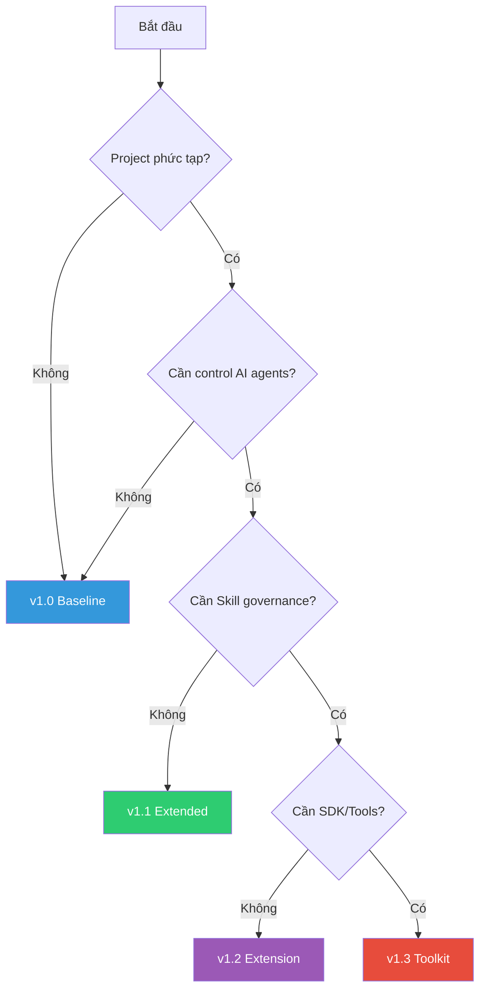

# 📘 Hướng dẫn Áp dụng CVF — Complete Guide

> **Version:** 1.3 | **Updated:** 29/01/2026  
> **Purpose:** Hướng dẫn toàn diện để sử dụng CVF hiệu quả nhất

---

## 🎯 CVF là gì?

**Controlled Vibe Framework (CVF)** là framework quản lý cách bạn làm việc với AI trong phát triển phần mềm.

> **Triết lý cốt lõi:**  
> *"AI là executor, không phải decision maker. Skills được thuần hóa, không được tự do."*

### CVF KHÔNG phải là:
- ❌ Một AI agent framework (như LangChain)
- ❌ Một prompt library
- ❌ Tool để viết code tự động

### CVF LÀ:
- ✅ **Governance framework** — Kiểm soát AI bằng cấu trúc
- ✅ **Decision framework** — Ghi lại mọi quyết định
- ✅ **Audit framework** — Trace mọi thay đổi

---

## 🗺️ Chọn Đúng Version



| Scenario | Version | Thư mục |
|----------|---------|---------|
| Project nhỏ, 1-2 người | **v1.0** | [v1.0/](../v1.0/) |
| Mới làm quen với vibe coding | **v1.0** | [v1.0/](../v1.0/) |
| Cần INPUT/OUTPUT spec rõ ràng | **v1.1** | [v1.1/](../v1.1/) |
| Multi-agent, phân vai AI | **v1.1** | [v1.1/](../v1.1/) |
| Skill registry, risk control | **v1.2** | [EXTENSIONS/v1.2/](../EXTENSIONS/CVF_v1.2_CAPABILITY_EXTENSION/) |
| Cần SDK, CLI, CI/CD | **v1.3** | [EXTENSIONS/v1.3/](../EXTENSIONS/CVF_v1.3_IMPLEMENTATION_TOOLKIT/) |

---

## 📦 Quick Start theo Version

### Option A: v1.0 — Đơn giản nhất (5 phút)

```bash
# 1. Tạo structure
mkdir -p my-project/{phases,decisions,governance}

# 2. Copy manifesto
cp v1.0/CVF_MANIFESTO.md my-project/

# 3. Bắt đầu Phase A
cp v1.0/phases/PHASE_A_DISCOVERY.md my-project/phases/
```

**Workflow v1.0:**
```
Phase A (Discovery) → Phase B (Blueprint) → Phase C (Construct) → Phase D (Deliver)
```

---

### Option B: v1.1 — Control chi tiết (15 phút)

```bash
# 1. Tạo structure theo v1.1
mkdir -p my-project/{specs,traces,src}

# 2. Copy templates
cp v1.1/templates/*.sample.md my-project/specs/

# 3. Viết INPUT_SPEC
# Xem mẫu: v1.1/templates/INPUT_SPEC.sample.md
```

**Workflow v1.1:**
```
INPUT_SPEC → Command + Archetype → Execute → Trace → Review
```

**Archetypes:**
| Archetype | Khi nào dùng |
|-----------|--------------|
| Builder | Viết code mới |
| Reviewer | Review code |
| Debugger | Fix bugs |
| Planner | Thiết kế |
| Researcher | Tìm hiểu |

---

### Option C: v1.2 + v1.3 — Full Control (30 phút)

```bash
# 1. Cài đặt SDK (v1.3)
cd EXTENSIONS/CVF_v1.3_IMPLEMENTATION_TOOLKIT
pip install pyyaml  # Dependency

# 2. Validate contracts
python cli/cvf_validate.py validate examples/real_world_contracts/

# 3. Tích hợp vào project
cp ci_cd/github_actions/cvf-validate.yml .github/workflows/
```

**Workflow v1.2 + v1.3:**
```
Skill Contract → Validate → Register → Lifecycle → Execute → Audit
```

---

## 🚀 Quy trình Chuẩn 7 bước

### Bước 1: Khởi tạo Project

```
my-project/
├── specs/
│   ├── INPUT_SPEC.md      ← Yêu cầu đầu vào
│   └── OUTPUT_SPEC.md     ← Kết quả mong đợi
├── decisions/
│   └── DECISIONS.md       ← Quyết định quan trọng
├── traces/
│   └── AU_001.md          ← Ghi log AI actions
├── contracts/              ← (v1.2+) Skill contracts
│   └── *.contract.yaml
├── src/                    ← Code
└── CHANGELOG.md
```

### Bước 2: Viết Spec

**INPUT_SPEC.md:**
```markdown
# INPUT_SPEC — [Tên App]

## Mục tiêu
[App làm gì, cho ai dùng]

## Yêu cầu chức năng
1. [Feature 1]
2. [Feature 2]

## Tech Stack
- Frontend: [React/Vue/...]
- Backend: [Node/Python/...]

## Constraints
- Không được: [giới hạn]
- Thời gian: [deadline]

## Acceptance Criteria
- [ ] Criteria 1
- [ ] Criteria 2
```

### Bước 3: Xác định Risk Level (v1.2+)

| Level | Mô tả | Required Controls |
|-------|-------|-------------------|
| **R0** | Không side effect (đọc, analyze) | Logging |
| **R1** | Side effect nhỏ, bounded | Logging + Scope Guard |
| **R2** | Có authority, có thể chain | Approval + Audit |
| **R3** | Thay đổi hệ thống, tác động bên ngoài | Hard Gate + Human |

### Bước 4: Tạo Skill Contract (v1.2+)

```yaml
# my_capability.contract.yaml
capability_id: "CODE_REVIEW_v1"
domain: "development"
description: "Review code for quality issues"
risk_level: "R1"

governance:
  allowed_archetypes: ["Analysis", "Execution"]
  allowed_phases: ["C", "D"]
  required_status: "ACTIVE"

input_spec:
  - name: "code"
    type: "string"
    required: true

output_spec:
  - name: "issues"
    type: "array"
  - name: "score"
    type: "integer"

execution:
  side_effects: false
  idempotent: true

audit:
  trace_level: "Full"
```

### Bước 5: Validate Contract (v1.3)

```bash
# Validate single file
python cli/cvf_validate.py validate my_capability.contract.yaml

# Validate all contracts
python cli/cvf_validate.py validate --all contracts/

# Lint for style
python cli/cvf_validate.py lint contracts/
```

### Bước 6: Execute với AI

**Prompt Format chuẩn:**
```markdown
[Command]: /create
[Archetype]: Builder
[Preset]: Balanced

[Task]: 
Tạo component Login form với validation

[Spec Reference]: 
specs/INPUT_SPEC.md#authentication

[Expected Output]: 
- src/components/LoginForm.tsx
- src/hooks/useAuth.ts

[Constraints]:
- React + TypeScript
- Không dùng UI library

[Stop Condition]:
Dừng sau khi hoàn thành, chờ review
```

### Bước 7: Trace & Audit

```markdown
# AU-001: Login Form

## Metadata
- Date: 2026-01-29
- Command: /create
- Archetype: Builder
- Contract: AUTH_FORM_v1

## Input Summary
Tạo Login form theo spec

## Output
- ✅ src/components/LoginForm.tsx
- ✅ src/hooks/useAuth.ts

## Review
- Reviewer: [Tên]
- Result: ✅ Approved
```

---

## 📊 Command Reference

### Core Commands (v1.1)

| Command | Archetype | Khi nào |
|---------|-----------|---------|
| `/plan` | Planner | Thiết kế architecture |
| `/create` | Builder | Viết code mới |
| `/modify` | Builder | Sửa code có sẵn |
| `/review` | Reviewer | Review trước merge |
| `/debug` | Debugger | Fix bugs |
| `/research` | Researcher | Tìm hiểu |
| `/refactor` | Refactorer | Cải thiện code |

### Preset Levels

| Preset | Stop Condition | Review | Dùng khi |
|--------|----------------|--------|----------|
| **Minimal** | Khi xong task | Optional | Task nhỏ |
| **Balanced** | Sau mỗi file | Required | Hầu hết |
| **Strict** | Sau mỗi function | Mandatory | Critical |

---

## 🔧 CI/CD Integration (v1.3)

### GitHub Actions

```yaml
# .github/workflows/cvf-validate.yml
name: CVF Validation

on: [push, pull_request]

jobs:
  validate:
    runs-on: ubuntu-latest
    steps:
      - uses: actions/checkout@v4
      - uses: actions/setup-python@v5
        with:
          python-version: '3.11'
      - run: pip install pyyaml
      - run: python EXTENSIONS/CVF_v1.3_IMPLEMENTATION_TOOLKIT/cli/cvf_validate.py validate --all contracts/
```

### Pre-commit Hook

```yaml
# .pre-commit-config.yaml
repos:
  - repo: local
    hooks:
      - id: cvf-validate
        name: Validate CVF Contracts
        entry: python EXTENSIONS/CVF_v1.3_IMPLEMENTATION_TOOLKIT/cli/cvf_validate.py validate
        language: python
        files: '\.contract\.ya?ml$'
```

---

## 💡 Best Practices

### ✅ DO

1. **Viết spec trước** — Không yêu cầu AI code khi chưa có spec
2. **Chia nhỏ task** — Mỗi Action Unit nên < 2 giờ
3. **Review mọi output** — AI không tự quyết định merge
4. **Trace everything** — Dù task nhỏ cũng phải ghi
5. **Dùng đúng risk level** — R3 cần human approval
6. **Validate contracts** — Chạy `cvf-validate` trước khi commit

### ❌ DON'T

1. **AI tự quyết scope** — Luôn giới hạn rõ ràng
2. **Skip trace** — "Task nhỏ" không có nghĩa là không quan trọng
3. **Merge mù** — Không merge output chưa review
4. **Mix archetypes** — 1 Action Unit = 1 Archetype
5. **Prompt quá dài** — Chia thành nhiều tasks nhỏ
6. **Ignore warnings** — `cvf-validate` warnings cũng quan trọng

---

## 🎯 Checklist Nhanh

```
□ Đã chọn version phù hợp (v1.0 / v1.1 / v1.2 / v1.3)
□ Đã tạo folder structure
□ Đã viết INPUT_SPEC
□ Đã viết OUTPUT_SPEC
□ (v1.2+) Đã xác định Risk Level
□ (v1.2+) Đã tạo Skill Contract
□ (v1.3) Đã validate contracts

Với mỗi task:
□ Chọn Command + Archetype + Preset
□ Format prompt theo template
□ Execute với AI
□ Ghi trace (AU_xxx.md)
□ Review output
□ Commit với message rõ ràng
```

---

## 📚 Templates & Examples

| Resource | Mục đích | Location |
|----------|----------|----------|
| INPUT_SPEC.sample.md | Mẫu spec đầu vào | [v1.1/templates/](../v1.1/templates/) |
| OUTPUT_SPEC.sample.md | Mẫu spec đầu ra | [v1.1/templates/](../v1.1/templates/) |
| AU_trace.sample.md | Mẫu ghi trace | [v1.1/templates/](../v1.1/templates/) |
| code_review.contract.yaml | Contract R1 | [v1.3/examples/](../EXTENSIONS/CVF_v1.3_IMPLEMENTATION_TOOLKIT/examples/real_world_contracts/) |
| database_query.contract.yaml | Contract R2 | [v1.3/examples/](../EXTENSIONS/CVF_v1.3_IMPLEMENTATION_TOOLKIT/examples/real_world_contracts/) |
| file_operations.contract.yaml | Contract R3 | [v1.3/examples/](../EXTENSIONS/CVF_v1.3_IMPLEMENTATION_TOOLKIT/examples/real_world_contracts/) |
| complete_example.py | Lifecycle demo | [v1.3/examples/](../EXTENSIONS/CVF_v1.3_IMPLEMENTATION_TOOLKIT/examples/complete_lifecycle/) |

---

## 📖 Đọc thêm

### Core Documentation
- [CVF Manifesto](../v1.0/CVF_MANIFESTO.md) — Triết lý cốt lõi
- [Version Comparison](./VERSION_COMPARISON.md) — So sánh các versions
- [Architecture Diagrams](./CVF_ARCHITECTURE_DIAGRAMS.md) — Sơ đồ kiến trúc

### v1.1 Guides
- [Quick Start](../v1.1/QUICK_START.md) — Bắt đầu trong 5 phút
- [CVF Commands](../v1.1/interface/CVF_COMMANDS.md) — Danh sách commands
- [Agent Archetypes](../v1.1/agents/AGENT_ARCHETYPES.md) — Roles cho AI

### v1.2/v1.3 Guides
- [Skill Contract Spec](../EXTENSIONS/CVF_v1.2_CAPABILITY_EXTENSION/SKILL_CONTRACT_SPEC.md) — Contract structure
- [Risk Model](../EXTENSIONS/CVF_v1.2_CAPABILITY_EXTENSION/CAPABILITY_RISK_MODEL.md) — R0-R3 levels
- [v1.3 Toolkit README](../EXTENSIONS/CVF_v1.3_IMPLEMENTATION_TOOLKIT/README.md) — SDK & CLI

### Expert Analysis
- [CVF Expert Review](./CVF_EXPERT_REVIEW_v1.2.md) — Đánh giá chuyên gia & Roadmap

---

## 🆘 Troubleshooting

### "AI không tuân thủ constraints"
→ Dùng Stop Condition rõ ràng hơn, chia nhỏ task

### "Contract validation failed"
→ Kiểm tra `risk_level` có đúng format (R0/R1/R2/R3)
→ Đảm bảo có ít nhất 1 input và 1 output field

### "Không biết chọn version nào"
→ Mặc định dùng v1.0, upgrade khi cần
→ v1.1 khi cần multi-agent, v1.2+ khi cần skill governance

### "AI làm quá nhiều/quá ít"
→ Điều chỉnh Preset: Minimal → Balanced → Strict
→ Đặt scope rõ ràng trong prompt

---

> **Remember:** CVF không giúp bạn đi nhanh hơn. CVF giúp bạn không đi sai.

*Cập nhật: 29/01/2026*
