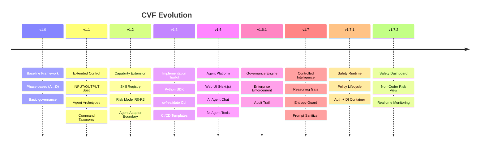
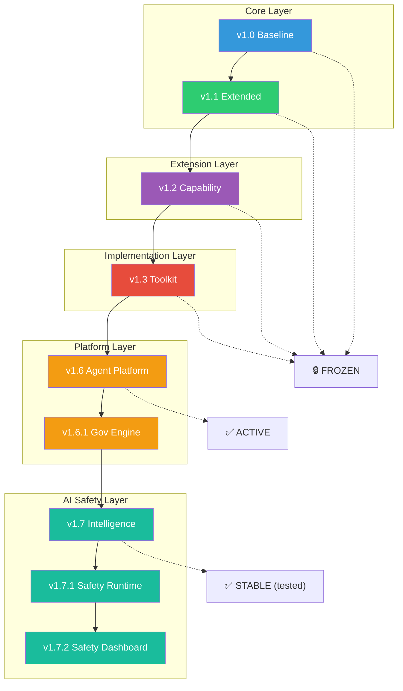

# VERSION COMPARISON — CVF v1.0 → v1.7.2

> **Updated:** February 25, 2026

## Overview

| Criteria | v1.0 | v1.1 | v1.2 | v1.3 | v1.6 | v1.6.1 | v1.7 | v1.7.1 | v1.7.2 |
|----------|:----:|:----:|:----:|:----:|:----:|:------:|:----:|:------:|:------:|
| **Type** | Core | Core | Extension | Toolkit | Web App | Gov Engine | Intelligence | Safety Runtime | Safety Dashboard |
| **Purpose** | Baseline | Control | Skill Gov | Implementation | End-User | Enterprise | Agent Behavior | Policy Enforcement | Non-Coder View |
| **Target** | Beginners | Complex projects | Enterprise | DevOps | ALL users | CI/CD + Audit | AI Safety | Runtime Engine | Non-Coders |
| **Status** | 🔒 FROZEN | 🔒 FROZEN | 🔒 FROZEN | 🔒 FROZEN | ✅ ACTIVE | ✅ ACTIVE | ✅ STABLE | ✅ STABLE | ✅ STABLE |

---

## Timeline

---

## Detailed Comparison

### 1. Core Governance

| Feature | v1.0 | v1.1 | v1.2 | v1.3 | v1.6+ |
|---------|:----:|:----:|:----:|:----:|:-----:|
| Phase-based (A→D) | ✅ | ✅ | ✅ | ✅ | ✅ |
| Decision artifacts | ✅ | ✅ | ✅ | ✅ | ✅ |
| Governance policy | ✅ | ✅ | ✅ | ✅ | ✅ |
| "Outcome > Code" philosophy | ✅ | ✅ | ✅ | ✅ | ✅ |

---

### 2. Specification & Control

| Feature | v1.0 | v1.1 | v1.2 | v1.3 | v1.6+ |
|---------|:----:|:----:|:----:|:----:|:-----:|
| INPUT/OUTPUT spec | ❌ | ✅ | ✅ | ✅ | ✅ |
| Agent Archetypes | ❌ | ✅ | ✅ | ✅ | ✅ |
| Command taxonomy | ❌ | ✅ | ✅ | ✅ | ✅ |
| Execution Spine | ❌ | ✅ | ✅ | ✅ | ✅ |
| Action Unit trace | ❌ | ✅ | ✅ | ✅ | ✅ |

---

### 3. Skill & Capability Layer (v1.2+)

| Feature | v1.0 | v1.1 | v1.2 | v1.3 | v1.6+ |
|---------|:----:|:----:|:----:|:----:|:-----:|
| Skill Contract Spec | ❌ | ❌ | ✅ | ✅ | ✅ |
| Skill Registry Model | ❌ | ❌ | ✅ | ✅ | ✅ |
| Capability Lifecycle | ❌ | ❌ | ✅ | ✅ | ✅ |
| Risk Model (R0-R3) | ❌ | ❌ | ✅ | ✅ | ✅ |
| Agent Adapter Boundary | ❌ | ❌ | ✅ | ✅ | ✅ |
| External Skill Ingestion | ❌ | ❌ | ✅ | ✅ | ✅ |

---

### 4. Implementation & Tooling (v1.3)

| Feature | v1.0 | v1.1 | v1.2 | v1.3 | v1.6+ |
|---------|:----:|:----:|:----:|:----:|:-----:|
| Python SDK | ❌ | ❌ | ❌ | ✅ | ✅ |
| CLI Tool (cvf-validate) | ❌ | ❌ | ❌ | ✅ | ✅ |
| Claude Adapter | ❌ | ❌ | ❌ | ✅ | ✅ |
| OpenAI GPT Adapter | ❌ | ❌ | ❌ | ✅ | ✅ |
| Generic/Ollama Adapter | ❌ | ❌ | ❌ | ✅ | ✅ |
| GitHub Actions template | ❌ | ❌ | ❌ | ✅ | ✅ |
| Pre-commit hooks | ❌ | ❌ | ❌ | ✅ | ✅ |
| JSON Schema | ❌ | ❌ | ❌ | ✅ | ✅ |

---

### 5. Agent Platform (v1.6+)

| Feature | v1.0 | v1.1 | v1.2 | v1.3 | v1.6 | v1.6.1 |
|---------|:----:|:----:|:----:|:----:|:----:|:------:|
| Web UI (Next.js) | ❌ | ❌ | ❌ | ❌ | ✅ | ✅ |
| AI Agent Chat | ❌ | ❌ | ❌ | ❌ | ✅ | ✅ |
| Multi-Agent Workflow | ❌ | ❌ | ❌ | ❌ | ✅ | ✅ |
| 34 Agent Tools | ❌ | ❌ | ❌ | ❌ | ✅ | ✅ |
| 141 Skill Library | ❌ | ❌ | ❌ | ❌ | ✅ | ✅ |
| Bilingual (EN/VI) | ❌ | ❌ | ❌ | ❌ | ✅ | ✅ |
| Governance Engine | ❌ | ❌ | ❌ | ❌ | ❌ | ✅ |
| Enterprise Audit | ❌ | ❌ | ❌ | ❌ | ❌ | ✅ |

---

### 6. AI Safety Layer (v1.7+)

| Feature | v1.0–v1.6.1 | v1.7 | v1.7.1 | v1.7.2 |
|---------|:-----------:|:----:|:------:|:------:|
| Reasoning Gate | ❌ | ✅ | ✅ | ✅ |
| Entropy Guard | ❌ | ✅ | ✅ | ✅ |
| Prompt Sanitizer | ❌ | ✅ | ✅ | ✅ |
| Anomaly Detection | ❌ | ✅ | ✅ | ✅ |
| Policy Lifecycle Engine | ❌ | ❌ | ✅ | ✅ |
| Auth & DI Container | ❌ | ❌ | ✅ | ✅ |
| Audit Trail | ❌ | ❌ | ✅ | ✅ |
| Safety Dashboard | ❌ | ❌ | ❌ | ✅ |
| Risk Level View (🟢🟡🟠🔴) | ❌ | ❌ | ❌ | ✅ |
| Non-Coder Interface | ❌ | ❌ | ❌ | ✅ |

---

## Decision Matrix

| Scenario | Version | Reason |
|----------|---------|--------|
| Learning vibe coding for the first time | **v1.0** | Simplest |
| Personal project, 1-2 people | **v1.0** | No overhead needed |
| Quick MVP, no audit needed | **v1.0** | Focus on shipping |
| Team > 3 people | **v1.1** | Need coordination |
| Formal review process | **v1.1** | Has trace templates |
| Multi-agent orchestration | **v1.1** | Has Archetypes |
| Need to govern AI capabilities | **v1.2** | Skill Registry |
| Risk-based control | **v1.2** | R0-R3 model |
| CI/CD integration | **v1.3** | GitHub Actions |
| Programmatic access | **v1.3** | Python SDK |
| Validate contracts | **v1.3** | cvf-validate CLI |
| No-code Web UI | **v1.6** | Agent Platform |
| AI Agent chat + multi-agent | **v1.6** | 34 Agent Tools |
| Enterprise enforcement | **v1.6.1** | Governance Engine |
| AI behavior control | **v1.7** | Reasoning gate + entropy guard |
| Policy enforcement runtime | **v1.7.1** | Safety Runtime |
| Non-coder risk visibility | **v1.7.2** | Safety Dashboard |

---

## Version Relationships

**Relationships:**
- **v1.0 ⊂ v1.1** — v1.1 extends v1.0, does not replace it
- **v1.2 extends v1.1** — v1.2 is an extension, opt-in
- **v1.3 implements v1.2** — v1.3 is the implementation of v1.2 spec
- **v1.6 builds on v1.3** — Web UI + Agent Platform
- **v1.6.1 extends v1.6** — Enterprise governance enforcement
- **v1.7 adds Intelligence** — Agent behavior control layer
- **v1.7.1 adds Runtime** — Policy enforcement engine
- **v1.7.2 adds Dashboard** — Non-coder safety UI

---

## Upgrade Path

### v1.0 → v1.1

1. Add `specs/` folder with INPUT_SPEC, OUTPUT_SPEC
2. Choose Archetypes for AI agents
3. Apply Command taxonomy
4. Add Action Unit templates

→ See [MIGRATION_GUIDE.md](../v1.1/MIGRATION_GUIDE.md)

### v1.1 → v1.2

1. Create Skill Contracts for existing capabilities
2. Define Risk Level (R0-R3)
3. Set up Capability Lifecycle

→ See [v1.2 README](../EXTENSIONS/CVF_v1.2_CAPABILITY_EXTENSION/README.md)

### v1.2 → v1.3

1. Validate contracts: `cvf-validate validate`
2. Integrate CI/CD
3. Use SDK for programmatic access

→ See [v1.3 README](../EXTENSIONS/CVF_v1.3_IMPLEMENTATION_TOOLKIT/README.md)

### v1.3 → v1.6

1. Run Web UI: `npm install && npm run dev`
2. Use AI Agent Chat with Gemini/OpenAI/Anthropic
3. Browse 141 skills + 34 agent tools

→ See [Agent Platform Guide](CVF_v16_AGENT_PLATFORM.md)

### v1.6 → v1.7.x

1. Safety features are integrated into the Web UI automatically
2. Prompt sanitizer, entropy guard, policy simulation — all built-in
3. Safety Dashboard available at `/safety` route

→ No migration needed — features are additive

---

## Score Matrix (out of 10)

| Criteria | v1.0 | v1.1 | v1.2 | v1.3 | v1.6 | v1.7.x |
|----------|:----:|:----:|:----:|:----:|:----:|:------:|
| Ease of learning | 9 | 7 | 6 | 7 | 8 | 8 |
| Ease of adoption | 9 | 7 | 6 | 8 | 9 | 9 |
| AI control | 6 | 8 | 9 | 9 | 9 | 10 |
| Trace/Audit | 5 | 8 | 9 | 10 | 10 | 10 |
| Skill Governance | 3 | 5 | 9 | 9 | 9 | 9 |
| Tooling | 3 | 4 | 5 | 9 | 10 | 10 |
| CI/CD Ready | 4 | 5 | 6 | 10 | 10 | 10 |
| AI Safety | 3 | 4 | 5 | 5 | 7 | 10 |
| Enterprise Ready | 5 | 7 | 9 | 10 | 10 | 10 |
| **Average** | **~5.2** | **~6.1** | **~7.1** | **~8.6** | **~9.1** | **~9.6** |

---

## Conclusion

| Version | Best For |
|---------|----------|
| **v1.0** | Learning, prototypes, small projects |
| **v1.1** | Team projects, need control |
| **v1.2** | Enterprise, risk management |
| **v1.3** | Full implementation, CI/CD |
| **v1.6** | End-users, no-code UI, agent workflows |
| **v1.6.1** | Enterprise governance enforcement |
| **v1.7** | AI behavior control, prompt safety |
| **v1.7.1** | Policy enforcement runtime |
| **v1.7.2** | Non-coder safety dashboard |

> **Recommendation:** Start with v1.0, upgrade progressively as needed. The Web UI (v1.6) is the quickest path for most users. v1.7.x safety features are automatically included.

---

*Updated: February 25, 2026*
