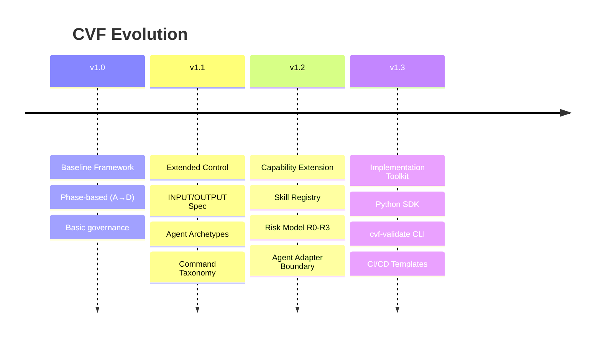
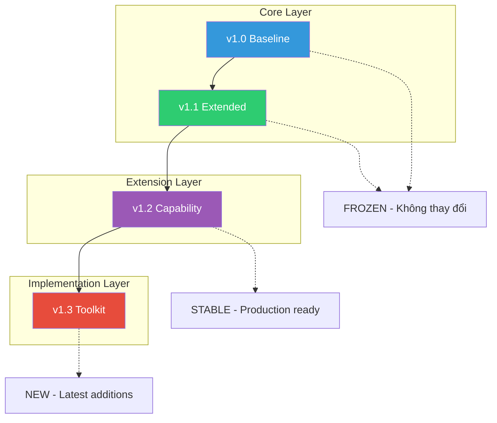

# VERSION COMPARISON — CVF v1.0 → v1.1 → v1.2 → v1.3

> **Updated:** 29/01/2026

## Tổng quan

| Tiêu chí | v1.0 | v1.1 | v1.2 | v1.3 |
|----------|:----:|:----:|:----:|:----:|
| **Type** | Core | Core | Extension | Toolkit |
| **Mục đích** | Baseline | Kiểm soát chi tiết | Skill Governance | Implementation |
| **Đối tượng** | Người mới | Project phức tạp | Enterprise | DevOps |
| **Trạng thái** | FROZEN | FROZEN | STABLE | ✅ NEW |

---

## Timeline

---

## So sánh Chi tiết

### 1. Core Governance

| Feature | v1.0 | v1.1 | v1.2 | v1.3 |
|---------|:----:|:----:|:----:|:----:|
| Phase-based (A→D) | ✅ | ✅ | ✅ | ✅ |
| Decision artifacts | ✅ | ✅ | ✅ | ✅ |
| Governance policy | ✅ | ✅ | ✅ | ✅ |
| Triết lý "Outcome > Code" | ✅ | ✅ | ✅ | ✅ |

---

### 2. Specification & Control

| Feature | v1.0 | v1.1 | v1.2 | v1.3 |
|---------|:----:|:----:|:----:|:----:|
| INPUT/OUTPUT spec | ❌ | ✅ | ✅ | ✅ |
| Agent Archetypes | ❌ | ✅ | ✅ | ✅ |
| Command taxonomy | ❌ | ✅ | ✅ | ✅ |
| Execution Spine | ❌ | ✅ | ✅ | ✅ |
| Action Unit trace | ❌ | ✅ | ✅ | ✅ |

---

### 3. Skill & Capability Layer (v1.2+)

| Feature | v1.0 | v1.1 | v1.2 | v1.3 |
|---------|:----:|:----:|:----:|:----:|
| Skill Contract Spec | ❌ | ❌ | ✅ | ✅ |
| Skill Registry Model | ❌ | ❌ | ✅ | ✅ |
| Capability Lifecycle | ❌ | ❌ | ✅ | ✅ |
| Risk Model (R0-R3) | ❌ | ❌ | ✅ | ✅ |
| Agent Adapter Boundary | ❌ | ❌ | ✅ | ✅ |
| External Skill Ingestion | ❌ | ❌ | ✅ | ✅ |

---

### 4. Implementation & Tooling (v1.3)

| Feature | v1.0 | v1.1 | v1.2 | v1.3 |
|---------|:----:|:----:|:----:|:----:|
| Python SDK | ❌ | ❌ | ❌ | ✅ |
| CLI Tool (cvf-validate) | ❌ | ❌ | ❌ | ✅ |
| Claude Adapter | ❌ | ❌ | ❌ | ✅ |
| OpenAI GPT Adapter | ❌ | ❌ | ❌ | ✅ |
| Generic/Ollama Adapter | ❌ | ❌ | ❌ | ✅ |
| GitHub Actions template | ❌ | ❌ | ❌ | ✅ |
| Pre-commit hooks | ❌ | ❌ | ❌ | ✅ |
| JSON Schema | ❌ | ❌ | ❌ | ✅ |

---

## Ma trận Lựa chọn

| Tình huống | Version | Lý do |
|------------|---------|-------|
| Học vibe coding lần đầu | **v1.0** | Đơn giản nhất |
| Project cá nhân, 1-2 người | **v1.0** | Không cần overhead |
| MVP nhanh, không cần audit | **v1.0** | Tập trung ship |
| Team > 3 người | **v1.1** | Cần coordination |
| Cần review formal | **v1.1** | Có trace template |
| Multi-agent orchestration | **v1.1** | Có Archetypes |
| Cần govern AI capabilities | **v1.2** | Skill Registry |
| Risk-based control | **v1.2** | R0-R3 model |
| CI/CD integration | **v1.3** | GitHub Actions |
| Programmatic access | **v1.3** | Python SDK |
| Validate contracts | **v1.3** | cvf-validate CLI |
| Enterprise audit | **v1.2 + v1.3** | Full stack |

---

## Relationship giữa các Versions

**Quan hệ:**
- **v1.0 ⊂ v1.1** — v1.1 mở rộng v1.0, không thay thế
- **v1.2 extends v1.1** — v1.2 là extension, opt-in
- **v1.3 implements v1.2** — v1.3 là implementation của v1.2 spec

---

## Upgrade Path

### v1.0 → v1.1

1. Thêm `specs/` folder với INPUT_SPEC, OUTPUT_SPEC
2. Chọn Archetypes cho AI agents
3. Áp dụng Command taxonomy
4. Thêm Action Unit templates

→ Xem [MIGRATION_GUIDE.md](../v1.1/MIGRATION_GUIDE.md)

### v1.1 → v1.2

1. Tạo Skill Contracts cho capabilities đang dùng
2. Xác định Risk Level (R0-R3)
3. Thiết lập Capability Lifecycle

→ Xem [v1.2 README](../EXTENSIONS/CVF_v1.2_CAPABILITY_EXTENSION/README.md)

### v1.2 → v1.3

1. Validate contracts: `cvf-validate validate`
2. Tích hợp CI/CD
3. Sử dụng SDK nếu cần programmatic access

→ Xem [v1.3 README](../EXTENSIONS/CVF_v1.3_IMPLEMENTATION_TOOLKIT/README.md)

---

## Điểm đánh giá (Thang 10)

| Tiêu chí | v1.0 | v1.1 | v1.2 | v1.3 |
|----------|:----:|:----:|:----:|:----:|
| Dễ học | 9 | 7 | 6 | 7 |
| Dễ áp dụng | 9 | 7 | 6 | 8 |
| Kiểm soát AI | 6 | 8 | 9 | 9 |
| Trace/Audit | 5 | 8 | 9 | 10 |
| Skill Governance | 3 | 5 | 9 | 9 |
| Tooling | 3 | 4 | 5 | 9 |
| CI/CD Ready | 4 | 5 | 6 | 10 |
| Enterprise Ready | 5 | 7 | 9 | 10 |
| **Tổng** | **~5.5** | **~6.4** | **~7.4** | **~9.0** |

---

## Kết luận

| Version | Best For |
|---------|----------|
| **v1.0** | Học, prototype, project nhỏ |
| **v1.1** | Team project, cần control |
| **v1.2** | Enterprise, risk management |
| **v1.3** | Full implementation, CI/CD |

> **Khuyến nghị:** Bắt đầu với v1.0, upgrade dần khi cần. Không cần dùng v1.3 nếu không cần tooling.

---

*Cập nhật: 29/01/2026*
