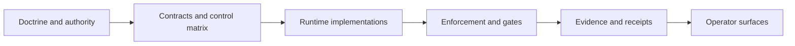

# CVF As-Built System Chain And Architecture Catalog

Status: PUBLIC_BOUNDED_SNAPSHOT

Date: 2026-07-11

## Purpose

Give public readers one evidence-bounded view of CVF's current system chain,
the gaps that remain open, and the rule used to admit new layers, modules, and
absorbed knowledge.

## As-Built System Chain

The internal source-backed inventory currently contains 22 bounded catalog
entities: 5 planes, 7 modules, 2 authority sources, and 8 proof-classed edges.
This count is an initial governed inventory, not a claim that every CVF file or
module has been cataloged.

Edges are classified by the strongest evidence actually available. A declared
relationship is not promoted to implemented or executed merely because a file
exists. Sampled evidence remains explicitly sampled.

## Current Open Gaps

| Gap | Current status | Condition for reconsideration |
|---|---|---|
| L4 product-implementation owner | VALUE_PARKED_WITH_REOPEN_CONDITIONS | Reopen only after a candidate leaves draft/pre-public status and a governed review accepts it as the active doctrine-equivalent owner. |
| L6 examples/ecosystem ownership | PARTIAL_CHAIN_WITH_BOUNDARY | Reopen if a governed decision either consolidates the distributed example surfaces or formally ratifies the distributed topology. |
| Unified Web inventory for repository checkers | EVIDENCED_NOT_OPERATOR_VISIBLE | Reopen when a separately authorized Web tranche can provide a truthful unified readout without implying new execution coverage. |

These are visible system-chain gaps, not hidden failures. The current catalog
does not label them complete and does not automatically rewrite their semantic
status when source files change.

## Catalog Admission Rule

When CVF gains a new layer, module, interface, or absorbed external value:

1. identify the governing authority and current owner;
2. assign a stable catalog identity;
3. record its maturity and claim boundary;
4. classify every relationship by proven evidence strength;
5. record unresolved ownership or visibility as a terminal gap;
6. regenerate deterministic catalog views;
7. run freshness and drift checks before accepting the change.

External material is not promoted directly into CVF authority. It must first
be enumerated, classified, reconciled against existing owners, and either
adapted, deferred, rejected, or admitted through a governed owner surface.

## Maintenance Model

The private provenance repository retains the detailed machine catalog,
source citations, gap records, generator, independent review, and local/CI/
weekly freshness evidence. This public document is a curated projection of
that accepted result; it intentionally excludes internal session state,
worker returns, raw audits, and private evidence paths.

## Claim Boundary

This snapshot proves that CVF now has a maintained, evidence-bounded
architecture catalog and explicit gap discipline. It does not claim exhaustive
inventory, closure of all gaps, hosted production readiness, or universal
operator visibility.
