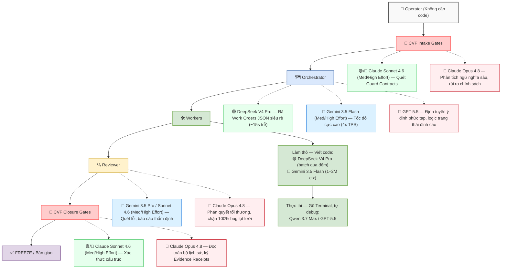
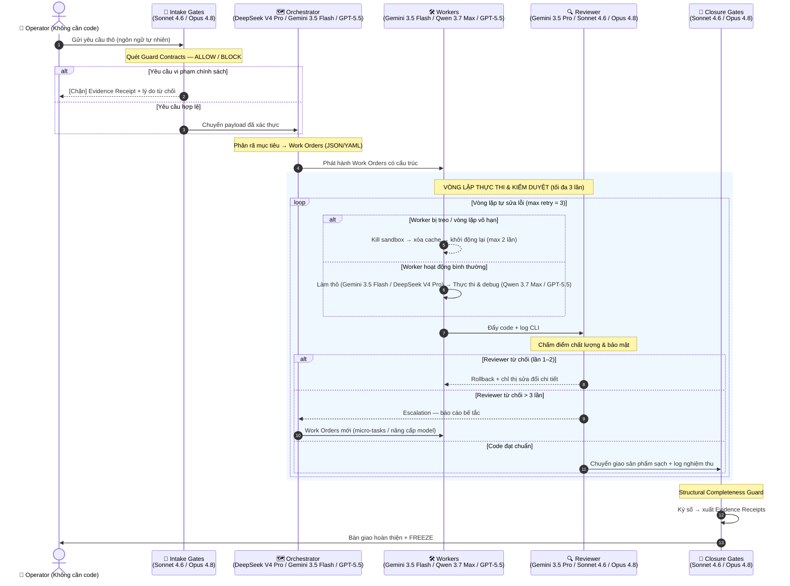

# CVF Pipeline Đa Tác Nhân — Sơ Đồ Trực Quan

🇻🇳 Tiếng Việt | [🇬🇧 English](../../README.md#cvf-multi-agent-pipeline)

**Phiên bản hợp đồng:** `cvf.multiAgentPipeline.visual.v1` | **Cập nhật:** 2026-05

CVF vận hành một pipeline quản trị năm giai đoạn đứng giữa người vận hành và bất kỳ nhà cung cấp AI nào. Mọi yêu cầu đều phải đi qua cổng tiếp nhận, phân rã nhiệm vụ, thực thi, kiểm duyệt và đóng cửa — với một Biên lai Chứng cứ (Evidence Receipt) ở cuối để chứng minh những gì đã chạy, ai phê duyệt và chính sách nào đã được áp dụng.

---

## Cấu Trúc Pipeline

```
Operator → CVF Intake Gates → Orchestrator → Workers → Reviewer → CVF Closure Gates → FREEZE
```

CVF cung cấp ba tùy chọn định tuyến tùy theo yêu cầu về chi phí, tốc độ và bảo mật:

| Tùy chọn | Hồ sơ | Phù hợp cho |
|---|---|---|
| 🟢 **[E] Eco — Siêu tiết kiệm** | Chi phí tối thiểu | Tác vụ khối lượng lớn, rủi ro thấp |
| 🔵 **[B] Balanced — Cân bằng** | Tốc độ cao & chất lượng | Mặc định cho hầu hết workflow CVF |
| 🔴 **[O] Premium — Tối đa** | Sức mạnh + bảo mật tuyệt đối | Dự án quan trọng hoặc nhạy cảm |

---

## Cấu Hình Vai Trò Agent

| Vai trò | Nhiệm vụ chính | 🟢 Eco | 🔵 Balanced | 🔴 Premium |
|---|---|---|---|---|
| 🛑 **CVF Intake Gates** | Quét Guard Contracts, chặn rủi ro trước khi vào pipeline | Claude Sonnet 4.6 (Medium Effort) | Claude Sonnet 4.6 (High Effort) | Claude Opus 4.8 |
| 🗺️ **Orchestrator** | Phân rã yêu cầu → Work Orders có cấu trúc JSON/YAML | DeepSeek V4 Pro | Gemini 3.5 Flash (Medium/High Effort) | GPT-5.5 |
| 🛠️ **Workers — Làm thô** | Viết code thô, xử lý codebase lớn (1–2M ctx) | DeepSeek V4 Pro (batch) | Gemini 3.5 Flash (Medium/High Effort) | Gemini 3.5 Flash (Medium/High Effort) |
| 🛠️ **Workers — Thực thi** | Gõ lệnh Terminal CLI, tự sửa lỗi (self-debug loop) | Qwen 3.7 Max | Qwen 3.7 Max / GPT-5.5 | GPT-5.5 |
| 🔍 **Reviewer** | Chấm điểm chất lượng, rà soát bảo mật, rollback nếu cần | — | Gemini 3.5 Pro / Claude Sonnet 4.6 (Medium/High Effort) | Claude Opus 4.8 |
| 🔏 **CVF Closure Gates** | Xác thực toàn vẹn, ký Evidence Receipts, FREEZE | Claude Sonnet 4.6 (Medium/High Effort) | Claude Sonnet 4.6 (Medium/High Effort) | Claude Opus 4.8 |

> CVF định tuyến theo vai trò và chính sách — không phải model cố định. Khóa provider thuộc về người dùng; quản trị thuộc về CVF.

---

## Sơ Đồ Khối Trực Quan



---

## Sơ Đồ Luồng Hoạt Động (Sequence Diagram)



---

## Sơ Đồ Kiến Trúc Văn Bản (ASCII)

```
[Operator (Không cần code)]
       │
       ▼
[CVF Intake Gates] ──────► 🟢/🔵 Claude Sonnet 4.6 (Med/High Effort) — Quét Guard Contracts, nhanh + tiết kiệm
       │                   🔴    Claude Opus 4.8                        — Phân tích ngữ nghĩa sâu, bảo mật cao
       ▼
[Orchestrator] ──────────► 🟢    DeepSeek V4 Pro                        — Rã Work Orders JSON, chi phí tối thiểu (~15s trễ)
       │                   🔵    Gemini 3.5 Flash (Med/High Effort)      — Tốc độ cực cao (4x TPS), giá cực tốt
       │                   🔴    GPT-5.5                                 — Định tuyến logic tinh vi, lập kế hoạch đỉnh cao
       ▼
[Workers] ───────────────► 🚀 Làm thô:  Gemini 3.5 Flash (1–2M ctx) / DeepSeek V4 Pro (batch qua đêm)
       │                   🛠️ Thực thi: Qwen 3.7 Max / GPT-5.5  (Terminal CLI, tự sửa lỗi)
       ▼
[Reviewer] ──────────────► 🔵    Gemini 3.5 Pro / Claude Sonnet 4.6 (Med/High Effort) — Quét lỗi, lập báo cáo thẩm định
       │                   🔴    Claude Opus 4.8                                        — Phán quyết tối thượng, chống bug 100%
       ▼
[CVF Closure Gates] ─────► 🟢/🔵 Claude Sonnet 4.6 (Med/High Effort) — Xác thực cấu trúc, xuất Evidence Receipts
       │                   🔴    Claude Opus 4.8                        — Đọc toàn bộ lịch sử, ký số chống giả mạo
       ▼
[FREEZE / Bàn giao]
```

---

## Luồng Vận Hành Chi Tiết

**Bước 1 — Tiếp nhận & Quét lọc (Intake Stage)**

Operator nạp prompt → CVF Intake Gates đối chiếu Guard Contracts. Option [E/B] dùng Claude Sonnet 4.6 (Medium/High Effort) để quét nhanh và tiết kiệm token. Option [O] dùng Claude Opus 4.8 để phân tích ngữ nghĩa sâu cho các dự án đặc biệt quan trọng.

Xử lý ngoại lệ: Nếu prompt vi phạm chính sách, hệ thống chặn ngay — xuất Evidence Receipt và ngắt luồng mà không đẩy sang các lớp sau, bảo vệ tài nguyên token.

**Bước 2 — Phân rã chỉ thị (Orchestration Stage)**

Orchestrator nhận payload sạch → biên dịch JSON/YAML để phân phối Work Orders:
- 🟢 Option [E]: DeepSeek V4 Pro — tách lệnh JSON siêu rẻ, chấp nhận độ trễ ~15 giây
- 🔵 Option [B]: Gemini 3.5 Flash (Medium/High Effort) — tốc độ sinh chuỗi 4x TPS, chi phí cực thấp
- 🔴 Option [O]: GPT-5.5 — định tuyến ý định phức tạp, xử lý logic trạng thái tốt nhất ngành

**Bước 3 — Thực thi chuyên sâu (Execution Stage)**

Workers kích hoạt phiên làm việc cô lập (Sandboxed Terminal):
- Giai đoạn 1 (Làm thô): Gemini 3.5 Flash (Medium/High Effort) nuốt trọn codebase lớn 1–2M token, sinh code thô với tốc độ chóng mặt. DeepSeek V4 Pro xử lý batch qua đêm để ép chi phí tối thiểu.
- Giai đoạn 2 (Thực thi & Sửa lỗi): Qwen 3.7 Max / GPT-5.5 gõ lệnh Terminal CLI, tự chạy vòng lặp sửa lỗi cục bộ (Self-debugging).

Xử lý ngoại lệ — Worker bị treo (>5 phút): `WorkerTimeoutException` → kill sandbox → xóa cache → khởi động lại (max 2 lần) → báo lỗi lên Orchestrator nếu vẫn thất bại.

**Bước 4 — Thẩm định chất lượng (Review Stage)**

Reviewer đối chiếu đầu ra với Work Orders gốc:
- 🔵 Option [B]: Gemini 3.5 Pro hoặc Claude Sonnet 4.6 (Medium/High Effort) — đọc nhanh toàn bộ mã nguồn, xuất báo cáo thẩm định chi tiết
- 🔴 Option [O]: Claude Opus 4.8 — đọc báo cáo từ lớp dưới, phán quyết phê duyệt/bác bỏ tối thượng, ngăn chặn 100% bug lọt lưới

Xử lý ngoại lệ — Reviewer từ chối >3 lần: `ReviewDeadlockException` → Orchestrator hạ cấp thành micro-tasks hoặc nâng cấp model. Nếu vẫn thất bại → `Human-Intervention-Required`.

**Bước 5 — Nghiệm thu & Đóng băng (Closure Stage)**

CVF Closure Gates thực hiện rà soát cuối (Structural Completeness Guard) → ký số → xuất Evidence Receipts → FREEZE. Option [O] dùng Opus 4.8 để đọc lại toàn bộ lịch sử dự án và ký số chống giả mạo.

---

## Xử Lý Ngoại Lệ

| Tình huống | Cơ chế | Kết quả |
|---|---|---|
| Yêu cầu vi phạm chính sách | `IntakePolicyViolation` → xuất Evidence Receipt, ngắt luồng | Operator nhận lý do từ chối |
| Worker bị treo (>5 phút) | `WorkerTimeoutException` → kill sandbox, khởi động lại (max 2×) | Retry hoặc báo lên Orchestrator |
| Reviewer từ chối >3 lần | `ReviewDeadlockException` → Orchestrator hạ cấp thành micro-tasks | Đơn giản hóa hoặc nâng cấp model |
| Micro-task vẫn thất bại | Dừng pipeline → tín hiệu `Human-Intervention-Required` | Operator can thiệp thủ công |

---

## Kiến Trúc MCP + CLI Kết Hợp

CVF sử dụng cả MCP (mặt phẳng kiểm soát quản trị) và CLI (mặt phẳng thực thi) — mỗi lớp có làn đường riêng:

| Lớp | Bề mặt | Trách nhiệm |
|---|---|---|
| 🛡️ MCP — Quản trị | Intake Gates, Reviewer, Closure Gates | Guard Contracts, thực thi chính sách, Evidence Receipts |
| 🛠️ CLI — Thực thi | Orchestrator, Workers | Phát hành Work Orders, terminal sandbox, vòng lặp tự debug |

MCP giữ "sách luật" và "con dấu duyệt bài". CLI cày cuốc trong sandbox cô lập. Hai lớp bổ trợ nhau — không phải thay thế nhau.

---

## Phạm Vi Tuyên Bố

> **Phiên bản hợp đồng:** `cvf.multiAgentPipeline.visual.v1` (2026-05)
>
> Tài liệu này mô tả kiến trúc pipeline và logic định tuyến vai trò–model của CVF. CVF **không** tuyên bố:
> - Tương đương hoàn toàn giữa các model hoặc làn provider
> - Lập lịch đa tác nhân tự động mà không cần giám sát của operator
> - Tính ổn định production của bất kỳ model bên thứ ba nào (DeepSeek, Gemini, GPT, Qwen)
> - Độ trễ, chi phí hoặc chất lượng giống hệt nhau giữa các tùy chọn E / B / O
>
> Các hợp đồng quản trị CVF (`Guard Contracts`, `Evidence Receipts`, `GC-018`, `GC-021`) thuộc sở hữu CVF và ổn định bất kể làn provider nào đang hoạt động.
