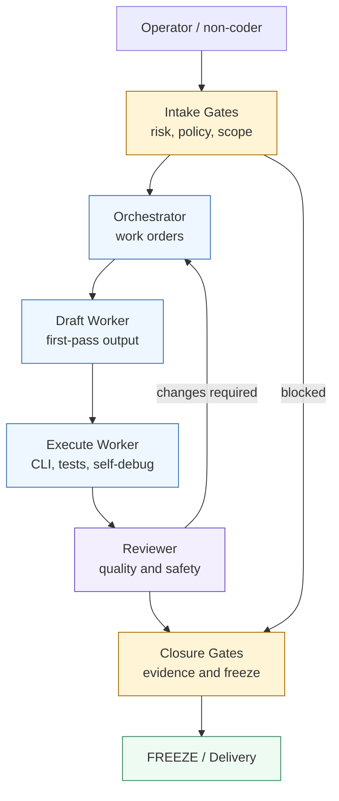
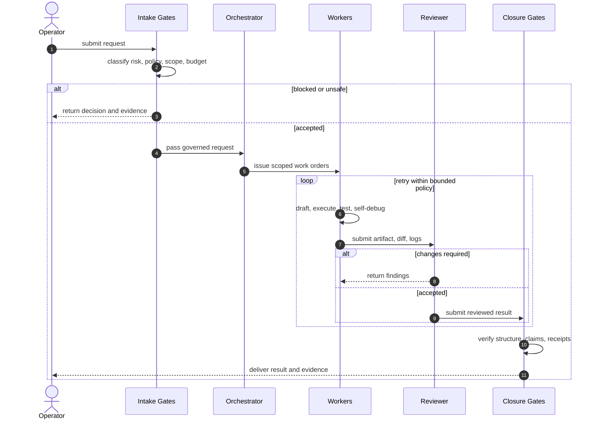

# CVF Multi-Agent Provider Routing Guide

Memory class: POINTER_RECORD

Status: public operator guide

## Purpose

Explain how CVF can mix agent roles and provider lanes to reduce cost while
keeping governance, review, and closure evidence under CVF control.

## Owner / Source

Owner: CVF public documentation surface.

Source: public-safe adaptation of the private `CVF Multi-Agent Visual
Flowchart` reference, reduced for public README clarity.

## Scope

This guide is for non-coder operators and technical maintainers who want to
choose a practical execution posture before running a governed workflow. It is
not a provider benchmark, pricing sheet, or production-readiness certificate.

## Protocol / Contract / Requirements

Contract: `cvf.multiAgentPipeline.visual.v1`.

Updated: 2026-05.

## Core Idea

CVF does not trust a provider because it is powerful or popular. CVF trusts the
governed route:

```text
Operator -> Intake Gates -> Orchestrator -> Workers -> Reviewer -> Closure Gates -> FREEZE
```

Provider choice is useful, but it is subordinate to:

- role assignment;
- risk and policy gates;
- cost boundary;
- review depth;
- evidence receipts;
- closure checks.

## Routing Postures

| Marker | Posture | Use when | Cost posture | Review posture |
| --- | --- | --- | --- | --- |
| 🟢 Green | Eco | many low-risk tasks, batch drafting, cheap decomposition | lowest intended cost | keep closure gate active |
| 🔵 Blue | Balanced | most production drafting and governed non-coder work | best speed/cost tradeoff | reviewer required |
| 🔴 Red | Premium | critical, sensitive, ambiguous, or high-blast-radius work | highest accepted cost | strongest review and closure |

Cost marker legend:

| Marker | Meaning |
| --- | --- |
| 🟢 Green lane | cheapest viable lane; use for decomposition, draft work, or low-risk batch execution |
| 🔵 Blue lane | default lane; use when speed, quality, and cost all matter |
| 🔴 Red lane | expensive lane; reserve for high-risk work, final judgment, or sensitive closure |

The posture can change by phase. For example, a workflow can draft in Eco,
review in Balanced, and close in Premium when the result is important.

## Role Map

| Stage | CVF responsibility | Provider lane pattern |
| --- | --- | --- |
| Intake Gates | classify request, policy, risk, and scope before work starts | 🟢/🔵 fast structural scanner; 🔴 deeper semantic risk review |
| Orchestrator | turn the accepted request into structured work orders | 🟢 cheap JSON decomposition; 🔵 fast work-order generation; 🔴 stronger planner |
| Workers - Draft | produce first-pass code, docs, specs, or artifacts | 🟢 low-cost batch model; 🔵 large-context fast model; 🔴 stronger coder when risk justifies cost |
| Workers - Execute | run commands, test, self-debug, or call approved tools | terminal-capable coding model under CVF scope |
| Reviewer | check quality, security, claim boundary, and evidence | 🔵 broad reviewer; 🔴 strict final reviewer |
| Closure Gates | verify structure, diff, receipts, and final claim | 🔵/🔴 closure model must be conservative and evidence-first |

## Example Provider Mix

The following is an operator routing profile, not a permanent CVF claim. Replace
provider/model names with the currently available models in your environment.

| Stage | 🟢 Eco example | 🔵 Balanced example | 🔴 Premium example |
| --- | --- | --- | --- |
| Intake Gates | Claude Sonnet, medium effort | Claude Sonnet, high effort | Claude Opus class |
| Orchestrator | DeepSeek Pro class | Gemini Flash class | GPT planning class |
| Draft Worker | DeepSeek Pro batch | Gemini Flash large-context | Gemini Flash large-context or stronger coder |
| Execute Worker | Qwen coder class | Qwen coder class or GPT coder class | GPT coder class |
| Reviewer | N/A or lightweight review | Gemini Pro class or Claude Sonnet | Claude Opus class |
| Closure Gates | Claude Sonnet | Claude Sonnet | Claude Opus class |

Compact reading:

```text
🟢 = spend less while preserving gates
🔵 = default balance for most non-coder work
🔴 = spend more only where judgment or risk demands it
```

## Visual Flow



## Operational Sequence



## How To Choose A Posture

Use Eco when:

- the task is low-risk;
- the output is a draft or decomposition;
- a reviewer and closure gate will still inspect the result;
- cost matters more than maximum reasoning depth.

Use Balanced when:

- the task is normal implementation or product work;
- speed matters, but quality still needs review;
- multiple agents or providers may participate;
- you need a good default for non-coder workflows.

Use Premium when:

- the task affects governance, security, public claims, or production behavior;
- source verification is difficult;
- prior agents disagreed;
- a false PASS would be expensive.

## Non-Coder Operator Pattern

For a non-coder, the useful routing pattern is:

1. Start with Balanced unless the task is obviously low-risk or critical.
2. Let the Orchestrator produce work orders before workers touch files.
3. Use cheaper or faster workers for draft work.
4. Use a stronger reviewer when the output will be trusted by others.
5. Do not close without evidence receipts, diff evidence, or a clear N/A reason.

This is how CVF reduces cost without relying on blind trust in a single model.

## Failure Handling

| Failure | CVF response |
| --- | --- |
| request violates policy | stop at Intake and return evidence |
| worker times out | retry within bounded policy, then escalate |
| reviewer rejects repeatedly | return to Orchestrator for smaller work orders |
| provider proof bypasses CVF route | label as provider-method proof only |
| attribution is unclear | record operator-reported attribution and evidence basis |
| closure evidence is incomplete | keep the work open or blocked |

## Claim Boundary

This guide describes a routing strategy. It does not claim:

- universal provider parity;
- equal speed, quality, latency, or cost across providers;
- autonomous multi-agent scheduling without operator/governance control;
- production readiness for any third-party provider;
- that a provider-method proof is the same as governed CVF route proof.

CVF-owned controls remain the guard contracts, policy gates, role boundaries,
evidence receipts, closure checks, and continuation rules.

## Enforcement / Verification

Before publishing changes to this guide, verify:

```bash
python governance/compat/check_docs_governance_compat.py
python governance/compat/check_markdown_structural_completeness.py
```

Provider/model examples must remain framed as routing examples, not certified
provider parity or production-readiness claims.

## Related Artifacts

- `README.md`
- `ARCHITECTURE.md`
- `PROVIDERS.md`
- `COST_AND_QUOTA.md`
- `GOVERNANCE.md`
- `docs/GET_STARTED.md`
- `docs/guides/CVF_MULTI_AGENT_PIPELINE_VI.md`
