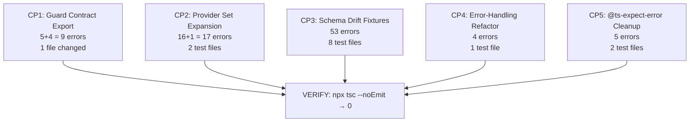

# GC-018: cvf-web Typecheck Stabilization — Execution Roadmap

> **Tranche**: W60-T1 — cvf-web Typecheck Stabilization
> **Class**: REMEDIATION (no new features, no restructuring)
> **Authorization**: GC-018
> **Baseline**: 97 live TS errors (`npx tsc --noEmit` @ 2026-04-07T22:53+07:00)
> **Exit Criteria**: `npx tsc --noEmit` → **0 errors**
> **Lane Eligibility**: Fast Lane (GC-021) — additive fixes on existing surfaces
> **Risk**: LOW — type alignment only, zero behavior change

---

## 1. AUDIT SUMMARY

### 1.1 Error Census (Live @ 2026-04-07)

| # | Category | Errors | Root Cause | Fix Complexity |
|---|----------|--------|------------|----------------|
| A | `cvf-guard-contract/enterprise` not found | **5** | Missing `exports` subpath in package.json | 🟢 1-line fix |
| B | Cascading `implicit any` from Category A | **4** | Same root cause as A | 🟢 Auto-resolves |
| C | `ResultViewer.test.tsx` — missing `intent` | **33** | `Execution` schema added `intent: string` | 🟡 1 fixture, many renders |
| D | `AgentChatMessageBubble.test.tsx` — missing `timestamp` | **5** | `ChatMessage` added `timestamp` field | 🟢 Add field to fixtures |
| E | `PhaseGateModal*.test.tsx` — wrong phase casing | **10** | Test uses `"Discovery"`, type requires `"INTAKE"` | 🟢 String replacement |
| F | `useAgentChat.test.ts` — missing providers | **16** | Provider set expanded with `alibaba`/`openrouter` | 🟡 1 shared fixture |
| G | `quota-manager.integration.test.ts` — same as F | **1** | Same root cause as F | 🟢 Copy fix pattern |
| H | `SkillLibrary*.test.tsx` — unused `@ts-expect-error` | **5** | Guards were relaxed, directives now unused | 🟢 Delete lines |
| I | `SkillPlanner.test.tsx` — `category` not in SkillRecord | **1** | SkillRecord type removed `category` | 🟢 Remove property |
| J | `SpecExport.test.tsx` — `EnforcementResult` incomplete | **1** | Missing `governanceStateSnapshot` + `source` | 🟢 Add fields |
| K | `enforcement-log.test.ts` — same + wrong field name | **4** | Same as J + `key` → `id` in SpecGateField | 🟢 Fix fields |
| L | `error-handling.test.tsx` — Boom component + NODE_ENV | **4** | Component returns `void`, NODE_ENV readonly | 🟡 Refactor test |
| M | `store.test.ts` — `category` string literal | **5** | `string` not assignable to `Category` enum | 🟢 Add `as const` |
| N | `openclaw-config.test.ts` — unknown type | **1** | Missing type narrowing | 🟢 Add type assertion |
| O | `templates/index.test.ts` — `outputExpected: undefined` | **1** | Should be `[]` not `undefined` | 🟢 1-char fix |
| | **TOTAL** | **97** | | |

### 1.2 Error Distribution

```
Source files:    9 errors  (Categories A, B)
Test files:     88 errors  (Categories C–O)
.next/types:     0 errors  (resolved — not present in live run)
```

**Key insight**: 91% of errors are in **test files only**. The production source code has only 9 errors, all from a single root cause (missing `enterprise` export).

---

## 2. AUDIT DECISIONS — OPEN QUESTIONS

### Q1: `.next/types/` errors — RESOLVED ✅

**Audit finding**: Live `npx tsc --noEmit` shows **zero** `.next/types/` errors. The old `ts_errors.txt` (173 errors) included stale generated files that have since been cleaned up.

**Decision**: **No action needed.** The `.next/types/` issue is moot.

### Q2: Guard Contract exports fix — SAME TRANCHE ✅

**Audit finding**: The `cvf-guard-contract` enterprise module **physically exists** at `src/enterprise/enterprise.ts` and is fully implemented (324 lines, exports `TeamRole`, `TeamPermissions`, `ApprovalWorkflow`, `ComplianceReport`). The only issue is the `package.json` `exports` map doesn't declare the `"./enterprise"` subpath.

**Decision**: **Fix in same tranche.** Rationale:
1. It's a **1-line prerequisite** — without it, 9 source errors (A+B) can't resolve
2. It's **additive** — doesn't change any existing export, only adds a new subpath
3. The file is **already published** in the `files` array (line 21: `"src/guards"` covers the pattern)
4. CI already installs `CVF_GUARD_CONTRACT` before type-checking `cvf-web` (line 86-88 of `cvf-ci.yml`)
5. **No behavior change** — only makes TypeScript module resolution work

**Action**: Add `"./enterprise": "./src/enterprise/enterprise.ts"` to `CVF_GUARD_CONTRACT/package.json` exports.

---

## 3. EXECUTION PLAN

### CP1: Guard Contract Export Fix (9 errors → 0)

**Scope**: 1 file in `CVF_GUARD_CONTRACT`, resolves Categories A + B

#### Step 1.1 — Add enterprise subpath export

**File**: `EXTENSIONS/CVF_GUARD_CONTRACT/package.json`

```diff
  "exports": {
    ".": "./src/index.ts",
    "./types": "./src/types.ts",
    "./engine": "./src/engine.ts",
+   "./enterprise": "./src/enterprise/enterprise.ts",
    "./guards/*": "./src/guards/*.ts",
    "./runtime/agent-handoff": "./src/runtime/agent-handoff.ts",
    "./runtime/agent-coordination": "./src/runtime/agent-coordination.ts"
  },
```

#### Step 1.2 — Add to `files` array

```diff
  "files": [
    "README.md",
    "src/index.ts",
    "src/types.ts",
    "src/engine.ts",
    "src/guards",
+   "src/enterprise",
    "src/runtime/agent-handoff.ts",
    "src/runtime/agent-coordination.ts"
  ],
```

**Verification**: `npx tsc --noEmit` in `CVF_GUARD_CONTRACT/` → no regression

---

### CP2: Test Fixture — Provider Set Expansion (17 errors → 0)

**Scope**: 2 test files, resolves Categories F + G

#### Step 2.1 — `useAgentChat.test.ts` shared fixture

**File**: `cvf-web/src/lib/hooks/useAgentChat.test.ts`

**Problem**: All 16 `mockSettings` objects only have `gemini`, `openai`, `anthropic`. Need `alibaba` and `openrouter`.

**Fix**: Find the shared `mockSettings` factory/object and add:

```typescript
providers: {
    gemini: { apiKey: 'test-key', selectedModel: 'gemini-2.5-flash' },
    openai: { apiKey: '', selectedModel: 'gpt-4o' },
    anthropic: { apiKey: '', selectedModel: 'claude-sonnet-4-20250514' },
+   alibaba: { apiKey: '', selectedModel: 'qwen-turbo' },
+   openrouter: { apiKey: '', selectedModel: 'meta-llama/llama-4-maverick' },
},
```

> **Strategy**: If there's a shared helper (e.g. `createMockSettings()`), fix once. If each test case has inline settings, use search-replace on all 16 instances.

#### Step 2.2 — `quota-manager.integration.test.ts`

**File**: `cvf-web/src/lib/quota-manager.integration.test.ts` line 64

Same pattern — add `alibaba` and `openrouter` entries.

---

### CP3: Test Fixture — Schema Drift (53 errors → 0)

**Scope**: 8 test files, resolves Categories C, D, E, I, J, K, M, N, O

#### Step 3.1 — `ResultViewer.test.tsx` (33 errors)

**File**: `cvf-web/src/components/ResultViewer.test.tsx`

**Problem**: Test uses a shared `defaultProps` factory that creates `execution` objects without `intent`.

**Fix**: Add `intent: 'test-intent'` to the base execution fixture. Also fix 3 `this` implicit-any errors at lines 37-39 by typing the mock function context.

```typescript
// In the shared execution factory or defaultProps:
const execution = {
    id: 'exec-1',
    templateId: 'tpl-1',
    templateName: 'Test Template',
+   intent: 'Analyze test data',
    status: 'completed' as const,
    createdAt: new Date(),
    // ... rest
};
```

#### Step 3.2 — `AgentChatMessageBubble.test.tsx` (5 errors)

**File**: `cvf-web/src/components/AgentChatMessageBubble.test.tsx`

**Fix A** (lines 15, 68, 83, 97): Add `timestamp: '2026-01-01T00:00:00Z'` to all `ChatMessage` fixtures.
**Fix B** (line 37): Change `qualityScore: 85` to `qualityScore: { overall: 85, structure: 80, completeness: 90, clarity: 85, actionability: 80 }`.

#### Step 3.3 — `PhaseGateModal.test.tsx` + `PhaseGateModal.extra.test.tsx` (10 errors)

**Files**:
- `cvf-web/src/components/PhaseGateModal.test.tsx`
- `cvf-web/src/components/PhaseGateModal.extra.test.tsx`

**Fix**: Replace legacy mixed-case phase names with canonical uppercase:

| Old Value | New Value |
|-----------|-----------|
| `"Discovery"` | `"INTAKE"` |
| `"Design"` | `"DESIGN"` |

#### Step 3.4 — `SkillPlanner.test.tsx` (1 error)

**File**: `cvf-web/src/components/SkillPlanner.test.tsx` line 161

**Fix**: Remove `category: 'development'` from the `SkillRecord` fixture (property no longer in type).

#### Step 3.5 — `SpecExport.test.tsx` (1 error)

**File**: `cvf-web/src/components/SpecExport.test.tsx` line 278

**Fix**: Change `as EnforcementResult` to `as unknown as EnforcementResult`, or add the missing fields:

```typescript
{
    status: 'active',
    specGate: { ... },
    reasons: [],
    mode: 'governance',
+   governanceStateSnapshot: { source: 'client', enforcementStatus: 'ALLOW', reasons: [], timestamp: new Date().toISOString() },
+   source: 'client' as const,
} as EnforcementResult
```

#### Step 3.6 — `enforcement-log.test.ts` (4 errors)

**File**: `cvf-web/src/lib/enforcement-log.test.ts`

**Fix A** (line 27): Change `key: 'field1'` to `id: 'field1'` in `SpecGateField`.
**Fix B** (lines 50, 73, 107): Add to all `EnforcementResult` objects:

```typescript
governanceStateSnapshot: { source: 'client', enforcementStatus: 'ALLOW', reasons: [], timestamp: new Date().toISOString() },
source: 'client' as const,
```

#### Step 3.7 — `store.test.ts` (5 errors)

**File**: `cvf-web/src/lib/store.test.ts` lines 53, 76, 104, 140, 141

**Fix**: Add `as const` to `category` literal or cast:

```diff
- category: 'business',
+ category: 'business' as const,
```

#### Step 3.8 — `openclaw-config.test.ts` (1 error)

**File**: `cvf-web/src/lib/openclaw-config.test.ts` line 44

**Fix**: Add type narrowing:

```typescript
- expect(result.decision).toBe('ALLOW');
+ expect((result as { decision: string }).decision).toBe('ALLOW');
```

#### Step 3.9 — `templates/index.test.ts` (1 error)

**File**: `cvf-web/src/lib/templates/index.test.ts` line 131

**Fix**: Change `outputExpected: undefined` to `outputExpected: []`.

---

### CP4: Error-Handling Test Refactor (4 errors → 0)

**Scope**: 1 test file, resolves Category L

#### Step 4.1 — `error-handling.test.tsx`

**File**: `cvf-web/src/lib/error-handling.test.tsx`

**Fix A** (lines 54, 73): Make `Boom` return a React node:

```diff
- function Boom() { throw new Error('test'); }
+ function Boom(): React.ReactNode { throw new Error('test'); }
```

**Fix B** (lines 65, 79): Use `Object.defineProperty` instead of direct assignment:

```diff
- process.env.NODE_ENV = 'production';
+ Object.defineProperty(process.env, 'NODE_ENV', { value: 'production', writable: true });
```

Or use a vitest `vi.stubEnv('NODE_ENV', 'production')` pattern.

---

### CP5: Unused `@ts-expect-error` Cleanup (5 errors → 0)

**Scope**: 2 test files, resolves Category H

#### Step 5.1 — `SkillLibrary.test.tsx` (4 directives)

**File**: `cvf-web/src/components/SkillLibrary.test.tsx`
**Lines**: 25, 200, 264, 663

Delete the `// @ts-expect-error` lines.

#### Step 5.2 — `SkillLibrary.i18n.test.tsx` (1 directive)

**File**: `cvf-web/src/components/SkillLibrary.i18n.test.tsx`
**Line**: 26

Delete the `// @ts-expect-error` line.

---

## 4. EXECUTION ORDER & DEPENDENCIES



**All CPs are independent** — can be executed in any order. Recommended: CP1 first (unblocks production code).

---

## 5. FILE MANIFEST

| CP | File | Action | Error Count |
|----|------|--------|-------------|
| CP1 | `CVF_GUARD_CONTRACT/package.json` | Add enterprise export | 9 |
| CP2 | `cvf-web/src/lib/hooks/useAgentChat.test.ts` | Add alibaba/openrouter to fixtures | 16 |
| CP2 | `cvf-web/src/lib/quota-manager.integration.test.ts` | Same | 1 |
| CP3 | `cvf-web/src/components/ResultViewer.test.tsx` | Add `intent` to Execution fixtures | 33 |
| CP3 | `cvf-web/src/components/AgentChatMessageBubble.test.tsx` | Add `timestamp`, fix QualityScore | 5 |
| CP3 | `cvf-web/src/components/PhaseGateModal.test.tsx` | Fix phase casing | 8 |
| CP3 | `cvf-web/src/components/PhaseGateModal.extra.test.tsx` | Fix phase casing | 2 |
| CP3 | `cvf-web/src/components/SpecExport.test.tsx` | Add EnforcementResult fields | 1 |
| CP3 | `cvf-web/src/lib/enforcement-log.test.ts` | Fix SpecGateField + EnforcementResult | 4 |
| CP3 | `cvf-web/src/lib/store.test.ts` | Cast category literals | 5 |
| CP3 | `cvf-web/src/lib/openclaw-config.test.ts` | Type narrowing | 1 |
| CP3 | `cvf-web/src/lib/templates/index.test.ts` | Fix outputExpected | 1 |
| CP3 | `cvf-web/src/components/SkillPlanner.test.tsx` | Remove unknown property | 1 |
| CP4 | `cvf-web/src/lib/error-handling.test.tsx` | Fix Boom + NODE_ENV | 4 |
| CP5 | `cvf-web/src/components/SkillLibrary.test.tsx` | Remove directives | 4 |
| CP5 | `cvf-web/src/components/SkillLibrary.i18n.test.tsx` | Remove directive | 1 |
| | **TOTAL: 16 files** | | **97 errors** |

---

## 6. VERIFICATION PLAN

### Step 1: Post-CP1 — Guard Contract health
```bash
cd EXTENSIONS/CVF_GUARD_CONTRACT && npx tsc --noEmit
```

### Step 2: Post-all-CPs — Zero error gate
```bash
cd EXTENSIONS/CVF_v1.6_AGENT_PLATFORM/cvf-web && npx tsc --noEmit
# Expected: 0 errors, exit code 0
```

### Step 3: Test suite integrity
```bash
cd EXTENSIONS/CVF_v1.6_AGENT_PLATFORM/cvf-web && npx vitest run
# Expected: all tests pass (type fixes don't change behavior)
```

### Step 4: CI validation
Push to `cvf-next` branch → `typecheck-web-ui` job passes ✅

---

## 7. GOVERNANCE COMPLIANCE

| Requirement | Status |
|-------------|--------|
| GC-018 authorization | ✅ This document |
| Fast Lane eligibility (GC-021) | ✅ Additive remediation only |
| No restructuring (P3 locked) | ✅ No folder moves |
| Pre-commit size check | ⬜ Run `/pre-commit-check` before commit |
| Closure integrity (MC1–MC5) | ✅ No foundation files touched |
| Architecture baseline (v3.7-W46T1) | ✅ No architecture change |

---

## 8. ESTIMATED EFFORT

| CP | Effort | Complexity |
|----|--------|------------|
| CP1 | 2 min | Trivial |
| CP2 | 10 min | Search-replace |
| CP3 | 25 min | Bulk fixture updates |
| CP4 | 5 min | Small refactor |
| CP5 | 2 min | Delete lines |
| Verify | 5 min | Run tsc + vitest |
| **Total** | **~50 min** | |

---

*Generated: 2026-04-07T22:53+07:00*
*Agent: GC-018 Stabilization Agent*
*Baseline: v3.7-W46T1 + MC1–MC5 closure*
