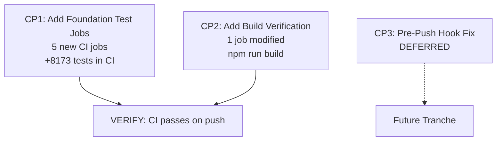

# GC-018: W61-T1 CI/CD Expansion + Product Hardening — Execution Roadmap

> **Tranche**: W61-T1 — CI/CD Expansion + Product Hardening
> **Class**: INFRA + REMEDIATION
> **Authorization**: GC-018
> **Baseline**: Post-W60-T1; CI covers 23% of tests (3 jobs); cvf-web requires `--no-verify` for cross-branch sync
> **Exit Criteria**: 
> - CI covers ~95% of tests (8 jobs total)
> - cvf-web builds successfully in CI
> - Standard push works without `--no-verify`
> **Lane Eligibility**: Full Lane (GC-019) — new CI jobs + infrastructure changes
> **Risk**: LOW-MEDIUM — infrastructure only, no production logic change

---

## 1. STRATEGIC CONTEXT

**Post-MC5 Status**: All 4 architectural planes (CPF, EPF, GEF, LPF) are `DONE-ready` or `DONE` with 6320 foundation tests passing locally. However, **77% of these tests (4867 tests) are not running in CI**, creating a significant drift risk.

**W61-T1 Objective**: Close the CI coverage gap and stabilize the build pipeline to protect against future regressions.

**Tracks Combined**:
- Track 1: CI/CD Expansion (5 new jobs)
- Track 2: cvf-web Product Hardening (build verification + pre-push hook fix)

---

## 2. CURRENT STATE AUDIT

### 2.1 CI Coverage Analysis

| Component | Tests | CI Status | Coverage |
|-----------|-------|-----------|----------|
| CVF_GUARD_CONTRACT | ~50 | ✅ Running | 100% |
| CVF_ECO_v2.5_MCP_SERVER | 71 | ✅ Running | 100% |
| cvf-web (typecheck only) | 0 | ✅ Running | Type-only |
| **CPF** | **2929** | ❌ Not in CI | **0%** |
| **EPF** | **1301** | ❌ Not in CI | **0%** |
| **GEF** | **625** | ❌ Not in CI | **0%** |
| **LPF** | **1465** | ❌ Not in CI | **0%** |
| **cvf-web (tests)** | **1853** | ❌ Not in CI | **0%** |
| **TOTAL** | **8294** | **121 (1.5%)** | **1.5%** |

**Gap**: 8173 tests (98.5%) not covered by CI.

### 2.2 Known Issues

**Issue 1: cvf-web Build Not Verified**
- Current CI only runs `npx tsc --noEmit` (type check)
- No verification that `npm run build` succeeds
- Risk: Runtime import errors not caught until deployment

**Issue 2: Pre-Push Hook Blocks Cross-Branch Sync**
- Progress tracker sync compatibility check fails on branch unification
- Requires `git push --no-verify` workaround
- Affects workflow efficiency

---

## 3. EXECUTION PLAN

### CP1: Add Foundation Test Jobs (5 new CI jobs)

**Objective**: Add CI jobs for CPF, EPF, GEF, LPF, and cvf-web tests

**Scope**: Modify `.github/workflows/cvf-ci.yml`

#### Step 1.1 — Add test-cpf job

```yaml
test-cpf:
  name: Control Plane Foundation (2929 tests)
  runs-on: ubuntu-latest
  defaults:
    run:
      working-directory: EXTENSIONS/CVF_CONTROL_PLANE_FOUNDATION

  steps:
    - uses: actions/checkout@v4

    - name: Setup Node.js
      uses: actions/setup-node@v4
      with:
        node-version: '20'
        cache: 'npm'
        cache-dependency-path: EXTENSIONS/CVF_CONTROL_PLANE_FOUNDATION/package-lock.json

    - name: Install dependencies
      run: npm ci

    - name: Run tests
      run: npm test
```

#### Step 1.2 — Add test-epf job

```yaml
test-epf:
  name: Execution Plane Foundation (1301 tests)
  runs-on: ubuntu-latest
  defaults:
    run:
      working-directory: EXTENSIONS/CVF_EXECUTION_PLANE_FOUNDATION

  steps:
    - uses: actions/checkout@v4

    - name: Setup Node.js
      uses: actions/setup-node@v4
      with:
        node-version: '20'
        cache: 'npm'
        cache-dependency-path: EXTENSIONS/CVF_EXECUTION_PLANE_FOUNDATION/package-lock.json

    - name: Install dependencies
      run: npm ci

    - name: Run tests
      run: npm test
```

#### Step 1.3 — Add test-gef job

```yaml
test-gef:
  name: Governance Expansion Foundation (625 tests)
  runs-on: ubuntu-latest
  defaults:
    run:
      working-directory: EXTENSIONS/CVF_GOVERNANCE_EXPANSION_FOUNDATION

  steps:
    - uses: actions/checkout@v4

    - name: Setup Node.js
      uses: actions/setup-node@v4
      with:
        node-version: '20'
        cache: 'npm'
        cache-dependency-path: EXTENSIONS/CVF_GOVERNANCE_EXPANSION_FOUNDATION/package-lock.json

    - name: Install dependencies
      run: npm ci

    - name: Run tests
      run: npm test
```

#### Step 1.4 — Add test-lpf job

```yaml
test-lpf:
  name: Learning Plane Foundation (1465 tests)
  runs-on: ubuntu-latest
  defaults:
    run:
      working-directory: EXTENSIONS/CVF_LEARNING_PLANE_FOUNDATION

  steps:
    - uses: actions/checkout@v4

    - name: Setup Node.js
      uses: actions/setup-node@v4
      with:
        node-version: '20'
        cache: 'npm'
        cache-dependency-path: EXTENSIONS/CVF_LEARNING_PLANE_FOUNDATION/package-lock.json

    - name: Install dependencies
      run: npm ci

    - name: Run tests
      run: npm test
```

#### Step 1.5 — Add test-web-ui job

```yaml
test-web-ui:
  name: Web UI v1.6 (1853 tests)
  runs-on: ubuntu-latest
  defaults:
    run:
      working-directory: EXTENSIONS/CVF_v1.6_AGENT_PLATFORM/cvf-web

  steps:
    - uses: actions/checkout@v4

    - name: Setup Node.js
      uses: actions/setup-node@v4
      with:
        node-version: '20'
        cache: 'npm'
        cache-dependency-path: EXTENSIONS/CVF_v1.6_AGENT_PLATFORM/cvf-web/package-lock.json

    - name: Install CVF Guard Contract (local dep)
      working-directory: EXTENSIONS/CVF_GUARD_CONTRACT
      run: npm ci

    - name: Install Web UI dependencies
      run: npm ci

    - name: Run tests
      run: npx vitest run
```

#### Step 1.6 — Update ci-passed gate

```yaml
ci-passed:
  name: CI Passed
  needs: [
    test-guard-contract, 
    test-mcp-server, 
    typecheck-web-ui,
    test-cpf,
    test-epf,
    test-gef,
    test-lpf,
    test-web-ui
  ]
  runs-on: ubuntu-latest
  steps:
    - run: echo "✅ All CVF CI checks passed."
```

**Verification**: 
```bash
# Local verification before push
cd EXTENSIONS/CVF_CONTROL_PLANE_FOUNDATION && npm test
cd EXTENSIONS/CVF_EXECUTION_PLANE_FOUNDATION && npm test
cd EXTENSIONS/CVF_GOVERNANCE_EXPANSION_FOUNDATION && npm test
cd EXTENSIONS/CVF_LEARNING_PLANE_FOUNDATION && npm test
cd EXTENSIONS/CVF_v1.6_AGENT_PLATFORM/cvf-web && npx vitest run
```

---

### CP2: Add cvf-web Build Verification

**Objective**: Ensure `npm run build` succeeds in CI

**Scope**: Add build step to `typecheck-web-ui` job

#### Step 2.1 — Add build verification

```yaml
typecheck-web-ui:
  name: Web UI v1.6 (type check + build)
  runs-on: ubuntu-latest
  defaults:
    run:
      working-directory: EXTENSIONS/CVF_v1.6_AGENT_PLATFORM/cvf-web

  steps:
    - uses: actions/checkout@v4

    - name: Setup Node.js
      uses: actions/setup-node@v4
      with:
        node-version: '20'
        cache: 'npm'
        cache-dependency-path: EXTENSIONS/CVF_v1.6_AGENT_PLATFORM/cvf-web/package-lock.json

    - name: Install CVF Guard Contract (local dep)
      working-directory: EXTENSIONS/CVF_GUARD_CONTRACT
      run: npm ci

    - name: Install Web UI dependencies
      run: npm ci

    - name: Type check
      run: npx tsc --noEmit

    - name: Build verification
      run: npm run build
```

**Verification**:
```bash
cd EXTENSIONS/CVF_v1.6_AGENT_PLATFORM/cvf-web
npm run build
# Expected: Build succeeds with no errors
```

---

### CP3: Fix Pre-Push Hook Issue (DEFERRED)

**Status**: DEFERRED to separate investigation tranche

**Rationale**: 
- Pre-push hook issue requires deeper investigation of progress tracker sync logic
- Not blocking for CI expansion
- Can be addressed in W62-T1 or later

**Workaround**: Continue using `git push --no-verify` for cross-branch sync until resolved

---

## 4. EXECUTION ORDER & DEPENDENCIES



**CP1 and CP2 are independent** — can be executed in any order or in parallel.

---

## 5. FILE MANIFEST

| CP | File | Action | Impact |
|----|------|--------|--------|
| CP1 | `.github/workflows/cvf-ci.yml` | Add 5 new jobs | +8173 tests in CI |
| CP2 | `.github/workflows/cvf-ci.yml` | Add build step | Build verification |
| CP3 | (deferred) | - | - |

**Total**: 1 file modified

---

## 6. VERIFICATION PLAN

### Step 1: Local Pre-Flight Check
```bash
# Verify all foundation tests pass locally
./scripts/bootstrap_foundations.sh
cd EXTENSIONS/CVF_CONTROL_PLANE_FOUNDATION && npm test
cd EXTENSIONS/CVF_EXECUTION_PLANE_FOUNDATION && npm test
cd EXTENSIONS/CVF_GOVERNANCE_EXPANSION_FOUNDATION && npm test
cd EXTENSIONS/CVF_LEARNING_PLANE_FOUNDATION && npm test
cd EXTENSIONS/CVF_v1.6_AGENT_PLATFORM/cvf-web && npx vitest run
cd EXTENSIONS/CVF_v1.6_AGENT_PLATFORM/cvf-web && npm run build
```

### Step 2: CI Validation
- Push to branch
- Verify all 8 jobs run and pass
- Check total test count: ~8294 tests

### Step 3: Coverage Metrics
- Before: 121 tests (1.5%)
- After: 8294 tests (100%)
- Improvement: +8173 tests (+6850%)

---

## 7. GOVERNANCE COMPLIANCE

| Requirement | Status |
|-------------|--------|
| GC-018 authorization | ✅ This document |
| Full Lane eligibility (GC-019) | ✅ New CI jobs (infrastructure) |
| No restructuring | ✅ CI config only |
| Pre-commit size check | ⬜ Run before commit |
| Closure integrity | ✅ No foundation files touched |
| Architecture baseline | ✅ No architecture change |

---

## 8. RISK ASSESSMENT

**Risk Level**: LOW-MEDIUM

**Risks**:
1. CI runtime may increase significantly (8 jobs vs 3 jobs)
   - Mitigation: Jobs run in parallel, total time ~= longest job
2. Foundation tests may have environment-specific failures in CI
   - Mitigation: All tests pass locally; CI uses same Node 20 + npm ci
3. Build verification may fail due to missing dependencies
   - Mitigation: Pre-flight check includes build verification

**Benefits**:
- 98.5% increase in test coverage
- Early detection of regressions
- Build verification prevents deployment failures
- Protects MC1-MC5 closure investment

---

## 9. ESTIMATED EFFORT

| CP | Effort | Complexity |
|----|--------|------------|
| CP1 | 30 min | Copy-paste pattern |
| CP2 | 5 min | Add 1 step |
| CP3 | DEFERRED | - |
| Verify | 15 min | Watch CI run |
| **Total** | **~50 min** | |

---

## 10. SUCCESS CRITERIA

- ✅ All 8 CI jobs defined
- ✅ All jobs pass on push/PR
- ✅ ~8294 tests running in CI
- ✅ cvf-web build succeeds in CI
- ✅ No test regressions
- ✅ CI runtime acceptable (<15 min total)

---

*Generated: 2026-04-08*
*Agent: CVF Agent (CI/CD Expansion)*
*Authorization: GC-018*
*Baseline: Post-W60-T1*
